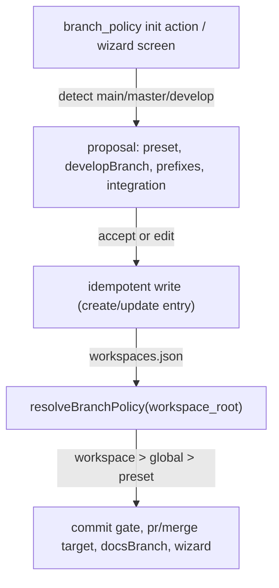

# Spec: Per-workspace branch policy with repo-aware idempotent init

**Branch:** `feature/workit-reliability-overhaul`

## Context

Branch policy (`branchPolicy.preset`, allowed, protected) is global today, so multi-context users — personal repos on GitHub (github-flow, PRs) and work repos on GitLab (gitflow, merge to develop) — cannot express per-repo conventions, and a stale global provider already caused a failed `workflow_pr_create`. Like `git flow init`, branching is per repository: the convention must be detected from the actual repo (main/master/develop presence), proposed with editable defaults, and persisted idempotently per workspace so it can be re-run and updated.

## Goals

- Per-workspace `branchPolicy` (preset, develop branch name, prefixes, protected, integration mode) that overrides the global policy when a workspace matches.
- A git-flow-style, idempotent, updatable init action (and CLI wizard screen) that detects main/master/develop presence, proposes the convention with editable defaults, and writes/updates the workspace entry.
- An `integration` mode per workspace — `"pr"` (default) or `"merge"` — where merge mode finishes the feature locally (merge to target, push, no PR), git-flow style.
- One shared `resolveBranchPolicy(workspace_root)` consumed by every policy surface (commit gate, PR/merge target validation, docsBranch base, wizard preview) so behavior cannot diverge.
- Feature parity across OpenCode, Cursor, and the CLI wizard, plus a repo `AGENTS.md` documenting the multi-platform contract (best-possible host-native adaptation, e.g. OpenCode handoff spawns a session, Cursor seeds a prompt).
- The feature ships with README/AGENTS.md updates, CLI wizard parity, and a changelog entry — docs, tags, and CLI stay in sync.

## Non-goals

- git-flow release start/finish and tag handling (`git flow release ...`) — deferred; release notes feature already covers the notes side.
- Reading git-flow's own `.git/config` flow section or the git-flow bin — detection is branch-presence rules only.
- Runtime auto-detection as the primary mechanism — detection happens in the explicit init action; unresolved workspaces keep the global policy.
- Per-workspace YouTrack meeting/comment configuration — unchanged (still global).

## Architecture



```text
┌──────────────────────────────────────────────────────────────┐
│ Branch policy init proposal                                  │
├──────────────────────────────────────────────────────────────┤
│ Detected: gitflow (develop + main present)                   │
│ preset: gitflow | developBranch: develop | integration: mer… │
│ prefixes: feature/* bugfix/* hotfix/* release/*              │
│ protected: main develop                                      │
│ [1] Accept defaults   [2] Edit   [3] Skip                    │
└──────────────────────────────────────────────────────────────┘
```

## Data flow / contracts

| Term | Meaning |
| --- | --- |
| `WorkspaceConfig.branchPolicy` | Per-workspace policy: `{ preset, developBranch?, prefixes?, allowed?, protected?, integration }` |
| `integration` | How changes land on the target branch: `"pr"` (default) or `"merge"` (local finish + push, no PR) |
| Detection rules | `develop` present → gitflow; only `main` → github-flow; only `master` → trunk-based |
| Resolution order | workspace `branchPolicy` > global `config.json` `branchPolicy` > preset defaults |
| `resolveBranchPolicy(workspace_root)` | The single shared resolver every policy consumer calls |
| Init action | `workflow_toolkit_init_apply action="branch_policy"` + wizard screen with the same proposal/write path |

| Detection input | Proposed preset | Proposed developBranch | Proposed integration | Proposed protected |
| --- | --- | --- | --- | --- |
| `develop` + `main`/`master` present | gitflow | `develop` | `merge` | `main`/`master` + `develop` |
| only `main` present | github-flow | — | `pr` | `main` |
| only `master` present | trunk-based | — | `pr` | `master` |

## Acceptance criteria

- CA-01: `workspaces.json` `branchPolicy` overrides the global `config.json` `branchPolicy` for every consumer (commit gate, PR/merge target validation, docsBranch base, wizard preview) through one shared `resolveBranchPolicy(workspace_root)`.
- CA-02: The init action detects branch presence per the rules table and proposes the correct preset, develop branch, prefixes, protected set, and integration mode, all editable before write.
- CA-03: Init is idempotent and updatable: an unchanged re-run reports already-configured; drift (e.g. a new `develop` branch) proposes the updated policy; acceptance/edits write only the workspace entry (creating it when the repo has none, glob = repo root).
- CA-04: `integration` defaults to `"pr"`; gitflow detection proposes `"merge"`. Merge mode finishes the feature locally (merge to target, push, no PR) and is gated by the same branch policy; `"pr"` mode keeps the existing PR path.
- CA-05: `vcs.defaultTargetBranch` stays consistent when unset: gitflow → develop, github-flow/trunk-based → main/master.
- CA-06: The CLI wizard exposes the same detection proposal, editing, and write path as the host init action, sharing the core resolver; a parity test proves identical outcomes.
- CA-07: Repo `AGENTS.md` documents the multi-platform contract — host-native adaptation per feature (e.g. OpenCode handoff spawns a session, Cursor seeds a prompt, CLI commands), the parity rule (shared core, host-native surfaces), and the sync rule (feature work ships with CLI + docs + changelog).
- CA-08: README documents the per-workspace branch policy fields, integration mode, and the init action; a changelog entry is added with the feature.
- CA-09: No consumer resolves branch policy on its own: a source/parity gate asserts only `resolveBranchPolicy(workspace_root)` is used.

## Decisions

- D-01: Explicit init action over runtime auto-detection — branching conventions are a per-repo decision the user pins and can update.
- D-02: Branch-presence rules over git-flow bin config — deterministic, no external tool state.
- D-03: `integration` field with `"pr"` default; gitflow proposes `"merge"` — matches the user's git-flow-to-develop workflow while defaulting to the safer PR path.
- D-04: Resolution order workspace > global > preset defaults; global remains the fallback for unmatched repos.
- D-05: git-flow release start/finish/tags deferred to a follow-up.
- D-06: This feature rides `feature/workit-reliability-overhaul` (PR #39) via `workflow_docs_branch` keep.

## Future work

- git-flow release start/finish and tag handling, `git flow release`-style, per repo.
- git-flow bin `.git/config` detection as a hint alongside branch presence.
- Per-workspace YouTrack meeting/comment configuration.
