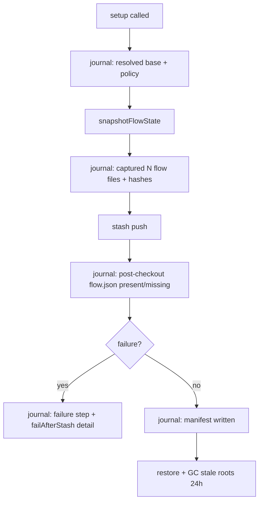

# Spec: Branch setup follow-ups

**Branch:** `bugfix/branch-setup-hardening-followups`

## Context

The branch-setup hardening (#78) made flow-state loss recoverable but left three threads open: the original Aug-23 sweeper that wiped `docs/<slug>/sdd/flow.json` mid-mutation-window was never identified (the guard neutralizes harm, not cause); snapshot roots are keyed only by workspace path so concurrent invocations clobber each other and failed runs retain their temp root until the next successful run; and the README workflow section predates both hardening behaviors.

## Goals

- A future occurrence of the sweeper is diagnosable in minutes: the mutation window emits an ordered, timestamped journal of what was observed at each step (pre-stash hash, post-checkout state, pre-pop, post-pop, restore outcome), through the existing plugin diagnostic logger.
- Snapshot roots are unique per invocation; stale roots are garbage-collected automatically and cannot destroy a live invocation's snapshot.
- README documents the hardening guarantees and the `warnings` field.

## Non-goals

- No change to stash semantics, pathspecs, or the restore-if-missing algorithm shipped in #78.
- No persistent log files inside the repository (journal goes through the diagnostic logger only).
- No behavioral change to approval flows or manifest schema.

## Architecture

## Data flow / contracts

| Term | Meaning |
| --- | --- |
| Mutation window | The span between `snapshotFlowState` and `restoreFlowSnapshot` inside one `branchSetup` call |
| Journal | Ordered diagnostic-log lines, prefixed `flow-guard:`, emitted at each window checkpoint |
| Stale root | A `workit-flow-guard-*` temp dir whose mtime is older than 24 hours |
| Unique root | Snapshot dir suffixed with invocation-unique entropy (pid + hrtime) after the workspace hash |

## Acceptance criteria

- CA-01: `branchSetup` accepts an optional injected logger and emits `flow-guard:` journal lines covering, in order: resolution result, snapshot capture count/hashes, stash push result, post-checkout presence check, pop/reapply result, restore outcome. Absent logger = zero behavioral change.
- CA-02: The plugin's `workit_branch_setup` tool passes its diagnostic logger so journal lines reach the opencode log without any caller changes.
- CA-03: A mid-window deletion is pinpointable: given a journal from a run where flow.json went missing, the last observed-present checkpoint identifies the two steps between which the wipe occurred (asserted in tests via an injected hook that deletes during the window).
- CA-04: Two concurrent `setup` invocations on the same workspace produce distinct snapshot roots and neither corrupts the other's captured bytes.
- CA-05: Any `workit-flow-guard-*` root older than 24 hours is purged by the next `snapshotFlowState`; roots newer than 24 hours belonging to other invocations are never touched.
- CA-06: README's workflow section documents the #78 hardening guarantees and the optional `warnings` field, referencing the CHANGELOG entry.
- CA-07: No new runtime dependencies; all new behavior covered by failing-first tests in `test/workit-core/branch.test.ts`.

## Decisions

- D-01: Logger injection over a global — core stays dependency-free and testable; the plugin already owns a diagnostic logger instance.
- D-02: Journal via logger only (no file artifacts) — the opencode log already proved sufficient for forensics yesterday.
- D-03: Uniqueness via `${hash}.${pid}.${hrtimeBigInt}` suffix; GC via mtime-age threshold (24h) rather than reference tracking — simple and safe because roots are disposable by design.
- D-04: Docs fix rides in this branch instead of a separate docs PR (one-line-class change).

## Future work

- If the journal ever captures the sweeper in the act, follow up with a targeted fix against the identified actor.
