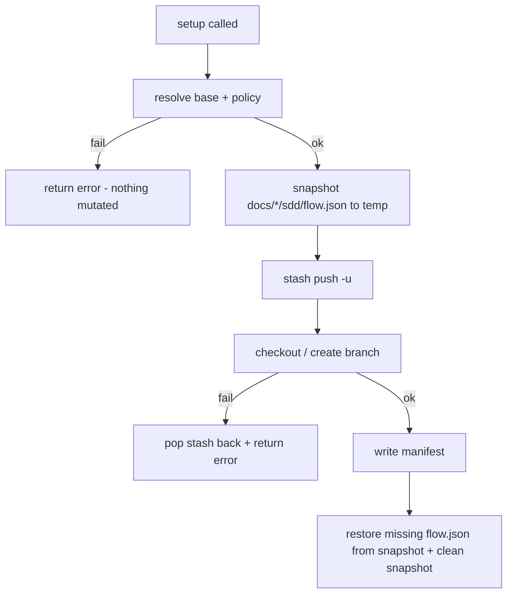

# Spec: Branch setup reliability hardening

**Branch:** `bugfix/branch-setup-hardening`

## Context

`workit_branch_setup` mutates developer state during guarded in-place checkouts. Two defects undermine trust in that mutation path: (1) when base-branch or checkout resolution fails *after* the pre-checkout stash push, the function returns an error without recording `stash_ref` in the SDD manifest — the stash is stranded, the working tree stays emptied, and `reapply_stash` can never run; (2) during the stash/checkout window, critical gitignored SDD state (`docs/<slug>/sdd/flow.json`) was observed wiped during a real execution (2026-08-23, release-selective-publish) by a mechanism that remains unidentified — properly ignored files survive every stash form we tested, so the sweeper is something else in the mutation window. Approval evidence is irreplaceable, so the class of threat must be defended against directly.

## Goals

- A failed `setup` leaves the working tree exactly as it was before the call: stash popped, no orphan stash entries, no half-written manifest state.
- All fallible resolution (base branch, branch policy) happens before any stash mutation.
- `docs/<slug>/sdd/flow.json` for every slug is snapshotted before any stash/checkout mutation and restored byte-identical if missing afterward, on both `setup` and `reapply_stash`.

## Non-goals

- No change to stash pathspec semantics (the suspected `:!docs/*/sdd` sweep was disproven by experiment).
- No manifest schema changes; no new runtime dependencies.
- No root-cause hunt continuation for the original wipe inside this spec (defensive guard covers the class).

## Architecture

## Data flow / contracts

| Term | Meaning |
| --- | --- |
| Stranded stash | A stash created by `setup` whose `stash_ref` was never recorded because an error return preceded the manifest write |
| Flow snapshot | Byte copy of every existing `docs/*/sdd/flow.json`, stored outside the repository, keyed by workspace path |
| Restore-if-missing | Snapshot restoration that only creates absent files; never overwrites newer working-tree content |

## Acceptance criteria

- CA-01: When branch creation/base resolution fails after a stash push, `setup` returns the structured error AND the previously dirty working tree is intact (stash list empty, modified files present again).
- CA-02: Base-branch and branch-policy resolution complete successfully before the stash push executes (no stash exists if resolution fails).
- CA-03: After any successful `setup(stash=yes)` that stashed untracked docs, every pre-existing `docs/<slug>/sdd/flow.json` remains on disk byte-identical.
- CA-04: A missing `flow.json` is restored from the snapshot (byte-identical) after `setup` or `reapply_stash`; the snapshot directory is removed after successful restore and retained on failure.
- CA-05: Snapshot storage lives under the OS temp directory scoped by a workspace-path hash — never inside the repository or `docs/`.
- CA-06: No new runtime dependencies; behavior covered by failing-first `bun:test` cases in the existing branch core test suite.

## Decisions

- D-01: Reorder `baseBranch`/policy resolution ahead of the stash push rather than adding narrower error handling alone — eliminates the common late-failure class outright.
- D-02: On any error after a stash push, best-effort `git stash pop` before returning the error (defense in depth for failures reorder cannot prevent).
- D-03: Snapshot via `fs.cpSync` of `flow.json` files into `<osTmpdir>/workit-flow-guard-<hash(workspace_root)>/docs/<slug>/sdd/flow.json`; restore-if-missing keeps newest working-tree bytes.
- D-04: Keep the existing stash pathspec unchanged — experiment showed it preserves properly ignored files.

## Future work

- Identify the original flow.json sweeper if it reoccurs (logging around the mutation window would capture it).
