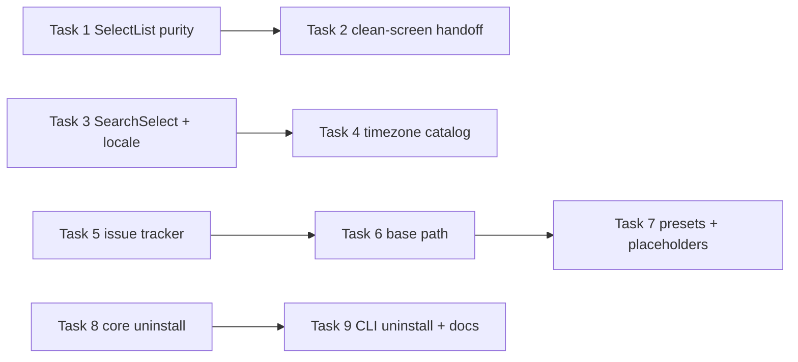

# CLI Wizard First-Run Fixes + Uninstall Implementation Plan

> **For agentic workers:** REQUIRED SUB-SKILL: Use superpowers:subagent-driven-development (recommended) or superpowers:executing-plans to implement this plan task-by-task. Steps use checkbox (`- [ ]`) syntax for tracking.

**Spec:** `docs/cli-wizard-uninstall/spec.md`
**Branch:** `feature/cli-wizard-uninstall`

**Goal:** Fix the nine first-run defects in `packages/workit-cli/src/` (render-phase dispatch, stale screen output, hardcoded locale/timezone lists, missing issue-tracker step, cwd assumptions, hidden preset conventions, missing placeholders) and add a wizard-style `workit uninstall` that preserves `~/.config/workit`.

## Global Constraints

- Each task lands exactly one contiguous non-empty commit range (`base..head`): fix rounds append commits to that range and never rewrite/amend an active review range; each progress line records the task's real base..head shas.
- The final task ends execution with `workit_plan_complete` (or the CLI `workit flow complete`) once the SDD ledger is complete and repository verification passes — a run never finishes while the plan is still `active`.
- No new runtime dependencies: @inkjs/ui 2.0.0 has no Autocomplete; searchable pickers build on TextInput + the existing SelectList pattern.
- TDD mandatory per behavior change: failing check first, minimal implementation, passing focused check (`bun test test/workit-cli/…`).
- Core logic lands in `packages/workit-core/src/core/` only for uninstall (Task 8); wizard defects are CLI-local fixes that consume existing core exports — no core re-implementations.

---

### Task 1: SelectList render-phase fix

**Files:**
- Modify: `packages/workit-cli/src/steps.tsx` (SelectList, ~lines 75–121)
- Test: `test/workit-cli/wizard-tty.test.tsx`

**Interfaces:** unchanged props `{options, value, onChange?, onSelect}`; only update mechanics change (CA-01).

- [ ] **Step 1: Write the failing tests** — two cases in the existing SelectList/wizard describe block: (a) one arrow-key press produces exactly one `set` dispatch for the moved-to option even under React StrictMode double-invoke (spy via reducer wrapper counting actions); (b) down,down,up then Enter submits exactly the highlighted option's value.
- [ ] **Step 2: Run RED** — `bun test test/workit-cli/wizard-tty.test.tsx`; expect double-dispatch/desync failures.
- [ ] **Step 3: Minimal implementation** — compute `next = clamp(index ± 1)` from the current closure `index` outside any setState updater; call `setIndex(next)` and `onChange?.(options[next].value)` as sibling statements; Enter path unchanged (`onSelect(options[index].value)`). No updater-function side effects remain.
- [ ] **Step 4: GREEN + regression sweep** — focused suite passes; run the full `test/workit-cli/` wizard suites to prove locale/timezone/workspace select screens still navigate identically.

### Task 2: Clean-screen handoff (npx banner + stale final frame)

**Files:**
- Modify: `packages/workit-cli/src/index.tsx` (runInit)
- Test: `test/workit-cli/wizard-tty.test.tsx` or new `test/workit-cli/clean-screen.test.ts`

**Interfaces:** none added; stdout write ordering changes (CA-02).

- [ ] **Step 1: Failing test** — drive `runInit` with injected streams (mirror the existing TTY-guard test harness): assert the first stdout chunk starts with `\x1b[2J\x1b[H`, and after unmount exactly one more clear precedes the first Apply-summary line ("Installed"/"Configured"/…), so summary output never interleaves with leftover frames.
- [ ] **Step 2: RED** — clear sequences absent today.
- [ ] **Step 3: Implementation** — one `process.stdout.write("\x1b[2J\x1b[H")` before `render(<Wizard …>)`; one identical write after `waitUntilExit()` resolves and before `printApplySummary` / blocked-output paths (both the preview.ok and !ok branches). Cancel path clears too (exit message must not sit atop stale frames).
- [ ] **Step 4: GREEN** — ordering assertions pass; manual smoke optional.

### Task 3: SearchSelect component + language-map locale step

**Files:**
- Add: `packages/workit-cli/src/search-select.tsx` (SearchSelect + LOCALE_LANGUAGE_MAP)
- Modify: `packages/workit-core/src/core/config.ts` (LOCALE_RE accepts 3-digit region subtags), `packages/workit-cli/src/steps.tsx` (locale screen consumes SearchSelect)
- Test: `test/workit-core/config.test.ts` (LOCALE_RE), `test/workit-cli/wizard-config.test.ts` (pure filtering/map tests) + `wizard-tty.test.tsx` (interaction)

**Interfaces:** `SearchSelect({options, value, placeholder, onSelect})` — TextInput query + filtered list capped at 5 visible rows, up/down within filtered set, Enter selects, Esc bubbles to screen-level cancel; `LOCALE_LANGUAGE_MAP: {label, locale}[]` in Teams style, language × nationality → BCP-47 tag (≈25 entries): Español (España)→es-ES, Español (Latinoamérica)→es-419, Español (Chile)→es-CL, Español (México)→es-MX, Español (Argentina)→es-AR, English (United States)→en-US, English (United Kingdom)→en-GB, Português (Brasil)→pt-BR, Português (Portugal)→pt-PT, Français (France)→fr-FR, Français (Canada)→fr-CA, Deutsch (Deutschland)→de-DE, 中文（简体）→zh-CN, 中文（繁體）→zh-TW, 日本語→ja-JP, 한국어→ko-KR, Italiano→it-IT, Русский→ru-RU, العربية→ar-SA, हिन्दी→hi-IN, … plus every entry of core `localeOptions`.

- [ ] **Step 1: Failing tests** — core: `LOCALE_RE` matches `es-419` and still rejects malformed tags. CLI pure: filter("es") returns ≤5 matches across language+nationality labels (España, Latinoamérica, Chile…); all five `readConfig().localeOptions` values appear in the map; selecting a map row commits its mapped locale through the reducer. Interaction: typing narrows visible rows; "Other…" routes to `pickOther` preserving the existing `LOCALE_RE` validation flow (CA-03).
- [ ] **Step 2: RED** — component/list absent.
- [ ] **Step 3: Implementation** — extend `LOCALE_RE` region group to `(?:[A-Z]{2}|[0-9]{3})`; SearchSelect per D-04; replace the locale screen's SelectList while keeping error display, back/cancel semantics, and the localeOther text screen untouched.
- [ ] **Step 4: GREEN** — new cases pass; existing locale validation tests unaffected.

### Task 4: Timezone full IANA catalog + autodetect default

**Files:**
- Modify: `packages/workit-cli/src/steps.tsx` (timezone screen), reuse `search-select.tsx`
- Test: `test/workit-cli/wizard-config.test.ts` + `wizard-tty.test.tsx`

**Interfaces:** initial query/preselection = `Intl.DateTimeFormat().resolvedOptions().timeZone`; catalog = `Intl.supportedValuesOf("timeZone")` with a static fallback list when unavailable (matches `KNOWN_TIMEZONES` guard in logic.ts); "Other…" keeps `validateTimezone` (CA-04).

- [ ] **Step 1: Failing tests** — detected zone appears preselected without typing; filter("Santiago") yields ≤5 rows including America/Santiago; committing a searched zone updates the draft; Other… path intact.
- [ ] **Step 2: RED**, **Step 3: implement** (swap fixed list for SearchSelect; seed query from resolvedOptions), **Step 4: GREEN**.

### Task 5: Issue-tracker step (YouTrack / GitHub Issues / None)

**Files:**
- Modify: `packages/workit-cli/src/wizard-state.ts` (screen graph, SetupValues, defaults), `packages/workit-cli/src/steps.tsx`, `packages/workit-cli/src/index.tsx` (summary already renders from values)
- Test: `test/workit-cli/wizard-config.test.ts`, `workspace-wizard.test.tsx`

**Interfaces:** `SetupValues.issueTracker: "youtrack" | "github" | "none"` (default `"youtrack"`); new screens `issueTracker`; NEXT/PREV rewire: branchProtected → issueTracker → youtrack → vcs; skip-gating mirrors `skipsCustomBranch`: `issueTracker !== "youtrack"` skips the youtrack screen; `defaultWorkspaceProvider` returns `"github"` when issueTracker is `"github"`; new workspaces created under github mode carry issue linking per `WorkspaceConfig.issues` (existing field — see writeWorkspaces validation).

- [ ] **Step 1: Failing tests** — choosing None: no baseUrl screen reached, scaffold preview contains zero youtrack mutations, summary shows "—". Choosing GitHub Issues: new workspace defaults provider github with issues linked. Choosing YouTrack: byte-identical scaffold path as today (reuse scaffold-parity expectations). Back-navigation across the rewired graph stays consistent.
- [ ] **Step 2: RED**, **Step 3: implement** (reducer fields, NEXT/PREV entries, skip predicate, steps.tsx select screen placed where Step 3 sits today per D-05), **Step 4: GREEN** + full wizard suites.

### Task 6: Explicit base path (workspaces previews + hygiene target)

**Files:**
- Modify: `packages/workit-cli/src/wizard-state.ts` (values.basePath + base-path prompt screen), `steps.tsx` (workspaces, workspaceGlob preview targets, project screen), `index.tsx` (runInit passes basePath into `buildSetupPreview({cwd})`)
- Test: `test/workit-cli/workspace-wizard.test.tsx`, `wizard-config.test.ts`

**Interfaces:** resolution order (D-06): `WORKFLOW_WORKSPACE_ROOT` env → prompted absolute path validated with `existsSync` → refuse to advance with a field error; `process.cwd()` removed from workspacePreviewTargets, match previews, workspaceAddCurrent, BranchPolicyScreen detection root, and the Step 6 displayed target; Step 6 prints the exact directory Apply will touch (CA-06, CA-07).

- [ ] **Step 1: Failing tests** — with env set, previews/current-project derive from it; without env, wizard shows the prompt screen and blocks empty/nonexistent input; Step 6 header equals the resolved basePath; runInit apply cwd equals basePath (assert via buildSetupPreview spy).
- [ ] **Step 2: RED**, **Step 3: implement** (single `resolveBasePath(values, env)` helper consumed by every former cwd call-site), **Step 4: GREEN**.

### Task 7: Preset conventions display + placeholders

**Files:**
- Modify: `packages/workit-cli/src/steps.tsx` (branchPreset screen + all TextInput placeholders)
- Test: `test/workit-cli/wizard-config.test.ts` (snapshot-ish content assertions)

**Interfaces:** preset descriptions derived from `PRESETS` + conventional facts table (gitflow → develop integration branch, pr/merge; github-flow/trunk-based → main-only); placeholders are display-only (CA-08, CA-09).

- [ ] **Step 1: Failing tests** — highlighted gitflow renders allowed/protected patterns and a develop-branch/integration hint; every TextInput screen (baseUrl, localeOther, timezoneOther, branchAllowed, branchProtected, workspaceName, workspaceGlob, branchPolicyDevelop) carries a non-empty example placeholder; submitted values unaffected by placeholder presence.
- [ ] **Step 2: RED**, **Step 3: implement** (static description map keyed by BranchPreset; `placeholder` props), **Step 4: GREEN**.

### Task 8: Core uninstall module (plan + apply, parity-proven)

**Files:**
- Add: `packages/workit-core/src/core/uninstall.ts`
- Test: `test/workit-core/uninstall.test.ts` (new)

**Interfaces:** `planUninstall(paths)` → `{hosts: [{host: "opencode"|"cursor", installed: boolean, actions: [{kind: "edit-json-remove"|"remove-dir", path, detail}]}]}`; `applyUninstall(plan, paths)` → per-action statuses (`removed|skipped|failed`) mirroring setup's result-entry shape; injectable homes exactly like doctor/setup path options (D-07). Install shapes are the inverse of what `setup.ts` register mutations + `registration.ts` write: OpenCode strips workit's plugin entry from opencode.json; Cursor strips settings.json + mcp.json entries and deletes `~/.cursor/plugins/local/workit`. `~/.config/workit` is never an action target (CA-11, CA-12, CA-14).

- [ ] **Step 1: Failing tests** — fixture home dirs (temp) seeded with workit + foreign JSON entries: plan reports both hosts installed with exact action paths; apply removes only workit entries (foreign bytes preserved elsewhere in file), deletes the cursor dir, leaves every `~/.config/workit` file byte-identical; malformed host JSON → that action `failed`, file untouched, others proceed; parity assertion: applying the plan twice-idempotent and plan-vs-applied outcomes identical (CA-13).
- [ ] **Step 2: RED**, **Step 3: implement** (read→filter→write only-if-changed JSON edits; rm -rf scoped strictly to the canonical plugins/local/workit dir), **Step 4: GREEN**.

### Task 9: CLI uninstall command + docs

**Files:**
- Modify: `packages/workit-cli/src/index.tsx` (subcommand, HELP line), small Ink uninstall wizard (MultiSelect hosts + ConfirmInput) consuming Task 8 module
- Test: `test/workit-cli/packed-cli.test.ts` (usage string), new `test/workit-cli/uninstall-command.test.ts`
- Docs: `README.md` (uninstall section), `CHANGELOG.md` (Unreleased)

**Interfaces:** `workit uninstall` — TTY-only interactive host picker + reviewable action summary before mutation (D-08); non-TTY stdin prints guidance, exit 2; exits 0 ok / 1 partial failure / 2 usage (CA-10, CA-13).

- [ ] **Step 1: Failing tests** — packed help lists `workit uninstall` verbatim; injected-home run removes selected host registrations, preserves unselected ones and `~/.config/workit`; non-TTY invocation exits 2 with guidance.
- [ ] **Step 2: RED**, **Step 3: implement** wizard + subcommand wiring, **Step 4: GREEN**,
- [ ] **Step 5: Docs + verification** — README uninstall subsection (what is removed per host, what is kept), CHANGELOG Unreleased entries; repository verification passes; finish with `workit_plan_complete`.
