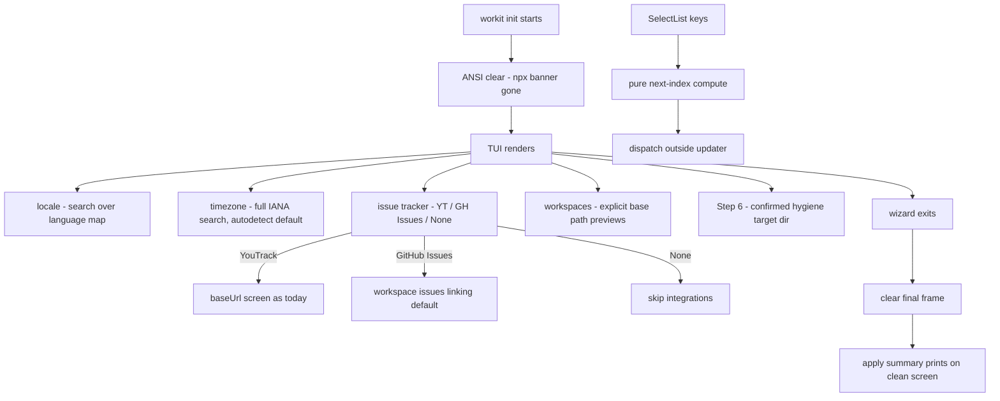
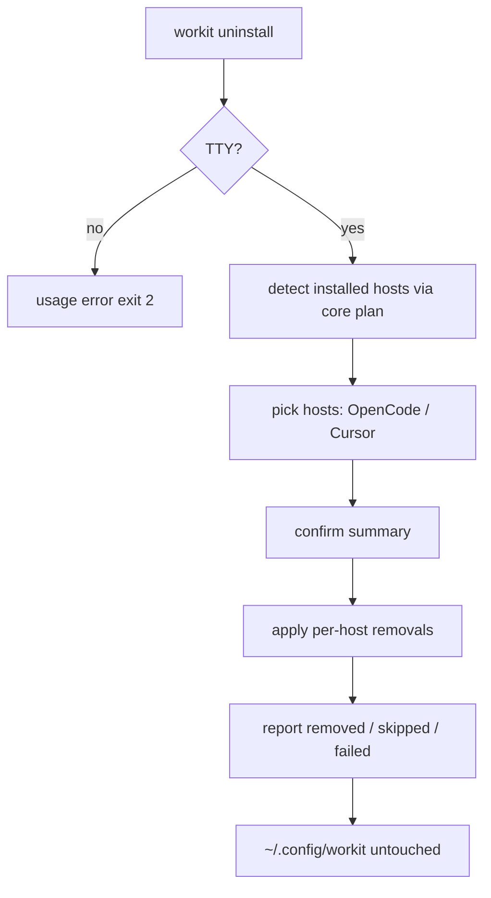

# Spec: CLI wizard first-run fixes + workit uninstall

**Branch:** `feature/cli-wizard-uninstall`

## Context

A first run of `npx workit init` (packages/workit-cli/src/) exposes nine defects and one missing capability. The terminal opens polluted: npm's download banner survives under the TUI and, after the wizard exits, the final stale Ink frame stays interleaved with the Apply summary. Inside the wizard, `SelectList` dispatches `onChange` inside its `setIndex` updater (steps.tsx:75) — a side effect during React's update phase that double-fires in StrictMode and can desync highlight vs committed value. The locale step hardcodes `["en", "es-CL"]` while core `localeOptions` carries five supported locales; users speaking other major world languages get no mapped shortcut. The timezone step offers a fixed 3-item list instead of the full IANA catalog and ignores the OS-detected zone. There is no issue-tracker step — Step 3 assumes YouTrack-or-skip even though workspaces support GitHub issue linking. The workspace screens and Step 6 project-hygiene assume `process.cwd()` is meaningful, which is false for a first run launched from `$HOME`. The preset screen hides what each preset conventionally means, and text inputs ship without placeholders. Finally, there is no uninstall path: removing workit means hand-editing three host config files.

## Goals

- G1: `SelectList` navigation is warning-free and exact: the value submitted on Enter is exactly the highlighted row, with no dispatches during React's render/update phase.
- G2: Clean first-run screen: stale pre-wizard output (npx banner) is cleared before the first frame, and the final TUI frame is cleared before the post-apply summary prints.
- G3: Locale step becomes a searchable autocomplete over the world's most-spoken languages presented with their national/regional variants — Microsoft Teams style ("Español (España)", "Español (Latinoamérica)", "English (United States)", …) — each mapped to its BCP-47 tag, so every user case finds an exact fit; all five core `localeOptions` remain directly reachable and a free-form BCP-47 entry stays possible.
- G4: Timezone step autodetects the user's current zone (`Intl.DateTimeFormat().resolvedOptions().timeZone`) as the preselected value and offers the full IANA catalog through the same search autocomplete (~5 visible matches).
- G5: A new issue-tracker step asks YouTrack / GitHub Issues / None and drives the integration outcome: YouTrack scaffolds as today, GitHub Issues sets the workspace issue-linking default, None skips both.
- G6: Workspace screens stop assuming cwd: match previews, "current project", and derived patterns come from an explicitly provided base path (env override respected).
- G7: Step 6 hygiene targets a directory the user sees and confirms (defaulting to the resolved workspace root), and the planned mutations write exactly there.
- G8: The branch-preset screen shows each preset's conventions (develop branch, integration style, allowed/protected patterns) so the choice is informed.
- G9: Every text input shows a concrete placeholder.
- G10: `workit uninstall` runs a wizard-style cleanup: pick hosts, remove their workit registrations/files, always preserve `~/.config/workit` (settings + tokens).

## Non-goals

- No token capture in either wizard; tokens stay file-based placeholders.
- No new runtime dependencies (@inkjs/ui 2.0.0 has no Autocomplete; the searchable picker is built from TextInput + SelectList).
- No host-adapter (OpenCode/Cursor) execution surface for uninstall: a running host cannot reliably remove its own registration mid-session. Deviation from parity rule 2 is deliberate; the core module stays adapter-ready.
- No changes to core config schema beyond what the issue-tracker choice already supports (`WorkspaceConfig.youtrack` / `.issues` exist today).
- No migration/cleanup of the legacy `~/.config/workflow-toolkit` dir.

## Architecture





Fixed wizard surface (key screens):

```text
┌──────────────────────────────────────────────────────────────────────┐
│ workit init — first-run wizard (fixed)                               │
│                                                                      │
│ Step 2 · Locale   🔍 es__                                            │
│   ❯ Español → es-CL     English → en      Português → pt-BR          │
│     es-MX / es-AR       Other…                                       │
│                                                                      │
│ Step 2 · Timezone   🔍 America/Sant__   (autodetected ✓)             │
│   ❯ America/Santiago ✓ detected    America/Sao_Paulo   +3 more…  Ot… │
│                                                                      │
│ Step 3 · Issue tracker   ❯ YouTrack   GitHub Issues   None           │
│                                                                      │
│ Step 5 · Preset GitFlow: develop branch · pr/merge · feature/* | ma… │
│                                                                      │
│ Step 6 · Hygiene target: /explicit/base/path   [y confirm / n]       │
└──────────────────────────────────────────────────────────────────────┘
```

## Data flow / contracts

| Term | Meaning |
| --- | --- |
| Language map | Curated `{ label, locale }[]` in Teams style: language × nationality → BCP-47 tag (e.g. `Español (Chile)`→es-CL, `Español (Latinoamérica)`→es-419, `English (United Kingdom)`→en-GB); major languages carry their real regional variants, and the five core `localeOptions` are all present |
| SearchSelect | TextInput query + filtered SelectList rendering at most ~5 visible rows; Enter selects, typing narrows |
| Base path | Explicit directory used for workspace match previews, "current project", and the Step 6 hygiene default; sourced from `WORKFLOW_WORKSPACE_ROOT` or a prompted path |
| Uninstall plan | Structured per-host action list (file edits + dir deletions) produced by the core module; identical for dry display and apply |
| Preserved dir | `~/.config/workit` — never written or deleted by uninstall |

## Acceptance criteria

- CA-01: Arrow-key navigation in `SelectList` performs zero state updates inside a setState updater function; Enter submits exactly the highlighted option; no React update-phase warnings appear under StrictMode double-invoke.
- CA-02: Before the wizard's first frame, previously printed terminal content is cleared once; after unmount, the final frame region is cleared before any Apply/doctor/guidance output — the post-apply summary starts on a clean screen.
- CA-03: Typing in the locale step filters the language map to ≤5 visible matches across language and nationality labels; major languages expose their regional variants Teams-style — Spanish at minimum España (es-ES), Latinoamérica neutral (es-419), Chile (es-CL), México (es-MX), Argentina (es-AR); English US/UK; Portuguese Brasil/Portugal; French France/Canada; Chinese Simplified/Traditional — selecting a row commits its mapped locale; every core localeOption is selectable without typing; "Other…" still accepts any `LOCALE_RE`-valid tag with existing validation.
- CA-04: The timezone step opens with the detected local zone preselected; searching filters the complete `Intl.supportedValuesOf("timeZone")` catalog to ≤5 visible matches; selecting commits the zone; "Other…" retains the existing validator.
- CA-05: The new issue-tracker step offers YouTrack / GitHub Issues / None. None yields no `youtrack.json` mutation and no issue-linking workspace fields. GitHub Issues defaults new workspaces to the `github` provider with issue linking. YouTrack keeps today's baseUrl → scaffold flow unchanged.
- CA-06: With `WORKFLOW_WORKSPACE_ROOT` set or a prompted base path given, workspace match previews, the current-project option, and derived globs use that path; unset and unanswered, the wizard prompts instead of silently using `process.cwd()`.
- CA-07: Step 6 displays the exact hygiene target directory before confirmation; the planned gitignore + hygiene mutations resolve against that displayed directory, and Apply writes only there.
- CA-08: The preset screen renders, for the highlighted preset, its conventional develop branch, integration style, and allowed/protected patterns before Enter commits.
- CA-09: Every TextInput screen shows a non-empty example placeholder; none of them change submitted values.
- CA-10: `workit uninstall` detects which hosts carry workit registrations, lets the user pick any subset, and shows a reviewable action summary before mutating.
- CA-11: After any uninstall run, every file under `~/.config/workit` (config.json, youtrack.json, vcs.json, *.token) exists iff it existed before, byte-identical.
- CA-12: OpenCode removal strips only workit's plugin entry from `~/.config/opencode/opencode.json` (foreign entries intact); Cursor removal strips workit's `~/.cursor/settings.json` + `~/.cursor/mcp.json` entries and deletes `~/.cursor/plugins/local/workit`.
- CA-13: Malformed host config files abort that file's edit with a Failed status (file left untouched) while other selected removals proceed; exit code reflects partial failure (0 ok / 1 failed / 2 usage, mirroring flow.ts).
- CA-14: Uninstall planning/applying lives in one core module consumed by the CLI; a parity test drives the same fixture through the module twice (plan vs applied result) and asserts identical outcomes.

## Decisions

- D-01: Fix `SelectList` by computing the next index purely and dispatching `onChange` after the updater resolves — smallest diff, removes the side effect at its source rather than silencing warnings.
- D-02: Clear the screen with one ANSI reset (`\x1b[2J\x1b[H` via stdout) at wizard start and again after unmount, before summary printing — dep-free, covers both the npx banner and the stale final frame with the same primitive.
- D-03: Locale autocomplete sources a static curated Teams-style map (≈25 entries: language × nationality → representative BCP-47 tag); neutral Latin America uses the UN M.49 tag `es-419`, which requires extending core `LOCALE_RE` to accept 3-digit region subtags (`[A-Z]{2}|[0-9]{3}`) — a one-line standard-conformance fix validated in the core config tests; variants like `es-MX`/`es-AR`/`pt-BR` stay directly listed so the five core-supported locales are one Enter away.
- D-04: One reusable `SearchSelect` component (TextInput query + SelectList, capped visible rows) serves locale, timezone, and future pickers — no third-party autocomplete dependency.
- D-05: The issue-tracker step replaces bare Step 3: it sits where "youtrack" sits today and gates the existing baseUrl screen, keeping the scaffold path byte-identical when YouTrack is chosen.
- D-06: Base-path resolution order: `WORKFLOW_WORKSPACE_ROOT` env → prompted path (validated `existsSync`) → refuse to proceed without one; `process.cwd()` disappears from workspace-preview and hygiene-target code paths entirely.
- D-07: Uninstall reuses the doctor's path-resolution shape (`resolveSetupPaths`-style injectable homes) so tests stay hermetic; removal edits merge-and-write preserving foreign JSON entries exactly like setup's register mutations, inverted.
- D-08: Wizard-style uninstall only (no flags): the interactive prompt IS the interface; non-TTY stdin fails with guidance like `init` does.

## Future work

- `--json` machine-readable uninstall plan for scripted environments.
- Host-side read-only "uninstall plan" tools if a safe self-de-registration protocol emerges.
- Optional `--purge-config` escape hatch (with its own confirmation gate) to also remove `~/.config/workit`.
