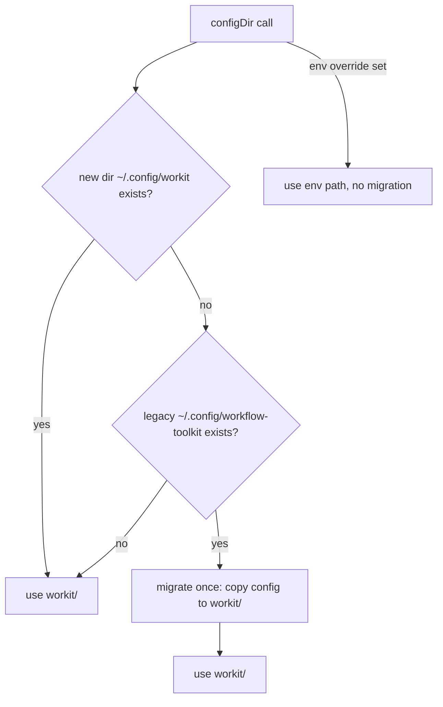

# Spec: Config dir → workit + auto-migration

**Branch:** `feature/config-dir-workit`

## Context

`configDir()` defaults to `~/.config/workflow-toolkit/` (the OLD name) for EVERY installation — new installs of workit would create their config under the rebranded-out name. The rebrand spec deliberately kept the user's live config dir (G6: "NOT renamed" for stability), but the CODE default was never updated. Fix: the default becomes `~/.config/workit/` (current name), with a one-time automatic migration from the legacy dir when it exists and the new one doesn't.

## Goals

- G1: `configDir()` (and all derived paths: youtrack.json, vcs tokens, docs-repo.json) resolve to `~/.config/workit/` by default (respecting the same WORKFLOW_TOOLKIT_CONFIG / WORKFLOW_TOOLKIT_CONFIG_DIR / XDG env chain, unchanged).
- G2: One-time migration: when `~/.config/workit/` does NOT exist but `~/.config/workflow-toolkit/` DOES, copy the legacy config files (config.json, youtrack.json, vcs.json, workspaces.json, docs-repo.json, *.token, templates/) into `workit/` — then subsequent calls use the new dir. Idempotent: only migrates when the new dir is absent; never overwrites; never deletes the legacy dir.
- G3: The env overrides (WORKFLOW_TOOLKIT_CONFIG / WORKFLOW_TOOLKIT_CONFIG_DIR) bypass migration entirely (explicit user intent wins).
- G4: Scripts that resolve the config dir (init/apply.sh, vcs/config.sh, youtrack/config.sh, token-create-url, sync-runtime.sh rules dir) use the same resolution + migration so the CLI, MCP, and shell flows agree.

## Non-goals

- No deletion of the legacy `~/.config/workflow-toolkit/` dir (kept as a safety net; documented).
- No changes to the env var names (WORKFLOW_TOOLKIT_* stays — they're the override chain).
- No changes to the plugin/share paths (`~/.local/share/workflow-toolkit` stays — separate concern, already aliased).
- No forced migration for users who explicitly set WORKFLOW_TOOLKIT_CONFIG.

## Architecture

## Data flow / contracts

| Term | Meaning |
| --- | --- |
| NEW config dir | `~/.config/workit/` (default) |
| Legacy dir | `~/.config/workflow-toolkit/` (migration source, kept) |
| Migration trigger | New dir absent AND legacy dir present AND no env override |
| Migration action | Copy files (not move) — never deletes legacy; skip existing targets |
| `configDir()` | Single source of truth; derived paths call it (youtrack.ts, vcs-config.ts, docs-repo.ts) |

## Acceptance criteria

- CA-01: With no env override and no dirs present, `configDir()` = `~/.config/workit/`.
- CA-02: With legacy `~/.config/workflow-toolkit/` present (files inside) and no new dir, the first `configDir()` call copies the files to `~/.config/workit/` and returns the new path; a second call doesn't re-copy (idempotent).
- CA-03: With the new dir already present, no migration happens (legacy untouched).
- CA-04: With WORKFLOW_TOOLKIT_CONFIG (or CONFIG_DIR) set, `configDir()` returns it and NO migration runs.
- CA-05: Derived paths (youtrack.json, tokens, docs-repo.json) follow the same resolution in tests.
- CA-06: `bun run check` green; tests cover CA-01..CA-05; docs validate ok.

## Decisions

- D-01: User choice: `workit` default + automatic migration.
- D-02: Copy-not-move migration (safety; legacy kept as fallback).
- D-03: Migration is lazy (runs on first configDir() call), not a setup step — no new commands.
- D-04: Env overrides always win (no migration when set) — the documented escape hatch.

## Future work

- A `wk doctor` command that reports which config dir resolved and whether migration ran.
- Optional `--migrate` flag to remove the legacy dir after verification.
