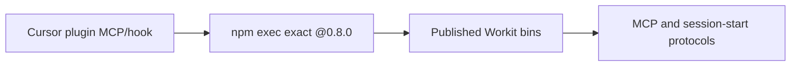

# Spec: Pin the Cursor npm runtime

**Branch:** `bugfix/cursor-npx-runtime-pin`

## Context

Cursor discovers the local `workit` plugin correctly but its MCP process exits
with `workit-cursor-mcp: not found`. The configured
`@brainervirus/workit-cursor@latest` command lets npm reuse a dist-tag-specific
`_npx` environment created before version 0.8.0 shipped its executable files.
That environment can contain updated 0.8.0 metadata while still lacking `dist/`
and the Workit bin links. A fresh cache works, and an exact `@0.8.0` invocation
works in both fresh and existing caches.

## Goals

- Pin Cursor MCP and session-start execution to the reviewed public runtime
  `@brainervirus/workit-cursor@0.8.0`.
- Make generated local registration, doctor checks, manifests, tests, and docs
  agree on the exact pin.
- Repair the real local Cursor installation without requiring global npm cache
  deletion.
- Publish a patch before submitting the prepared Cursor Marketplace application.

## Non-goals

- Deleting user npm caches as the product fix.
- Returning local Cursor installs to direct `node dist/...` execution.
- Changing MCP tools, hook output, skills, rules, branding, or Marketplace
  metadata.
- Submitting the Cursor publisher application before the patch release and live
  runtime verification.
- Automating future version selection from the mutable `latest` dist-tag.

## Architecture

The existing npm executables remain the only runtime entry points. Static Cursor
configuration and core registration helpers replace `@latest` with `@0.8.0`.
Doctor validates that exact package spec and rejects mutable or lookalike values.
Release documentation records that each reviewed Marketplace update must bump
the runtime pin deliberately after the target npm version is public.

## Data flow / contracts

| Surface | Contract |
| --- | --- |
| MCP package spec | `--package=@brainervirus/workit-cursor@0.8.0` |
| MCP executable | `workit-cursor-mcp` |
| Hook command | `npx -y --package=@brainervirus/workit-cursor@0.8.0 workit-cursor-session-start` |
| Doctor | Accepts the exact package and executable only |
| Local install | Rewrites user and plugin MCP/hook configuration to the exact pin |
| Marketplace | Remains unsubmitted until the exact public runtime passes live smoke tests |
| Future releases | Update the committed pin deliberately; never follow `latest` implicitly |

## Error handling

- A stale `@latest` npm environment is reproduced as evidence but is not deleted
  automatically.
- Exact-pin startup failure remains visible through Cursor MCP/hook diagnostics.
- The installer must not report a healthy Cursor registration if the configured
  exact runtime cannot start.
- Marketplace submission remains paused on any runtime, doctor, schema, or full
  verification failure.

## Acceptance criteria

- CA-01: No active Cursor manifest, registration helper, doctor expectation,
  installer fixture, or user documentation invokes
  `@brainervirus/workit-cursor@latest`.
- CA-02: MCP configuration uses `npx` with exact args `-y`,
  `--package=@brainervirus/workit-cursor@0.8.0`, `workit-cursor-mcp`, and
  `${workspaceFolder}`.
- CA-03: The session-start hook uses the exact `@0.8.0` package and
  `workit-cursor-session-start` executable.
- CA-04: Doctor accepts the exact pin and rejects `@latest`, prerelease-like,
  prefix-shared, and executable-lookalike values.
- CA-05: Focused tests fail against the current `@latest` source and pass after
  the exact-pin change.
- CA-06: `npm exec --package=@brainervirus/workit-cursor@0.8.0` starts both
  published executables on Node 22.
- CA-07: Reinstalling Workit updates the real local Cursor settings while
  preserving unrelated MCP servers and settings; Cursor doctor passes.
- CA-08: `bun run check`, release-candidate verification, Marketplace validation,
  and workflow document validation pass before release.
- CA-09: README, Cursor package README, AGENTS.md, and CHANGELOG Unreleased state
  the pinned reviewed-runtime policy without claiming Marketplace submission.
- CA-10: Cursor Marketplace submission is performed only after the patch is
  public and a live exact-version MCP smoke test passes.

## Decisions

- D-01: Pin `0.8.0`; do not clear caches as the product fix.
- D-02: Keep npm-hosted runtime execution for local and Marketplace parity.
- D-03: Treat runtime-pin updates as reviewed repository changes.
- D-04: Pause the already-filled publisher application until release verification.

## Future work

- Bump the exact runtime pin for each reviewed Marketplace release after its npm
  artifact is public.
- Reconsider a mutable dist-tag only if npm provides cache-refresh semantics that
  are tested across upgrades adding new bins/files.
