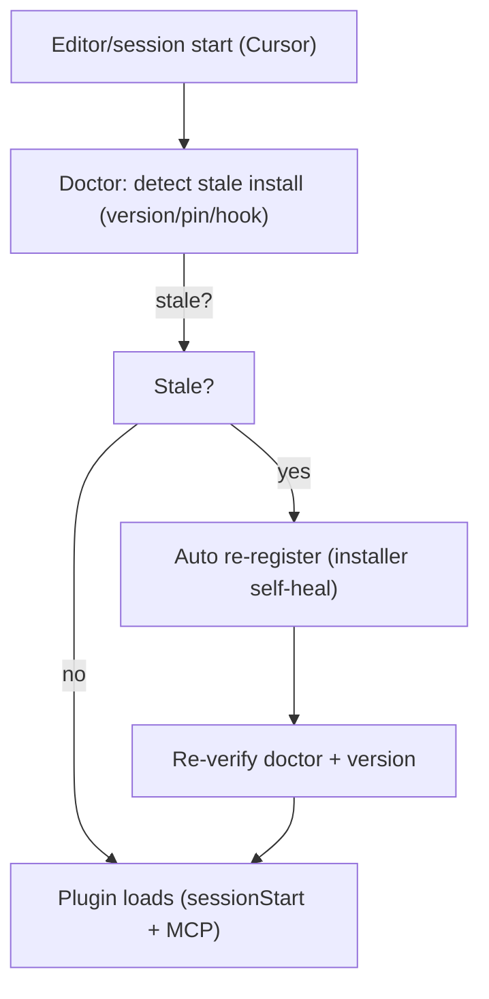

# Spec: Cursor plugin auto-load repair

**Branch:** `feature/cursor-plugin-autoload-repair`

## Context

Cursor did not load the workit plugin's workflow features automatically at session start; the user had to trigger it manually. Investigation found the installed plugin stale and internally inconsistent:

- `~/.cursor/plugins/local/workit` is **version 0.4.0** — its `dist/` predates the `workit_*` rename, the current flow state, and the completion contract.
- The plugin's own `mcp.json` pins `@brainervirus/workit-cursor@0.8.0` (stale npx pin).
- The plugin's `hooks/hooks-cursor.json` sessionStart runs the local 0.4.0 `dist/cursor-session-start.js`.
- Global `~/.cursor/mcp.json` runs the local 0.4.0 `dist/mcp-server.js`.

Cursor therefore executes an ancient runtime whose sessionStart hook stopped firing, so the plugin's MCP tools and rules never auto-register. The just-merged `@latest` + `--prefer-online` change fixes the *manifest selectors* going forward, but does not repair an already-installed stale plugin directory. Re-running `install-cursor-plugin.sh` manually fixes the machine, but nothing detects or automates that.

## Goals

- Detect a stale Cursor plugin install (version behind the latest published `@brainervirus/workit-cursor`, legacy npx pin, or a local-dist install whose dist is older than the runtime) in the doctor and the installer.
- Automatically re-register a stale install: refresh the plugin directory (or the npx pin / local-dist launcher) so the sessionStart hook and MCP entry run a current runtime.
- Make the doctor report stale-install status explicitly (`stale_install` finding) with the exact repair step, and the installer self-heal on stale state.
- Restore the intended auto-load: after repair, Cursor runs the sessionStart hook and MCP server on session start without a manual trigger.

## Non-goals

- No change to the `@latest` + `--prefer-online` selector policy from the merged runtime spec.
- No change to the OpenCode auto-load model (bootstrap injects on the first turn by design).
- No automatic deletion of user MCP servers/settings; only workit-owned registration is repaired.
- No new Marketplace submission claims.

## Architecture

The doctor gains a stale-install check: read the installed plugin's `package.json` version and its `mcp.json`/`hooks-cursor.json` selectors, compare the local-dist dist build against the current runtime, and surface a structured `stale_install` finding with the required repair action. The installer runs the same check before registering; if stale, it refreshes the plugin directory (sync from the share/dev root) and rewrites the workit MCP/hook entries to the canonical `@latest` + `--prefer-online` selector (or the current local-dist launcher), then re-runs the doctor to verify.

## Data flow / contracts

| Term | Meaning |
| --- | --- |
| Stale install | Installed plugin version < latest published `@brainervirus/workit-cursor`, or any legacy exact npx pin, or a local-dist install whose `dist/` is older than the runtime's current build. |
| Auto-load | Cursor invoking the sessionStart hook and starting the workit MCP server automatically per workspace at session start. |
| Self-heal | The installer detecting stale state and re-registering workit-owned Cursor entries without user intervention. |

| Contract rule | Required behavior |
| --- | --- |
| Stale detection | Doctor reads the installed plugin version + launcher selectors and compares against the current runtime/selector; reports `stale_install` with the concrete repair step when stale. |
| Installer self-heal | `install-cursor-plugin.sh` checks stale state before registering; on stale, refreshes the plugin dir and rewrites the workit MCP/hook entries to the canonical current selector, preserving unrelated settings. |
| Verification | After repair, the doctor reports a healthy registration and the installed version matches the current runtime. |
| Non-destruction | Unrelated MCP servers/settings are never touched; only workit-owned registration is repaired. |

## Error handling

- If the registry is unreachable during staleness comparison, the doctor reports the comparison as unavailable (`registry_unreachable`) rather than failing the install or claiming freshness.
- If the plugin dir is missing, the installer creates it fresh (existing behavior); the doctor reports `missing_plugin` until then.
- A repair that fails verification restores nothing it did not own and reports the failure stage; it never leaves partial unrelated changes.

## Acceptance criteria

- CA-01: The doctor detects a stale install — installed version behind latest, a legacy exact npx pin (`@0.8.0`-style), or an outdated local-dist — and reports a structured `stale_install` finding with the repair step.
- CA-02: `install-cursor-plugin.sh` self-heals a stale install: it refreshes the plugin directory and rewrites the workit MCP/hook entries to the canonical current selector (or current local-dist launcher), preserving unrelated MCP servers/settings.
- CA-03: After repair, the doctor reports healthy and the installed plugin version equals the current runtime; a focused test proves the stale → repaired transition.
- CA-04: A registry-unreachable staleness comparison fails open with `registry_unreachable` (no false `stale_install`, no install failure).
- CA-05: The real machine state is repaired: re-running the installer against the current stale 0.4.0 install produces a healthy registration whose sessionStart hook + MCP run a current runtime, and the doctor passes.
- CA-06: Auto-load is restored: after repair, Cursor's sessionStart hook fires and the workit MCP server registers per workspace without a manual trigger (verified on the real install).
- CA-07: Full repository verification passes: lint, format:check, tests, build, changelog (`bun run check` / `workit_verify`), plus `bun run validate:cursor-marketplace`.

## Decisions

- D-01: Add staleness detection to the doctor and self-heal to the installer rather than requiring a manual re-run, because the failure is machine-state drift that recurs whenever the plugin dir is not refreshed.
- D-02: Compare against the current runtime selector/version from `registration.ts` as the single source of truth, not a hardcoded version list.
- D-03: Repair only workit-owned Cursor entries (plugin dir, workit MCP/hook); unrelated user settings are preserved.
- D-04: Fail open on registry-unreachable staleness checks so a network blip never blocks install or falsely flags health.

## Future work

- Consider a sessionStart-hook self-check that triggers the repair from inside Cursor when the hook runs but finds a stale install.
- Consider surfacing `stale_install` in `workit_status` output so the user sees it without running the doctor.
