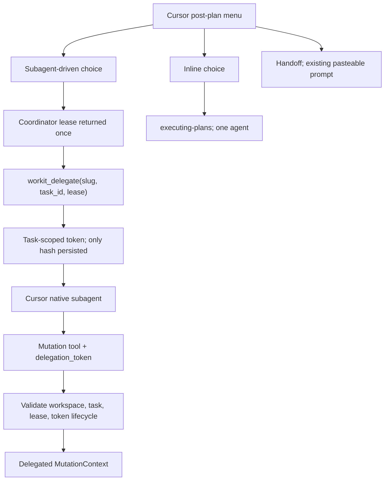

# Spec: Cursor subagent-driven execution + true inline

**Branch:** `feature/cursor-subagent-inline`

## Context

The Cursor host adapter currently disables subagent-driven plan execution: `cursorMutationContext` hard-codes `role: "coordinator"` and no task identity, while `recordMenuChoice` rejects `subagent-driven` on Cursor with `unsupported_mode`. OpenCode can derive a delegated role from a host-provided session `parentID`; Cursor does not expose that signal to the MCP server.

Cursor does have native subagents, so the host should use that capability rather than pretending Cursor and OpenCode have identical session APIs. The safe adapter boundary is a capability protocol: the coordinator receives a private lease when the Cursor menu records `subagent-driven`, mints a task-scoped delegation token with that lease, and passes only the delegation token to the native subagent. The MCP stores only token hashes and fails closed when a token is missing, invalid, revoked, or bound to another task/workspace. This is application-level capability validation, not a claim that Cursor supplies OpenCode-style host authentication.

Separately, Cursor Inline has been observed running the coordinator-plus-subagent pattern. Inline must instead use the single-agent `executing-plans` path. Cursor Handoff already produces a pasteable prompt for a hand-created next session and is intentionally unchanged.

## Goals

- Allow Cursor to record and execute `subagent-driven` plans through Cursor-native subagents using a coordinator lease plus task-scoped delegation tokens.
- Preserve the coordinator boundary: product mutations remain blocked for the coordinator while a subagent-driven plan is active.
- Validate delegation tokens against the current workspace, approved plan, active task, and token lifecycle; reject invalid inputs rather than downgrading them to coordinator identity.
- Make Cursor Inline single-agent by routing it to `executing-plans`; it must not mint delegation tokens or dispatch subagents.
- Keep OpenCode session-parentage delegation, CLI behavior, and Cursor's existing pasteable Handoff behavior unchanged.

## Non-goals

- No change to OpenCode's `parentID`-derived delegation model.
- No change to the CLI execution model; the CLI keeps its current host-native flow and receives parity coverage.
- No change to approval/receipt evidence semantics.
- No Cursor Handoff redesign; `workit_handoff_prompt` remains the pasteable-prompt path.
- No claim that a Cursor MCP token is equivalent to host-authenticated OpenCode session parentage.

## Architecture

When Cursor records `subagent-driven`, core stores only a hash of a coordinator lease and returns the raw lease once in the menu-tool result. `workit_delegate` requires that lease, validates the approved plan and an unfinished task, stores a hash of a task-scoped delegation token, and returns the raw token to the coordinator. The coordinator places the token in the native subagent prompt. Mutating Cursor tools accept `delegation_token`; the adapter validates it before constructing a delegated `MutationContext`. The token may be reused for mutations belonging to that task and is revoked when the task progress line is recorded or a new task token is issued.

## Data flow / contracts

| Term | Meaning |
| --- | --- |
| Coordinator lease | Opaque capability returned once when Cursor records `subagent-driven`; only its SHA-256 hash is persisted. It authorizes token minting but is never passed to a worker. |
| Delegation token | Opaque task-scoped capability returned by `workit_delegate`; only its hash is persisted. It is reusable for one active task and revoked at task completion. |
| Active task | An approved-plan task id that exists in the parsed plan and has not completed in the SDD ledger. Exactly one Cursor delegation token is active for it. |
| Delegated identity | `MutationContext.role === "delegated"` and `taskIdentity === String(task_id)` after token validation. |
| Inline | Single-agent execution through `executing-plans`; no token minting and no native subagent dispatch. |

| Contract rule | Required behavior |
| --- | --- |
| Lease issuance | Cursor `recordMenuChoice` creates a cryptographically random lease for `subagent-driven`, persists only its hash, and returns the raw lease once. Other choices do not issue one. |
| Token minting | `mintDelegateToken(root, slug, planPath, taskId, coordinatorLease)` checks the lease, approved plan, unfinished task, and active Cursor execution mode; it returns a random token and persists only its hash. |
| Token validation | `cursorMutationContext(root, delegationToken)` returns a delegated context only for a valid active token bound to the same root, slug, and task. Missing/invalid/revoked tokens return a structured failure. |
| Token lifecycle | A token is task-scoped, reusable within that task, atomically revoked when its task progress is recorded, and replaced when the next task is delegated. |
| Coordinator block | Coordinator product mutations remain blocked during subagent-driven execution; the lease-minting/delegation operations are narrow orchestration operations and do not edit product state. |
| Host adaptation | OpenCode uses `parentID`; Cursor uses lease/token capabilities; CLI behavior remains unchanged. |

## Error handling

- Missing or invalid coordinator leases reject `workit_delegate` with `coordinator_lease_invalid`.
- Missing, invalid, revoked, expired, wrong-task, or wrong-workspace delegation tokens reject the mutation with a structured `delegation_token_invalid` or `delegation_token_revoked` error. They never silently become coordinator context.
- Token hashes, raw leases, and raw delegation tokens are never written to flow state or diagnostic logs.
- Concurrent mint/consume/revoke writes use the existing flow-state atomic write path; a failed write issues no usable token.
- Inline never calls `workit_delegate` and never dispatches a native subagent.

## Acceptance criteria

- CA-01: Cursor `recordMenuChoice` accepts `subagent-driven`, records `execution.mode === "subagent-driven"`, returns a coordinator lease once, and no longer returns `unsupported_mode`.
- CA-02: `workit_delegate` requires the coordinator lease, approved plan, current workspace, and an unfinished `task_id`; it returns a task-scoped token while persisting only hashes and rejects coordinator-lease reuse or invalid leases.
- CA-03: A Cursor mutation with a valid token for the active task returns delegated context with `taskIdentity`; the same token can be reused for that task's allowed mutations and is revoked when its progress line is recorded.
- CA-04: Missing, invalid, revoked, wrong-task, and wrong-workspace tokens fail closed with structured errors; `cursorMutationContext` never downgrades an invalid token to coordinator identity.
- CA-05: Coordinator product mutations remain blocked during an active subagent-driven plan, while the narrow lease/delegation operations do not modify product state; concurrency tests cover token mint/revoke races.
- CA-06: Cursor `wk-implement`, execution contract, plan/doc contract, Cursor rules, and the Cursor Superpowers execution guidance route Subagent-driven to Cursor-native subagents with delegation tokens and route Inline to single-agent `executing-plans`.
- CA-07: Cursor Inline does not mint tokens or dispatch subagents; OpenCode keeps parentage delegation and CLI behavior remains unchanged, with host-parity tests covering all three adapters.
- CA-08: Cursor Handoff remains the existing pasteable prompt path and is not changed by this feature.
- CA-09: README, Cursor README, AGENTS.md, CHANGELOG Unreleased, and shipped Cursor templates explain the host-specific delegation difference without claiming Cursor has OpenCode parentID authentication.
- CA-10: `bun run check`, `workit_verify`, and `bun run validate:cursor-marketplace` pass.

## Decisions

- D-01: Use a coordinator lease plus task-scoped delegation token because Cursor has native subagents but no MCP-visible `parentID`. The lease prevents free-standing token minting; token validation is fail-closed application capability validation, not fabricated host identity.
- D-02: Reuse a token for one active task rather than consume it on the first mutation; otherwise a worker could not perform the required brief, implementation, review, and progress mutations. Revoke it at task completion and before the next task.
- D-03: Keep OpenCode's session-parentage model and Cursor's lease/token model separate; host adapters use the strongest mechanism each host provides.
- D-04: Route Cursor Inline to `executing-plans` and reserve `wk-implement`'s coordinator-plus-native-subagent path for Subagent-driven.
- D-05: Keep Cursor Handoff unchanged because its pasteable prompt already adapts OpenCode's native session-spawn capability to Cursor.

## Future work

- Add a bounded lease/token TTL after the task-scoped lifecycle is verified.
- Use a host-provided Cursor subagent identifier if Cursor later exposes one to MCP processes; it could replace the capability protocol without changing the shared delegated-worker contract.
