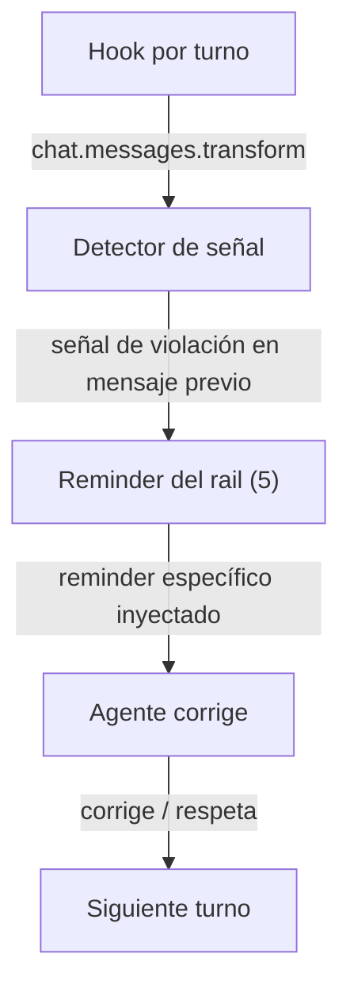

# Spec: Enforcement rails — verification/TDD/brainstorm/debugging/receiving

**Branch:** `feature/enforcement-rails`

## Context

The audit of vendored superpowers skills vs the toolkit's enforcement found 5 gaps: skills whose principles have no rail — `verification-before-completion` ("no completion claims without fresh verification evidence"), `test-driven-development` ("write the test first, watch it fail"), `brainstorming` ("no implementation until a design is presented and approved"), `systematic-debugging` ("no fixes without root-cause investigation first"), `receiving-code-review` ("verify before implementing"). Each is an agent claim the toolkit can detect post-hoc and remind about — the same reminder+detector+hook pattern already proven by SDD_REMINDER, DOC_RENDER, and CONFIG_GUARD.

## Goals

- G1: Five per-turn rail constants in `src/core/reminder.ts` — `VERIFICATION_TEXT`, `TDD_TEXT`, `BRAINSTORM_TEXT`, `DEBUG_TEXT`, `REVIEW_RECEPTION_TEXT` — each carrying the skill's core rule (mirroring the vendored skill wording, trimmed to one instruction).
- G2: One detector each in `src/core/detector.ts` — signal-based, conservative (prefer no-op over noise): verification (assistant claims done/fixed/passing/green without a check command output in the same message), TDD (implementation commit/diff without a preceding failing test), brainstorm (implementation action without a presented design), debugging (fix proposal without root-cause evidence), receiving (accepting review feedback without verification).
- G3: Hook injections in `src/plugin.ts` (distinct tags `"vf"`, `"tdd"`, `"br"`, `"db"`, `"rc"`), idempotent, fail-closed, composed with existing rails.
- G4: `workflow_verify`/`bun run check` stay the completion gate (the verification rail is a reminder; the real gate already exists in wf-implement's final gate).

## Non-goals

- No hard gates (reminders only — same policy as every existing rail).
- No new detectors for non-claim signals (e.g. no TDD enforcement on docs-only changes).
- No changes to the vendored skills themselves.
- No changes to wf-implement's final-gate behavior.

## Architecture

## Data flow / contracts

| Term | Meaning |
| --- | --- |
| Rail constant | `<workflow-*-rail>` block in `reminder.ts`, one per skill |
| Detector | `detect*` boolean fn in `detector.ts` — assistant-text signal, no file reads |
| Tag | Distinct part-id suffix per rail (`vf`/`tdd`/`br`/`db`/`rc`) |
| Injection | Only when the signal fired AND the current turn lacks the marker (idempotent) |

## Acceptance criteria

- CA-01: Five rail constants exist with the five Iron-Law instructions (asserted by text tests); each mentions the skill name.
- CA-02: Each detector fires on its canonical signal and NOT on a clean message (positive + negative tests): verification ("done"/"fixed"/"passing" without check output), TDD (code change without failing-test evidence), brainstorm (implementation without design), debugging (fix without root cause), receiving (review acceptance without verification).
- CA-03: Hook injects each rail once with its distinct tag when its detector fires; absent signal → no injection; idempotent; fail-closed (empty env, missing files).
- CA-04: Multiple rails can fire on one turn (distinct tags, no clobber).
- CA-05: `bun run check` green; docs validate ok.

## Decisions

- D-01: One spec for all five (user choice) — shared mechanics, single PR.
- D-02: Reminder-only enforcement (consistent with every existing rail; the hard completion gate already exists in wf-implement).
- D-03: Conservative detectors — false negatives preferred over false positives (the reminder is cheap, noise is expensive).
- D-04: Wording mirrors the vendored Iron Laws (the skills are the source of truth, not re-paraphrased).

## Future work

- Promote verification to a hard gate inside wf-implement's final gate (evidence-required) if reminders prove insufficient.
- Detector tuning from real usage (false-positive reports).
