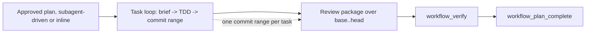

# Spec: Execution contract repair

**Branch:** `feature/execution-contract-repair`

## Context

Three defects in the execution contract surfaced repeatedly during real plan runs (workspace-routing-config-repair and menu-receipt-label-matching), all observed first-hand:

1. **Plans are never marked completed.** The `workflow_plan_complete` tool and `workit flow complete` CLI exist, but no skill contract (wk-implement, wk-handoff, subagent-driven-development) instructs the executing agent to call them. Twice in a row, a handoff/subagent-driven run finished all tasks with a complete ledger and passing verification while the plan stayed `active`; the coordinator had to complete it manually afterward.

2. **The commit rule contradicts the SDD machinery.** `plan-template.md` guidance and past plans say "Do not create per-task commits" and commit only at the end, but `sdd.ts` requires every progress line to carry `commits <sha>..<sha>` (`PROGRESS_RE`) and `sddReviewPackage` diffs `base_sha..head_sha` to build the review package. With no per-task commits, workers fabricate same-sha ranges (`ae2fab4..ae2fab4`) — an empty, meaningless diff — to satisfy the validator. The atomic per-task commit rule (one contiguous commit range per task) must be codified in the plan template and skill, and the validator should reject empty ranges.

3. **User-facing names still carry the old brand.** Tools and variables still show `workflow-toolkit` / `workflow` / `flowkit` in user-visible places: the `<workflow-toolkit-contract>` bootstrap marker, the `workflow_toolkit_status` and `workflow_toolkit_init_status` tool names, the YouTrack token default name `flowkit`, the share path `~/.local/share/workflow-toolkit`, and the `.workflow-toolkit-root` marker. Legacy-identity *detection* (removing old pins/registrations from configs, migration copy from the legacy dir) must stay — only user-facing names change.

This change repairs all three in one execution-contract boundary, shipped in three phases so each defect is independently reviewable.

## Goals

- Make plan completion part of the execution contract: every subagent-driven or inline run ends with `workflow_plan_complete` (or the CLI equivalent) once the ledger is complete and verification passes, with the skill contract saying so explicitly.
- Codify atomic per-task commits: each SDD task produces a contiguous, non-empty local commit range; fix rounds add commits; `sddReviewPackage` and the progress validator reject empty (`HEAD..HEAD`) ranges; plan-template text and wk-implement match the SDD machinery.
- Rename user-facing `workflow-toolkit`/`workflow`/`flowkit` surfaces to `workit` while preserving legacy-identity detection and migration paths exactly.

## Non-goals

- No Marketplace, release, or Cursor-pin work.
- No change to the legacy auto-migration copy contract (legacy dir detection stays).
- No change to evidence/receipt semantics, approval digests, or menu choice handling.
- No worktrees; guarded in-place branches only.
- No change to which choices the post-plan menu offers.

## Architecture

## Data flow / contracts

| Term | Meaning |
| --- | --- |
| Task commit range | The contiguous local commit range `base_sha..head_sha` a single SDD task produces, where `base_sha` is the previous task's head (or the merge base for task 1). |
| Plan completion | The `active|paused -> completed` lifecycle transition (`workflow_plan_complete` / `workit flow complete`) that runs the SDD ledger check and repository verification before storing `completed`. |
| Legacy-identity detection | Code that finds and removes old `workflow-toolkit` plugin/registration identities from user configs or migrates from the legacy config dir — renamed nothing, kept as-is. |
| User-facing surface | Tool names, CLI help, skill text, markers, token defaults, and share paths a user sees or interacts with directly. |

| Contract rule | Required behavior |
| --- | --- |
| Atomic commits | Every SDD task lands exactly one contiguous non-empty commit range; fix rounds append commits to that range; no amending/rewriting an active review range. |
| Empty-range guard | `sddReviewPackage` and the progress validator reject `base == head` (zero-commit) ranges with a structured error. |
| Completion | Executing agents call `workflow_plan_complete` after the final task once verification passes; the skill contract mandates it, and `workflow_plan_complete`'s existing gates (complete ledger, green verification) are the only conditions. |
| Naming | User-facing `workflow-toolkit`/`workflow`/`flowkit` identifiers are renamed to `workit`; legacy detection/migration code is untouched. |

## Acceptance criteria

- CA-01: wk-implement, wk-handoff, and subagent-driven skill contracts explicitly require ending execution with `workflow_plan_complete` (or CLI equivalent) after the final task, ledger completion, and green verification; no run may finish while the plan is `active`.
- CA-02: `plan-template.md` and execution skill text codify one contiguous non-empty commit range per task, with fix rounds appending commits and no rewriting of an active review range; the "do not create per-task commits" wording is replaced.
- CA-03: `sddReviewPackage` rejects a zero-commit range (`base_sha == head_sha`) with a structured error instead of producing an empty diff; the progress-line validator likewise rejects `commits <same>..<same>`.
- CA-04: A parity test proves a task with a real commit range reviews cleanly and a same-sha range fails, through core, OpenCode tool, Cursor MCP, and CLI surfaces.
- CA-05: User-facing names use `workit`: the bootstrap contract marker, `workflow_toolkit_status`/`workflow_toolkit_init_status` tool names (renamed to `workit_status`/`workit_init_status` or similar documented names), the YouTrack token default name, the share path, and the `.workflow-toolkit-root` marker — with README/AGENTS/CHANGELOG updated.
- CA-06: Legacy-identity detection and migration paths (removing old `workflow-toolkit` pins/registrations, copying from the legacy config dir) still function; existing doctor/migration tests keep passing unchanged.
- CA-07: Full repository verification passes: lint, format:check, tests (including a new completion-contract test asserting a completed plan post-run), build, changelog.
- CA-08: All three changes ship in one PR with phase-scoped commits (Phase 1 completion contract, Phase 2 atomic commit contract + empty-range guards, Phase 3 naming) so each defect is independently reviewable.

## Decisions

- D-01: Treat completion, commit atomicity, and naming as one execution-contract repair because all three are properties of how a plan run is specified and executed; separate phases keep review tractable.
- D-02: Make the completion step explicit in skill contracts (the contract is the fix) rather than adding a hidden side effect — the plan-complete tool already enforces ledger + verification gates.
- D-03: Codify one commit range per task and make the validators reject empty ranges, aligning the plan text with the SDD machinery instead of relaxing the machinery.
- D-04: Rename only user-facing surfaces; legacy-identity detection stays byte-identical to keep existing installs' cleanup and migration correct.

## Future work

- Consider a CI-level gate that fails a run whose final flow state is not `completed` after a subagent-driven execution.
- Consider enforcing the per-task commit range in the SDD review tool automatically (resolve base from the task ledger) instead of caller-supplied shas.
