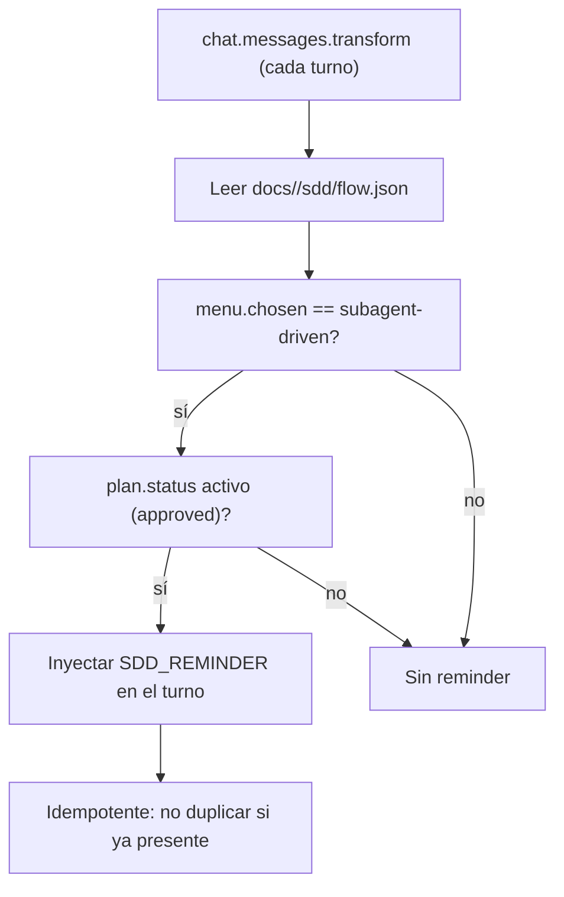

# Spec: Flow rails — issue prompt fix + subagent-driven enforcement

**Branch:** `feature/flow-rails`

## Context

Two enforcement gaps surfaced in the NSAT-9 session (ses_0227dc417ffeqLhBcU3UX5Ze7l) and in the hygiene spec execution:

1. **Issue prompt anti-pattern**: `wf-issue-update` instructed the agent to "require the user-provided issue URL or ID", but the agent implemented it as a native `question` with a single clickable option labeled `Type the issue URL/ID`. Clicking an option returns the **label literal** as the answer, not free text — the flow dead-ended ("You selected 'Type the issue URL/ID' but didn't include it") and the user had to paste the URL as a manual message.
2. **Subagent-driven not enforced**: the hygiene spec was approved as subagent-driven (menu chosen), but was implemented inline in the same session (direct edits + commits). The plugin has per-turn reminders for bounded choices and doc delivery, but nothing reads `docs/<slug>/sdd/flow.json` to remind the agent that the plan's execution mode is subagent-driven.

## Goals

- G1: `wf-issue-update` never presents a clickable option whose label is an instruction to type free text; the issue URL/ID is requested in plain prose with the custom answer field.
- G2: Per-turn reminder injected while a plan with `menu.chosen === "subagent-driven"` is active, telling the agent to execute via `wf-implement`/`task`, not inline.
- G3: Both behaviors are idempotent (no duplicate reminders) and fail closed (broken/missing flow.json → no crash, no reminder).

## Non-goals

- No change to the post-plan `question` menu itself (the four options stay).
- No change to the prose-choice detector (`DETECTION_TEXT`) or doc delivery detector.
- No automatic blocking of inline work; the rail is a reminder, not a gate.

## Architecture

## Data flow / contracts

| Term | Meaning |
| --- | --- |
| `flow.json` | `docs/<slug>/sdd/flow.json` — spec/plan status + `menu.chosen` persisted by `recordMenuChoice` |
| `menu.chosen` | `"subagent-driven"` \| `"inline"` \| `"handoff"` \| `"review-spec"` \| `"review-plan"` |
| Active plan | `plan.status === "approved"` and the `progress.md` ledger shows at least one unfinished task |
| `SDD_REMINDER_TEXT` | New reminder constant in `src/core/reminder.ts` |

## Acceptance criteria

- CA-01: `wf-issue-update` skill text instructs asking for the issue URL/ID in plain prose (custom answer), explicitly forbidding clickable options whose label is an instruction like "Type the issue URL/ID".
- CA-02: A per-turn hook reads every `docs/*/sdd/flow.json` reachable from the working directory; when `menu.chosen === "subagent-driven"` and the plan status is active, the turn gets one `SDD_REMINDER_TEXT` injection.
- CA-03: The injection is idempotent — the same reminder text is not duplicated within a turn (per-turn re-injection is the design).
- CA-04: Missing, malformed, unreadable, or plan-complete flow.json (or no docs/ dir) yields no reminder and no hook error.
- CA-05: `workflow_verify` and `bun run check` stay green with new tests covering CA-02/CA-03/CA-04.

## Decisions

- D-01: Per-turn reminder (user choice) over post-hoc detection — simple, robust, covers all execution turns, not just the ones after a tell-tale assistant message.
- D-02: Reminder, not a hard gate — consistent with existing rails (`REMINDER_TEXT`, `DETECTION_TEXT`); the agent remains able to escalate a deviation to the user.
- D-03: Both fixes land in one spec (`flow-rails`) — user choice; both are small, related enforcement changes.
- D-04: Issue prompt fix lives in the skill text, not a detector — the anti-pattern is an instruction gap, so the skill is the root cause.

## Future work

- Promote the rail to a hard gate (deny inline tools while subagent-driven is active) if reminders prove insufficient.
