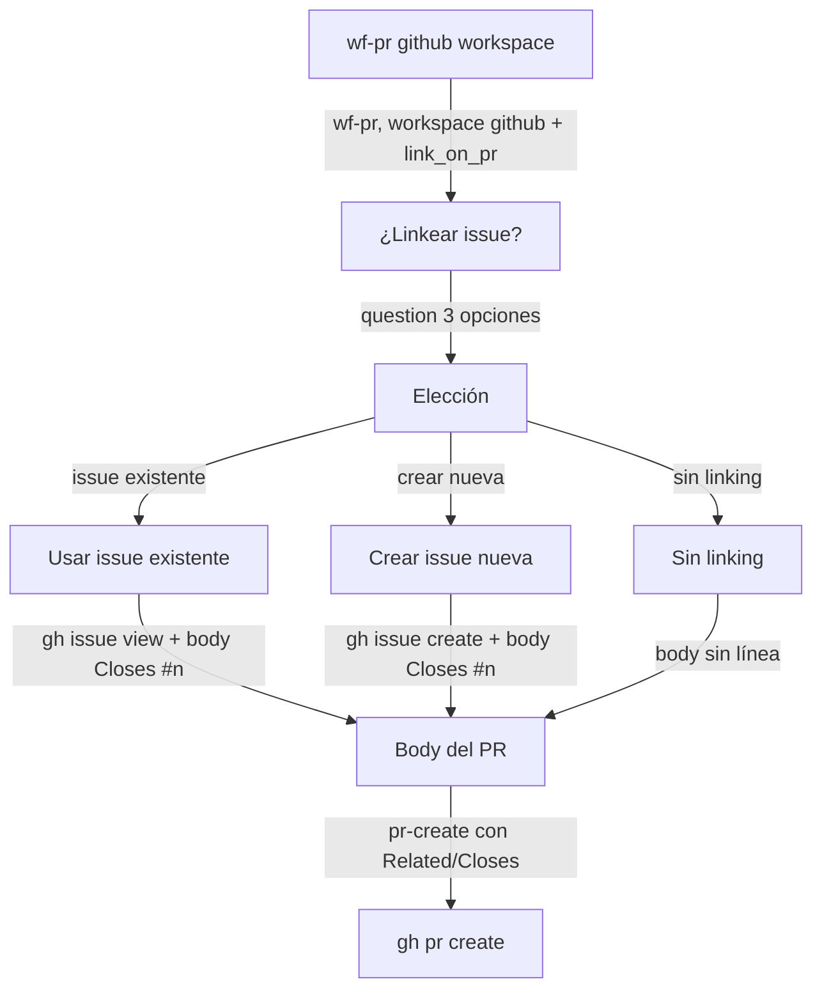

# Spec: GitHub issues linking — crear/usar/skip

**Branch:** `feature/gh-issues-linking`

## Context

The vcs-workspaces spec added PR↔issue linking for YouTrack (`youtrack.link_issues`). The user's personal workspace uses GitHub for everything — issues live in GitHub, not YouTrack. The config already carries `issues: { provider: "github", link_on_pr: true }` (written to the user's workspaces.json) but the toolkit ignores it. This spec adds the GitHub-side flow: when creating a PR in a github workspace with `link_on_pr`, ask with native `question` — three options: use an existing issue / create a new one (`gh issue create`) / skip linking.

## Goals

- G1: `config.sh` and `resolveWorkspace` recognize `issues: { provider: "github", link_on_pr }` (and keep `youtrack.link_issues` for work workspaces).
- G2: `wf-pr` skill flow, when the resolved workspace is github + `link_on_pr` and no issue is already known (env or branch-derived), asks with native `question`: (1) use an existing issue — user provides the number/URL; (2) create a new issue via `gh issue create`; (3) skip linking. A branch-derived issue id (e.g. `feature/123-title`) still auto-links without asking.
- G3: `pr-create.sh` supports github issue linking: body gets `Closes #<n>` (when the PR resolves the issue) or `Related to #<n>` + the GitHub issue URL; the choice (closes vs related) is conveyed via env from the skill flow.
- G4: Missing `gh` already errors with the CLI guard (from vcs-workspaces) — the create-issue path reuses the same guard/install-link flow.

## Non-goals

- No YouTrack changes (work workspace flow stays as shipped).
- No auto-linking without user choice (question is mandatory when no issue is derivable).
- No cross-provider issue creation (gitlab issues are out of scope).
- No change to the workspaces.json schema beyond what the user's config already carries.

## Architecture

## Data flow / contracts

| Term | Meaning |
| --- | --- |
| `issues: { provider: "github", link_on_pr }` | Workspace field (user's config already has it) — recognized by config.sh resolve |
| `WORKFLOW_GH_ISSUE` | Env conveying the issue number to pr-create (e.g. `42` or `#42`) |
| `WORKFLOW_GH_ISSUE_RELATION` | `closes` (default) or `related` — the body line prefix |
| Body line | `Closes #42` / `Related to #42` (+ URL `https://github.com/<owner>/<repo>/issues/42` when related) |
| Branch-derived | `feature/42-title` → auto-link `#42` without asking (consistent with the youtrack regex, github uses pure numbers) |

## Acceptance criteria

- CA-01: config.sh resolve returns `issues_provider: "github"` and `link_on_pr` for the personal workspace; youtrack fields remain null; work workspace unchanged.
- CA-02: pr-create.sh github path: with `WORKFLOW_GH_ISSUE=42` + relation closes → body contains `Closes #42`; relation related → `Related to #42` + URL; no env → no line (unless branch-derived).
- CA-03: Branch-derived github issue: `feature/42-title` → auto `Closes #42` (no question needed); `feature/foo` → no line.
- CA-04: `wf-pr` skill text documents the three-option question (existing / create via `gh issue create` / skip) when no issue is derivable; the create path reuses the CLI guard.
- CA-05: `bun run check` green; tests cover CA-01..CA-03; docs validate ok.

## Decisions

- D-01: Native `question` with exactly three options (user choice): use existing / create new / skip.
- D-02: `Closes #n` by default; `Related to #n` + URL when the PR is not meant to resolve the issue (env-driven).
- D-03: Auto-link from branch when derivable (no friction); question only when nothing is derivable.
- D-04: Create-issue reuses `gh` + the existing missing-CLI guard (install link flow from vcs-workspaces).

## Future work

- `flowkit` wizard step to set `issues` per workspace.
- GitLab issues linking (work side) if the user ever wants MR↔issue on gitlab.
