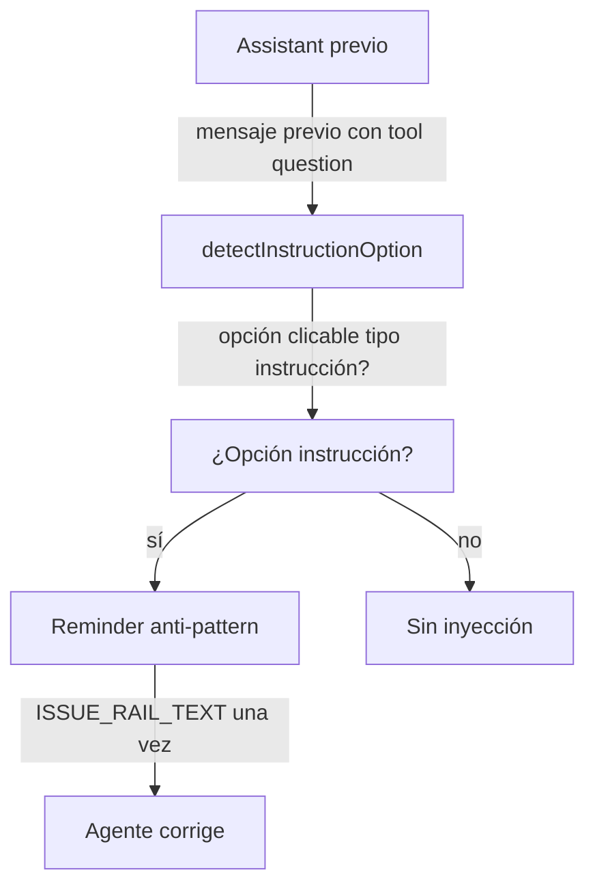

# Spec: Issue rail — detección post-hoc del anti-pattern de question

**Branch:** `feature/issue-rail`

## Context

The `wf-issue-update` skill now forbids the anti-pattern (a clickable `question` option whose label is an instruction like "Type the issue URL/ID" — clicking returns the label literal, not free text), but the bug still surfaced twice in real sessions before the fix: the agent asked for the issue with a single clickable option labeled "Type the issue URL/ID", the user clicked it, the answer was the literal label, and the flow dead-ended ("You selected 'Type the issue URL/ID' but didn't include it"). The skill text prevents it going forward, but there is no post-hoc rail — no detector that catches the agent actually doing it and reminds it. This spec adds that rail: detect `question` tool calls with instruction-labeled options in the previous assistant message and inject a one-shot reminder.

## Goals

- G1: `detectInstructionOption(questionCall)` — given a `question` tool-call input (the questions array with options), true when any option's label is an instruction to type/provide/paste free text (label matches `^(type|provide|paste|enter|write|give me)\b.*\b(url|id|issue|text|notes|number)\b` (case-insensitive) — e.g. "Type the issue URL/ID").
- G2: The per-turn hook inspects the previous assistant message's `question` tool calls; if any option is instruction-labeled → inject `ISSUE_RAIL_TEXT` (reminder: clicking an option returns the label literal — ask for free text in prose with the custom answer field, never as a clickable option).
- G3: `ISSUE_RAIL_TEXT` is specific, actionable, and mirrors the skill's wording (so the reminder and the skill agree).
- G4: Idempotent (one injection per turn), fail-closed (malformed tool input → no crash, no injection), composes with the existing rails (distinct tag).

## Non-goals

- No change to the skill (already fixed in flow-rails).
- No hard gate (reminder only — consistent with every rail).
- No detection of other question anti-patterns (e.g. A/B/C options for non-free-text) — those are covered by DETECTION_TEXT's prose-choice detector.
- No change to how `question` works (that's opencode's contract).

## Architecture

## Data flow / contracts

| Term | Meaning |
| --- | --- |
| `question` tool call | A part with `tool === "question"` in the assistant message; input has `questions: [{ header, options: [{ label }] }]` |
| `detectInstructionOption(input)` | Boolean — any option label matching the instruction pattern |
| `ISSUE_RAIL_TEXT` | `<workflow-issue-rail>` block in `reminder.ts` |
| Tag | `"ir"` — distinct part-id suffix |

## Acceptance criteria

- CA-01: `detectInstructionOption` fires on "Type the issue URL/ID", "Provide the issue ID", "Paste the URL", "Enter the issue number" — and does NOT fire on real choices ("Use IRPT-12", "Use session facts", "No time", "Skip").
- CA-02: The hook injects `ISSUE_RAIL_TEXT` once when the previous assistant message contains a `question` call with an instruction-labeled option; no injection otherwise; idempotent (marker already present → no re-inject).
- CA-03: Fail-closed: malformed question input (missing options, non-array, null) → detector false, no crash.
- CA-04: `ISSUE_RAIL_TEXT` wording matches the skill's rule (label-literal mechanism + prose-with-custom-answer fix).
- CA-05: `bun run check` green; tests cover CA-01..CA-04; docs validate ok.

## Decisions

- D-01: Post-hoc detection on the previous assistant message (same pattern as DETECTION_TEXT/DOC_DELIVERY — the hook already inspects `lastAssistant.parts` and can read `question` tool calls).
- D-02: Regex pattern on option labels — conservative: only clear instruction verbs (Type/Provide/Paste/Enter/Write/Give me) + a free-text noun (URL/ID/issue/text/notes/number); versioned in one constant for tuning.
- D-03: Reminder only (never a gate) — the skill already forbids it; the rail catches the residual case.
- D-04: Mirrors the skill wording verbatim so both sources agree.

## Future work

- Extend to other free-text prompts (e.g. "Tell me your notes") if the pattern misses real cases.
- Hook-level integration test driving the transform with a mock question part (if the hook becomes unit-testable).
