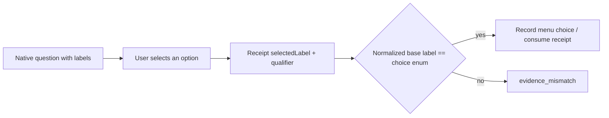

# Spec: Menu receipt label matching

**Branch:** `bugfix/menu-receipt-label-matching`

## Context

Flow mutations that depend on a native-question receipt compare the recorded `selectedLabel` against the expected enum value with exact case-insensitive matching (`sameChoiceLabel` in `flow-state.ts`). Hosts routinely decorate question labels with qualifiers — OpenCode's question tool appends `(Recommended)` to the recommended option, and the post-plan contract renders `Handoff (new session only)` for display. Any qualifier makes the stored label fail the comparison:

- `workflow_plan_menu [choice=handoff]` rejected a receipt whose label was `Handoff (new session only)` (`evidence_mismatch`), leaving a seeded handoff session unselected and the flow unmarked.
- `workflow_plan_menu [choice=subagent-driven]` rejected `Subagent-driven (Recommended)`, prompting the user a second time.

Both failures happened in real usage during the `workspace-routing-config-repair` execution. The approval transitions (`transitionSpec`/`transitionPlan`) are immune because they never compare labels, but menu recording and the receipt store's label filter do. The comparison must be robust to host-added qualifiers so no menu option can ever fail to bind, while still rejecting genuinely mismatched or fabricated receipts.

## Goals

- Make `workflow_plan_menu` bind every one of the five source menu options (`Subagent-driven`, `Inline`, `Handoff`, `Review spec first`, `Review plan first`) and the four destination options regardless of host-added qualifiers such as `(Recommended)` or `(new session only)`.
- Make the receipt-store label filter accept the same normalized forms so handoff marking, approvals, and lifecycle transitions never reject a qualifier-decorated label.
- Keep rejecting receipts whose base label genuinely does not match the expected choice (fabrication/forgery guard unchanged).
- Prove with focused tests that each menu option works with plain, `(Recommended)`-decorated, and `(new session only)`-decorated labels through core, OpenCode tool, and Cursor surfaces.

## Non-goals

- No change to which choices exist or their stored enum values.
- No change to negative-answer handling, freshness, or one-use receipt semantics.
- No change to Cursor's policy-only confirmation shape.
- No Marketplace, release, or rename work.

## Architecture



The post-plan menu the host renders carries display qualifiers; the receipt stores the decorated label and the flow compares the normalized base:

```text
┌──────────────────────────────────────────┐
│ Execute the approved plan               │
│                                          │
│   ○ Subagent-driven                     │
│   ○ Inline                              │
│   ● Handoff (new session only)          │
│   ○ Review spec first                   │
│   ○ Review plan first                   │
│                                          │
│            [Confirm]  [Cancel]          │
└──────────────────────────────────────────┘
```

Normalization strips parenthesized qualifiers, trims whitespace, and lowercases before comparison; the stored `selectedLabel` keeps its original bytes for provenance.

## Data flow / contracts

| Term | Meaning |
| --- | --- |
| Base label | The enum value the flow stores, e.g. `subagent-driven`, `handoff`, `inline`, `review-spec`, `review-plan`. |
| Decorated label | A host-rendered label such as `Subagent-driven (Recommended)` or `Handoff (new session only)`. |
| Normalized form | The base label derived by removing parenthesized qualifiers, collapsing whitespace, and lowercasing. |

| Input label | Expected enum | Matches |
| --- | --- | --- |
| `Subagent-driven` | `subagent-driven` | yes |
| `Subagent-driven (Recommended)` | `subagent-driven` | yes |
| `Handoff` | `handoff` | yes |
| `Handoff (new session only)` | `handoff` | yes |
| `Review spec first` | `review-spec` | yes |
| `Inline` | `inline` | yes |
| `Implement` | `inline` | no (base label differs) |

The single shared matcher normalizes both sides; every caller (receipt-store label filter, menu evidence check, any future label-gated transition) uses it.

## Acceptance criteria

- CA-01: `workflow_plan_menu` records `subagent-driven`, `inline`, `handoff`, `review-spec`, and `review-plan` when the receipt label is the plain display form, the `(Recommended)` form, or the `(new session only)` form.
- CA-02: The four destination options record identically on a marked handoff destination.
- CA-03: A receipt whose base label genuinely differs from the requested choice is still rejected with `evidence_mismatch` (e.g. `Implement` for `inline`, `Handoff` for `review-spec`).
- CA-04: The receipt-store `consume` label filter accepts qualifier-decorated labels for the same expected value, so handoff marking and lifecycle transitions bind without re-asking.
- CA-05: The stored `selectedLabel` and evidence record preserve the original decorated bytes for provenance; only the comparison normalizes.
- CA-06: Parity tests exercise plain and decorated labels through core transitions, the OpenCode tool wrapper, and Cursor MCP/CLI surfaces with identical accept/reject outcomes.
- CA-07: Existing negative-answer, freshness, one-use, and fabrication tests keep passing unchanged.
- CA-08: Full repository verification (lint, format, tests, build) succeeds.

## Decisions

- D-01: Normalize inside the shared `sameChoiceLabel` matcher (strip parenthesized qualifiers, trim, lowercase) rather than asking hosts to stop decorating labels — hosts legitimately annotate recommended options, and the contract renders `Handoff (new session only)`.
- D-02: Keep original label bytes in the evidence record; normalization is comparison-only, preserving audit provenance.
- D-03: Reject on base-label mismatch only — qualifiers never grant acceptance to a different choice, so the fabrication guard remains effective.

## Future work

- Add a contract test asserting the question labels used by the OpenCode plugin match the documented display forms, so future label rewording surfaces a test failure instead of a runtime `evidence_mismatch`.
