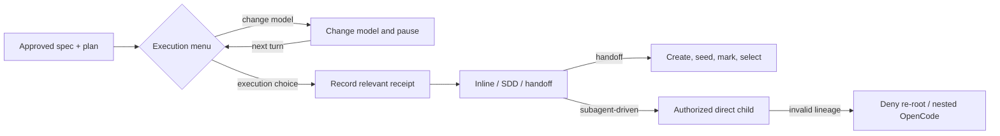

# Spec: OpenCode execution reliability

**Branch:** `bugfix/opencode-execution-reliability`

## Context

Real OpenCode runs exposed four related execution failures after spec and plan approval. An unrelated branch question replaced the execution-menu receipt, handoff created and seeded sessions before discovering that no `handoff` choice had been recorded, the coordinator was instructed to write SDD metadata that enforcement rejected, and a delegated worker used nested `opencode run` processes to manufacture a new child lineage after loading coordinator-only guidance. The same runs also made OpenCode's native `Continue opencode -s <session-id>` exit epilogue look like a Workit error because handoff sessions were titled `Continue <slug>`.

The failures were reproduced in the session trail rooted at `ses_fe00da1c4ffeL4YNg7LFw9wrlF`, including handoff destination `ses_fdff7b414fferNP7vWon9qZwPK`. They are one urgent execution-reliability boundary: native-choice correlation, handoff ordering, coordinator/worker ownership, and delegated lineage must agree before another feature is executed through this flow.

## Goals

- Correlate native-question receipts by workflow purpose so unrelated questions cannot invalidate an earlier execution-menu answer.
- Let users defer execution to change models from both OpenCode execution menus without selecting or activating an execution mode.
- Make handoff validate its recorded choice before creating a session and automatically select every successfully seeded non-`--stay` destination when the host supports selection.
- Make the coordinator own gitignored SDD control metadata while delegated workers alone own tracked product changes and task commits.
- Trust only direct children of the activating OpenCode coordinator and reject nested-OpenCode lineage laundering.
- Remove contradictory coordinator guidance from delegated worker context so a normal subagent-driven run has no expected startup failure.

## Non-goals

- No Pi host adapter, Pi companion profile, MCP/LSP curation, or Pi subagent identity work.
- No broad `workflow_*` to `workit_*` tool rename.
- No Cursor delegated-subagent implementation; Cursor remains inline-only until it exposes trustworthy child identity.
- No signed task leases or caller-supplied delegation tokens.
- No automatic opening of OpenCode's model picker; model selection remains a user-controlled host action.
- No replacement or suppression of OpenCode's native `Continue opencode -s <session-id>` recovery command.
- No worktrees and no weakening of approval digests, one-use receipts, freshness, or negative-answer rejection.
- No product implementation for GitHub roadmap persistence; creating and cross-linking the requested issues is session bookkeeping performed after this spec is reviewed and published.

## Architecture



The source menu has the five execution/review choices plus model deferral. A handoff destination omits the recursive Handoff choice but keeps model deferral:

```text
┌──────────────────────────────────────────────────────────────────┐
│ OpenCode post-plan execution                                     │
├──────────────────────────────────────────────────────────────────┤
│ Choose what happens next                                         │
│ ( ) Subagent-driven                                              │
│ ( ) Inline                                                       │
│ ( ) Handoff (new session only)                                   │
│ ( ) Review spec first                                            │
│ ( ) Review plan first                                            │
│ ( ) Change model first                                           │
├──────────────────────────────────────────────────────────────────┤
│ Change model pauses; the appropriate menu returns next turn.     │
└──────────────────────────────────────────────────────────────────┘
```

## Data flow / contracts

| Term | Meaning |
| --- | --- |
| Receipt purpose | Host-observed classification of a receipt-backed native question: `spec-approval`, `plan-approval`, `execution-menu`, `plan-pause`, `plan-resume`, or `plan-complete`. Unrelated questions produce no flow receipt. |
| Model deferral | `Change model first`; a display-only choice that leaves `menu.presented`, `menu.chosen`, and execution lifecycle state unchanged. |
| SDD control metadata | Gitignored task briefs, review packages, progress ledger, and advisories under `docs/<slug>/sdd/`; maintained by the coordinator through path- and content-gated Workit operations. |
| Product mutation | Tracked source, test, documentation, configuration, git, or external-system writes performed for a plan task; denied to the coordinator during subagent-driven execution. |
| Activating coordinator | The OpenCode root session whose accepted `subagent-driven` menu choice activates the plan. |
| Authorized worker | A session whose host-attested `parentID` exactly equals the activating coordinator session ID. |
| Re-rooted lineage | A fresh root process or a child whose direct parent is not the activating coordinator, including `worker -> opencode run -> root -> task -> child`. |

| Boundary | Required behavior |
| --- | --- |
| Receipt correlation | A transition consumes the newest unconsumed, fresh receipt for its exact purpose. The newest same-purpose negative answer rejects the transition; questions for another purpose neither replace nor authorize it. Original labels and question bytes remain audit evidence. |
| Menu recording | `workflow_plan_menu` is called immediately after a real execution/review choice and before implementation skills, branch questions, or handoff. `Change model first` never calls it. |
| Model deferral | The current turn stops after the deferral answer. On the next turn, the source six-choice menu or destination five-choice menu is presented again. |
| Handoff preflight | The source flow must be approved, valid, not already a destination, and have `menu.chosen === "handoff"` before session creation. A logical preflight failure creates no session. |
| Handoff sequence | A valid handoff creates, seeds, marks the destination, and, unless the exact `--stay` flag is present, publishes the TUI session-selection event. A successful host selection reports `selected: true`; an unavailable or failed host selection reports a `select` partial failure and preserves the session ID for manual recovery. |
| SDD ownership | The coordinator may call `workflow_sdd_task_brief`, `workflow_sdd_review_package`, `workflow_sdd_append_progress`, and a dedicated advisory append operation; these writes remain approval-, menu-, docs-, path-, and content-gated. Workers do not own coordinator bookkeeping. |
| Product ownership | The coordinator remains blocked from product edits, task commits, unbounded shell commands, and external mutations during subagent-driven execution. |
| Delegation identity | Subagent activation persists the coordinator session ID. OpenCode derives the current session and parent from host records; only an exact direct-parent match grants worker authority. Pause/resume preserves the ID; completion or approval drift clears it; non-subagent choices never set it. Missing or mismatched identity fails closed. |
| Nested harnesses | An authorized worker cannot launch `opencode` recursively while the plan is active. Review and fix workers are dispatched directly by the coordinator instead. |
| Worker guidance | A delegated session receives a worker-only contract: execute the supplied brief, use TDD, commit its task range, report results, and never load `wk-implement`, manage the coordinator ledger, or spawn another harness. |
| Host parity | OpenCode and Cursor expose model deferral in their native/policy question menus. Cursor's existing Subagent-driven choice continues to return `unsupported_mode` and leave execution pending. The CLI has no model host, so it preserves a pending flow until its caller selects an execution command; no fake CLI model selector is added. |

## Acceptance criteria

- CA-01: Host receipts retain original label, question, session, call, and timestamp evidence and also carry one exact purpose from `spec-approval`, `plan-approval`, `execution-menu`, `plan-pause`, `plan-resume`, or `plan-complete`, derived from the observed native question and never from model-supplied tool arguments; unrelated questions are not added to the flow receipt store.
- CA-02: Each approval, menu, and lifecycle consumer uses the newest fresh, unconsumed receipt for its exact purpose; an intervening unrelated question cannot cause `evidence_mismatch`, while the newest same-purpose negative answer and mismatched, stale, reused, or fabricated evidence remain rejected.
- CA-03: The ordinary post-plan menu contains exactly `Subagent-driven`, `Inline`, `Handoff (new session only)`, `Review spec first`, `Review plan first`, and `Change model first`; a handoff destination contains the same set without Handoff.
- CA-04: Selecting `Change model first` records no execution/review mode, leaves execution pending, ends the turn, and causes the appropriate menu to be presented again on the next turn after the user changes models.
- CA-05: A real execution/review answer is recorded with `workflow_plan_menu` before loading an execution skill, asking a branch/stash question, mutating branch state, or invoking handoff.
- CA-06: `workflow_handoff_session` rejects missing or non-handoff menu state before calling session creation, and tests assert zero create/seed/select calls on that path.
- CA-07: A valid non-`--stay` handoff follows create -> seed -> mark -> select and reports `selected: true` when the host selection API succeeds; an exact `--stay` handoff follows create -> seed -> mark and reports `selected: false` without publishing selection.
- CA-08: Handoff failures report `create`, `seed`, `mark`, or `select` stage with any available session ID; logical preflight failures cannot leave orphaned sessions.
- CA-09: Handoff session titles no longer start with `Continue`; user-facing guidance identifies OpenCode's native `Continue opencode -s <session-id>` epilogue as a valid manual recovery command when host selection is unavailable.
- CA-10: During active subagent-driven execution, the coordinator can create SDD task briefs, review packages, progress entries, and advisories under the validated gitignored SDD directory without receiving `coordinator_write_denied`; advisories use a dedicated append operation exposed through core, OpenCode, Cursor, and CLI surfaces rather than unrestricted file writes.
- CA-11: The same coordinator remains blocked from tracked product writes, task commits, disallowed shell commands, and external/configuration mutations; moving SDD metadata to the control plane does not weaken product-write enforcement.
- CA-12: Accepting `subagent-driven` records the activating OpenCode coordinator session ID in flow state and preserves it across pause/resume. Completion and approval drift clear it; inline, handoff, and review choices never set it; a later valid subagent activation after reset or in a handoff destination records the new coordinator ID.
- CA-13: A direct child whose host-attested `parentID` equals the activating coordinator can perform assigned product mutations; a root, unrelated child, re-rooted grandchild, missing lookup, or mismatched parent fails closed with a structured delegation-lineage error.
- CA-14: A delegated worker's shell call that launches `opencode` during an active plan is denied before process creation; ordinary task commands remain governed by the worker's normal tool permissions.
- CA-15: Delegated context is worker-specific and contains no instruction to load coordinator-only `wk-implement`, call nonexistent vendor SDD scripts, use `.superpowers/sdd`, create worktrees, or redispatch through another harness.
- CA-16: A literal OpenCode subagent-driven contract test covers menu answer -> menu recording -> branch setup -> coordinator task brief -> direct worker task -> coordinator review package/progress, with no expected failed tool call before useful work begins.
- CA-17: An adversarial test reproduces `authorized child -> nested opencode root -> new child` and proves both the nested launch and non-direct lineage are rejected.
- CA-18: Core, OpenCode, Cursor, and CLI parity tests prove identical state outcomes for supported menu and lifecycle operations, with documented host-native differences for model selection and delegated identity; Cursor selecting Subagent-driven returns `unsupported_mode` and leaves the flow pending.
- CA-19: README, AGENTS, OpenCode/Cursor contracts and skills, the canonical templates, and CHANGELOG Unreleased describe the new menus, SDD ownership, handoff behavior, direct-child boundary, and native recovery command consistently.
- CA-20: Full repository verification passes, including lint, format check, unit/integration tests, build, Cursor Marketplace validation, and package/doctor checks discovered by `workflow_verify`.

## Decisions

- D-01: Repair the four failures in one bugfix because receipt ordering, handoff selection, SDD ownership, and worker lineage are consecutive boundaries in one OpenCode execution path; separate fixes would retain contradictory intermediate states.
- D-02: Classify and consume receipts by host-observed question purpose instead of relying on the session's latest answer globally. This preserves one-use/freshness guarantees while preventing unrelated bounded questions from masking a valid choice.
- D-03: Keep model deferral outside the persisted execution-choice enum. It is a pause for a host action, not a sixth execution mode, so no new lifecycle branch or migration is needed.
- D-04: Keep handoff's create/seed/mark/select sequence, but move every deterministic logical check before create. Host failures remain structured partial results; contract failures cannot create waste.
- D-05: Treat gitignored SDD files as coordinator control-plane state. Product-write enforcement remains strict and becomes consistent with the existing `wk-implement` per-task loop.
- D-06: Bind delegated authority to the activating coordinator's direct children and deny nested OpenCode launches. This closes the observed bypass with existing host identity instead of introducing speculative bearer tokens.
- D-07: Adapt model deferral per host rather than adding a fake model picker to Workit's CLI. Workit controls workflow state; each harness controls its own model selection.

## Future work

- Build the Pi host adapter with a curated MCP/LSP/subagent profile and a provider-integrated child-attestation seam before enabling Pi subagent-driven execution.
- Refresh and execute the broad `workflow_*` to `workit_*` tool namespace rename before adding Pi so the new adapter starts on the final public names.
- Replace the stale Cursor delegated-subagent proposal with a narrow Cursor inline-contract repair until Cursor exposes trustworthy child identity.
- Consider upstreaming a generic attested-parent interface to host SDKs if direct-child identity becomes available outside OpenCode.
