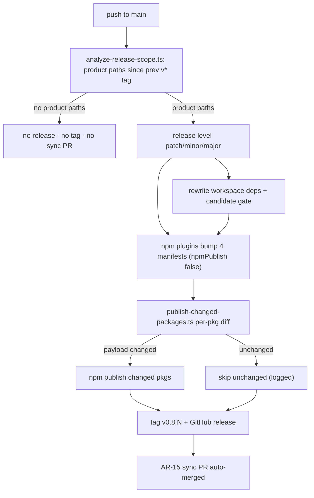

# Spec: Selective npm publishing with path-gated releases

**Branch:** `bugfix/release-selective-publish`

## Context

Every merge to `main` carrying a releasable commit (`fix`/`feat`/`perf`) republishes all four npm packages — even when the change touched only workflow YAML (v0.8.11 shipped for a CI-only fix). Root cause: `release.config.cjs` runs four unconditional `@semantic-release/npm` plugins, and the built-in commit-analyzer inspects commit messages only, never file paths. The result is registry churn, forced re-downloads, and releases that carry no product change.

## Goals

- A release is cut only when a releasable commit touches at least one product path under `packages/**`; tooling-only merges (`.github/`, `test/`, root docs) produce no release, no tag, and no sync PR.
- When a release runs, only packages whose payload files changed since the previous tag are published to npm; unchanged packages log an explicit skip line.
- The shared repo-wide version stays lockstep across all manifests; tags, GitHub releases, and the AR-15 manifest-sync PR behave exactly as today.

## Non-goals

- Independent per-package versions or per-package git tags.
- Migration to changesets or semantic-release-monorepo.
- Changing AR-15 sync behavior (it still aligns all six tracked manifests to the released tag).
- Suppressing releases by commit scope conventions alone (path evidence is the source of truth).

## Architecture

Two new Bun scripts in `packages/workit-core/scripts/`, wired through the existing `@semantic-release/exec` hooks:

1. **`analyze-release-scope.ts`** (`analyzeCmd`, replaces message-only `commit-analyzer`): resolves the previous `v*` tag, lists commits since it, resolves each commit's changed file set, keeps only commits touching **product paths**, parses conventional-commit types on that filtered set, and prints the winning release level (`major` > `minor` > `patch`). Prints nothing when no product-path commits exist — semantic-release then skips every later phase (no tag, no publish, no sync).
2. **`publish-changed-packages.ts`** (`publishCmd`, after the four npm plugins): for each of the four packages, diffs its directory since the previous tag; publishes via `npm publish --access public` only when the diff is non-empty. Runs inside each package's `pkgRoot` so setup-node's `.npmrc` auth applies. Logs one line per package: `publish <pkg>` or `skip <pkg> (no payload change since <tag>)`.

The four `@semantic-release/npm` plugins remain but with `npmPublish: false` — they still perform prepare-time version bumps so packed tarballs carry the released version.

## Data flow / contracts

| Term | Meaning |
| --- | --- |
| Product path | Any tracked file under `packages/workit-core/`, `packages/workit-opencode/`, `packages/workit-cursor/`, or `packages/workit-cli/`. Root-level `README.md`, `AGENTS.md`, `.github/`, `test/`, and `docs/` changes are non-product. |
| Payload change | At least one tracked file under `packages/<pkg>/` differs between the previous `v*` tag and `HEAD`. Manifest version-only churn cannot occur between tags because release-time bumps are written only inside the ephemeral CI checkout. |
| Previous tag | The newest existing `v*` git tag at analysis time. Absent on a first-ever release: treat as "all packages changed" and default level `minor`. |
| Release level | Max severity across product-path commits: BREAKING CHANGE → `major`, `feat` → `minor`, `fix`/`perf` → `patch`. Non-conventional subjects are ignored. |
| Lockstep version | All six tracked manifests continue to carry the single released version; selective gating affects only which packages reach the npm registry. |

## Acceptance criteria

- CA-01: A merge whose commits touch only non-product paths produces no release: no new tag, no npm activity, no AR-15 sync PR, and the workflow logs the empty analysis outcome.
- CA-02: A merge touching product paths under exactly one package publishes exactly that package to npm and skips the other three with logged skip lines.
- CA-03: A merge touching `packages/workit-core/src/core/support-matrix` (consumed by all adapters) publishes workit-core; adapter packages without their own payload changes remain skipped (their `^core` ranges stay satisfied).
- CA-04: Conventional parsing on product-path commits yields patch for `fix:`, minor for `feat:`, major for a BREAKING CHANGE footer, and the highest level wins when multiple commits mix severities.
- CA-05: Squash-merge subjects (`fix(scope): title (#N)`) parse like any conventional commit.
- CA-06: On a repository with no previous `v*` tag, the first release defaults to `minor` and publishes all four packages.
- CA-07: When a release fires, tarball versions equal the released version (prepare-time bumps preserved via `npmPublish: false`), and `rewrite-workspace-deps` ordering is unchanged (verify-time rewrite before npm verification, prepare-time rewrite after bumps).
- CA-08: The orchestration contract test pins the new pipeline shape: `analyzeCmd` present, four `npmPublish: false` plugins, `publishCmd` between the last npm plugin and `@semantic-release/github`.
- CA-09: Both scripts are covered by focused tests against fixture git repositories (tooling-only → no release; mixed tooling+product → release; per-package publish/skip matrix; BREAKING footer; first-run behavior), and full verification stays green.

## Decisions

- D-01: Path evidence over scope conventions — release decisions derive from `git diff --name-only <prevTag>..HEAD` filtered to `packages/**`, immune to mis-scoped commit messages.
- D-02: Keep lockstep versions; gate publishing only. Independent versions would break the plugin.json/core contract test, `rewrite-workspace-deps`, and AR-15's single-tag sync.
- D-03: Reuse `@semantic-release/exec` hooks instead of authoring a standalone plugin package — two scripts, zero new dependencies.
- D-04: Registry divergence is acceptable within lockstep — an unpublished package simply keeps its previous npm version while repo manifests advance; consumers pin `^0.8.x` ranges that remain satisfiable.
- D-05: The probe-style observability requirement extends here: every skipped package logs its reason, so release logs answer "what shipped?" without leaving the terminal.

## Future work

- Per-package changelogs derived from path-filtered commits.
- Promoting the probe/diagnostic pattern into a reusable release-health check.
