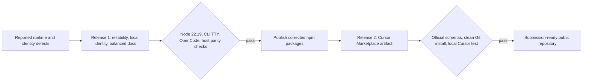

# Spec: Reliability and Cursor Marketplace readiness

**Branch:** `feature/reliability-marketplace-readiness`

## Context

Workit 0.7.1 has three user-visible defects: the CLI initialization wizard can
enter an infinite React render loop after an input change, routine structured
`info` logs leak into the CLI and OpenCode terminal UI, and a local Cursor
installation is still indexed under the legacy `workflow-toolkit` identity even
though its manifest says `Workit`. Installing the CLI on Node 22.19 also reports
an `ini@7` engine warning through a dependency tree that the bundled CLI does not
use at runtime.

The repository documentation no longer describes the current package behavior,
host-native differences, runtime requirements, command and tool surfaces, or
release process accurately. Cursor Marketplace publication also requires a
Git-discoverable plugin index, complete metadata, valid hooks and assets, and a
runnable MCP and hook strategy that does not assume Cursor builds the repository.

This work ships in two releases. Release 1 restores reliability, corrects the
local Cursor identity, and refreshes the documentation. After the corrected npm
packages are public, Release 2 makes the Git repository ready for Cursor's
authenticated Marketplace submission flow.

## Goals

- G-01: Make every controlled CLI wizard input settle after a user change,
  without React maximum-depth warnings or unbounded idle rerenders.
- G-02: Keep durable structured diagnostics without printing routine JSON
  records over interactive CLI or OpenCode terminal output.
- G-03: Support a Node ≥ 22 floor (the pinned Ink 7 requires Node ≥ 22), including warning-free CLI installation and execution on Node 22.19.
- G-04: Make `workit` the canonical Cursor local plugin identity and safely
  migrate exact legacy Workit registration and installation entries.
- G-05: Refresh the root and four package READMEs as balanced user and
  contributor references grounded in current code, tests, and release behavior.
- G-06: Publish a Git-discoverable Cursor plugin named `workit`, displayed as
  `Workit`, with complete metadata, a repository-owned logo, valid components,
  and documented security and data-handling behavior.
- G-07: Run the Marketplace MCP server and session-start hook through the latest
  public `@brainervirus/workit-cursor` npm package without committing generated
  JavaScript bundles to Git.
- G-08: Preserve Cursor/OpenCode feature parity through host-native adaptations
  rather than forcing identical logging, approval, implementation, commit, or
  handoff mechanics.
- G-09: Leave the public repository validated and ready for Marketplace
  submission after Release 2.

## Non-goals

- Publishing npm packages, tags, GitHub Releases, or submitting Cursor's
  authenticated publisher form as part of implementation.
- Renaming stable internal compatibility surfaces such as
  `WORKFLOW_TOOLKIT_*`, `.workflow-toolkit-root`, or
  `~/.local/share/workflow-toolkit` when they do not determine Cursor's UI
  identity.
- Removing persistent JSONL logs, OpenCode native app logs, CLI warning/error
  diagnostics, or Cursor's protocol-safe stderr diagnostics.
- Adding a custom logger framework, React state abstraction, package manager,
  Marketplace deployment service, or separate plugin repository.
- Committing Cursor MCP or hook JavaScript bundles to Git.
- Rewriting the 14 vendored Superpowers skills or changing their upstream
  behavior.
- Guaranteeing a Cursor Marketplace review timeline, acceptance, plugin-name
  availability, or undocumented publisher-form fields.
- Preserving exact legacy Workit Cursor entries after the replacement plugin has
  been installed successfully.

## Architecture



### Release 1: reliability and local identity

The CLI remains an Ink application using the existing wizard reducer. State
transitions become idempotent: a repeated controlled value returns the existing
state instead of constructing a new draft. This closes the feedback loop for the
platform `MultiSelect` and all controlled `TextInput` fields without adding
memoization wrappers or replacing `@inkjs/ui`.

```text
┌──────────────────────────────────────────────────────────────────┐
│ Stable CLI Interaction                                           │
├──────────────────────────────────────────────────────────────────┤
│ Workit setup                                                     │
│ Select platforms to configure                                    │
│ [x] OpenCode                                                     │
│ [ ] Cursor                                                       │
├──────────────────────────────────────────────────────────────────┤
│ Input settles while the user pauses.                             │
│ No React warnings or structured info logs appear.                │
│                           [ Continue ]                           │
└──────────────────────────────────────────────────────────────────┘
```

The shared logger continues to write redacted durable records. Adapters choose
host-appropriate presentation: CLI stderr accepts only `warn` and `error`,
OpenCode uses persistent JSONL plus `client.app.log()` without raw stderr, and
Cursor keeps stderr because stdout is reserved for MCP and hook protocols.

The OpenCode package build bundles the SDK surface used by the adapter instead
of leaving `@opencode-ai/plugin` as a published runtime dependency. The CLI keeps
its adapter package dependencies because setup resolves their package roots and
copies their host assets. Removing the OpenCode adapter's published SDK
dependency eliminates the OpenCode -> Effect -> `ini@7` install path while
retaining Node `>=22` (Ink 7 requires Node ≥ 22). Packed-artifact tests prove that OpenCode still loads
through its real package entry, the CLI can still install both adapters, and CLI
installation on Node 22.19 is warning-free.

Cursor local installation moves from
`~/.cursor/plugins/local/workflow-toolkit` to
`~/.cursor/plugins/local/workit`. Registration writes
`enabled_plugins.workit = true`. After the new copy and registration succeed,
the installer removes only known legacy Workit keys, plugin-dir entries, and the
legacy local directory. Unrelated Cursor settings and plugins remain unchanged.

### Release 2: Marketplace artifact

The repository root gains `.cursor-plugin/marketplace.json`, indexing
`packages/workit-cursor`. The package-level `.cursor-plugin/plugin.json` remains
the authoritative plugin manifest and carries the `workit` identifier, `Workit`
display name, author/publisher, repository, homepage, MIT license, discovery
metadata, and a relative path to a simple repository-owned SVG logo.

Cursor installs Marketplace plugins from Git and does not run this repository's
build. The 12 Workit skills and four rules remain tracked. The build-generated,
sanitized 14-skill Superpowers tree is also tracked under the Cursor package so
all declared skills exist in the submitted commit. CI rebuilds that tree and
fails on drift, missing skills, unexpected executable content, or invalid
frontmatter.

MCP and session-start runtime code is not committed. The Cursor package exposes
two minimal npm executable entries backed by its built artifacts. Marketplace
configuration invokes those entries with
`npx -y @brainervirus/workit-cursor@latest`. The hook uses Cursor's documented
single command-string shape. This deliberately allows npm runtime updates
without a Marketplace repository update; documentation states that trust and
review trade-off explicitly.

## Data flow / contracts

| Surface | Release contract |
| --- | --- |
| CLI controlled input | Repeating an unchanged value preserves state identity and causes no parent rerender. |
| CLI stderr | Human-visible `warn` and `error` diagnostics only; no routine structured `info` records. |
| OpenCode diagnostics | Redacted JSONL plus native `client.app.log()`; no direct `process.stderr` mirror. |
| Cursor diagnostics | Redacted stderr remains for stdio protocol safety; stdout remains protocol-only. |
| Node support | Published CLI, OpenCode, and Cursor artifacts run on Node 22+; Node 22.19 installation emits no Workit dependency engine warning. |
| Cursor local identity | Folder and enabled key are `workit`; exact legacy Workit identities are removed only after successful replacement. |
| Cursor display identity | Manifest `name` is `workit`; `displayName` is `Workit`. |
| Marketplace index | Root `.cursor-plugin/marketplace.json` points to `packages/workit-cursor`. |
| Marketplace runtime | MCP and hook commands use `npx -y @brainervirus/workit-cursor@latest` and package-provided executable entries. |
| Marketplace skills | All 12 Workit and 14 sanitized Superpowers skills referenced by the manifest exist in Git. |
| Marketplace updates | Git plugin metadata is manually reviewed by Cursor; npm `@latest` runtime updates independently. |
| Documentation | Root README is the product-wide reference; package READMEs explain package purpose, runtime, setup, surfaces, limitations, scripts, and links to shared guidance. |
| Version ledger | CHANGELOG records the reliability and Marketplace changes under Unreleased; source-manifest versus release-time version rewriting is documented. |

## Error Handling

- Repeated wizard input is a no-op, not an error, and does not discard draft
  state.
- CLI warnings and failures remain visible on stderr; suppressing routine
  `info` records must not suppress nonzero exits or human-readable errors.
- OpenCode native app-log failures remain non-fatal because durable JSONL is the
  fallback diagnostic sink.
- Cursor migration must install and register `workit` before deleting exact
  legacy Workit state. Partial failure reports the failed stage and leaves a
  recoverable installation.
- `npx` startup or network failure is surfaced by Cursor as an MCP or hook
  startup failure; Workit must not silently substitute stale local runtime code.
- Marketplace validation hard-fails on malformed manifests, missing component
  paths, invalid skill/rule frontmatter, missing logo, unsupported hook shape,
  or absent npm executable declarations.
- The session-start hook remains fail-open where Cursor's hook contract requires
  startup continuity, but emits valid protocol output and a diagnostic on
  runtime failure.

## Documentation Scope

| Document | User content | Contributor/reference content |
| --- | --- | --- |
| Root `README.md` | Product purpose, wizard and manual setup, host capability matrix, configuration, troubleshooting | Architecture, package layout, development checks, CI, release/versioning, credits |
| `packages/workit-core/README.md` | When consumers need core directly and when they do not | Shared module/assets ownership, exports, adapter boundary, package scripts |
| `packages/workit-cli/README.md` | `init`, `doctor`, TTY behavior, safe apply semantics, Node support | Build/typecheck scripts and packed CLI behavior |
| `packages/workit-opencode/README.md` | Installation, commands/skills/tools, approvals, delegation, handoff, diagnostics | Bundle/runtime model and package scripts |
| `packages/workit-cursor/README.md` | Local/npm/Marketplace installation, host limitations, configuration, security/data handling | Plugin layout, MCP/hook runtime, validation, publication/update process |
| `CHANGELOG.md` | User-visible fixes and Marketplace readiness | Release-time manifest rewriting and comparison links |

Documentation uses behavior and generated checks as the source of truth. It
avoids fragile manually maintained counts where a concise capability description
is sufficient. Where counts help users verify installation, tests must derive or
validate them from canonical registrations.

## Acceptance criteria

- CA-01: An Ink regression test changes the platform selector, pauses without
  submitting, and observes settled renders with no `Maximum update depth
  exceeded` warning.
- CA-02: Equivalent repeated values for every reducer-controlled platform and
  text field preserve state identity, while actual changed values still update
  the draft and navigation behavior.
- CA-03: Packed CLI help and interactive init emit no structured `info` JSON on
  stderr; warnings, errors, and nonzero failures remain visible.
- CA-04: OpenCode startup records `initialization`, `provenance`,
  `configuration_source`, and `assets` through durable/native logging without
  writing raw JSON to `process.stderr`.
- CA-05: Cursor MCP and session-start logging tests retain stderr diagnostics
  and protocol-clean stdout, proving the shared logger change did not flatten
  host behavior.
- CA-06: A clean install of the packed CLI on Node 22.19 emits no `EBADENGINE`
  warning from Workit's dependency tree, and packed CLI/OpenCode/Cursor smoke
  tests pass on supported Node versions.
- CA-07: The published OpenCode artifact loads through `dist/plugin.js` with no
  runtime `@opencode-ai/plugin` dependency, and its tool schemas and host hooks
  remain behaviorally equivalent.
- CA-08: A fresh Cursor local installation uses
  `~/.cursor/plugins/local/workit`, writes `enabled_plugins.workit = true`, and
  displays `Workit` from the plugin manifest.
- CA-09: Migrating an existing local installation removes exact
  `workflow-toolkit`, `local/workflow-toolkit`, and superseded Workit plugin-dir
  entries only after successful replacement; unrelated settings and plugin
  directories are byte-for-byte preserved.
- CA-10: Doctor, sync, install scripts, TypeScript setup, and host smoke tests all
  agree on the canonical local Cursor path and identity.
- CA-11: Root and package READMEs satisfy the documented scope table and contain
  no known stale runtime, host-parity, install, CI, versioning, or publication
  claims identified in the audit.
- CA-12: `CHANGELOG.md` records both staged changes under Unreleased and explains
  the source-versus-published version model without inventing missing releases.
- CA-13: Root `.cursor-plugin/marketplace.json` and package
  `.cursor-plugin/plugin.json` validate against the current official Cursor JSON
  schemas and consistently identify the plugin as `workit` / `Workit`.
- CA-14: The plugin manifest includes complete author/publisher, repository,
  homepage, MIT license, discovery metadata, and a valid relative path to the
  committed Workit SVG logo.
- CA-15: Every declared Workit and Superpowers skill and every rule exists in a
  clean Git checkout with valid frontmatter; the sanitized vendor tree matches
  the canonical source and contains no excluded executable artifacts.
- CA-16: The Cursor package exposes runnable MCP and session-start npm
  executables, and `npx -y @brainervirus/workit-cursor@latest` invokes each
  against the expected stdio contract on Node 22+.
- CA-17: Cursor's hook manifest uses the documented command-string format, and
  MCP configuration contains no repository-relative reference to an untracked
  `dist` file.
- CA-18: A clean local plugin copy at `~/.cursor/plugins/local/workit` loads the
  manifest, rules, all declared skills, MCP server, and session-start hook after
  **Developer: Reload Window**.
- CA-19: Cursor README documents installation, configuration, external Git/VCS
  and YouTrack interactions, local process execution, persistent logs, secret
  handling, `@latest` review drift, update behavior, and troubleshooting.
- CA-20: Release 1 verification passes before npm publication; Release 2
  verification runs only after a public `@brainervirus/workit-cursor` version
  containing the executable entries is available.
- CA-21: The final repository passes `bun run check`, release-candidate packing,
  official Cursor schema validation, and a clean-checkout Marketplace artifact
  validation without relying on ignored files.
- CA-22: The final implementation updates `README.md`, package READMEs,
  `AGENTS.md`, and the Unreleased `CHANGELOG.md` section as required by the
  repository parity contract.

## Decisions

- D-01: Deliver two staged releases: reliability/local identity/documentation
  first, Marketplace readiness second.
- D-02: Fix the CLI feedback loop in the existing reducer by making unchanged
  updates idempotent; do not replace Ink controls or add callback abstractions.
- D-03: Keep shared durable logging and adapt terminal sinks per host.
- D-04: Raise the Node support floor to `>=22` because the CLI's pinned Ink 7
  requires Node ≥ 22, while still removing the unused `ini@7` transitive
  dependency from the OpenCode package.
- D-05: Bundle the OpenCode SDK surface needed by the adapter and keep the CLI's
  adapter packages as required install assets rather than overriding `ini`
  resolution or removing setup inputs.
- D-06: Canonical Cursor branding is identifier `workit`, display name `Workit`.
- D-07: Migrate only exact known Workit legacy identities and retain unrelated
  internal compatibility names.
- D-08: Optimize each refreshed README as a balanced user and contributor
  reference, with the root README authoritative for shared product behavior.
- D-09: Use a simple repository-owned SVG Workit mark; add no design dependency.
- D-10: Invoke Marketplace MCP and hook runtime through
  `@brainervirus/workit-cursor@latest` via `npx`, accepting independent npm
  runtime updates as an explicit user-selected trade-off.
- D-11: Commit the sanitized Cursor Superpowers skill tree because Cursor must
  discover skills from Git, but do not commit generated JavaScript runtime
  bundles.
- D-12: Prepare and validate the repository only; Marketplace submission remains
  a later authenticated user action after publication.

## Future work

- Submit the validated public repository at
  `https://cursor.com/marketplace/publish` and address manual review findings.
- Replace `@latest` with a review-pinned runtime version if Cursor review policy
  rejects mutable npm execution or users require immutable reviewed code.
- Add Marketplace submission automation only if Cursor publishes a stable,
  supported API; do not automate browser form submission as release machinery.
- Add a dedicated branding package only if Workit needs assets beyond the single
  Marketplace logo.
