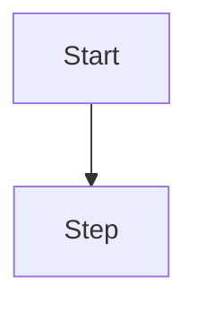

# Spec Quality: Systematic Formatting Implementation Plan

> **For agentic workers:** REQUIRED SUB-SKILL: Use superpowers:subagent-driven-development (recommended) or superpowers:executing-plans to implement this plan task-by-task. Steps use checkbox (`- [ ]`) syntax for tracking.

**Spec:** `docs/spec-quality/spec.md`
**Branch:** `feature/spec-quality`

**Goal:** Make spec/plan formatting add-ons always-on — quality templates that mandate ASCII wireframes (UI), mermaid diagrams (flows/architecture), and tables (glossary/contracts/scope), plus a validation quality pass that reports findings (advisory for drafts, hard gate at promote/implement).

**Architecture:** Two new templates (`templates/spec-template.md`, `templates/plan-template.md`) define the mandated structure with inline formatting rules. `src/core/docs-validate.ts` gains an opt-in quality pass (`qualitySpec(text)`) with heuristic findings (missing sections, missing CA-XX, missing ASCII for UI, missing mermaid for flow, missing table). The `workit_docs_validate` tool returns `quality: { passed, findings }` in its success envelope. The wf-implement skill and execution contract reference the templates and surface findings.

**Tech Stack:** TypeScript + zod (existing), `bun test`, existing `src/core` patterns. No new dependencies.

## Global Constraints

- Quality findings are structured data, never thrown: `{ code, message, severity: "warning" | "hard" }`.
- Severity: missing section / missing CA-XX = `hard`; missing diagram/table (heuristic) = `warning`.
- Heuristic keywords: UI = `UI`, `interface`, `screen`, `modal`, `form`, `component`; flow = `flow`, `pipeline`, `sequence`, `architecture`, `diagram`, `workflow`.
- Required sections (spec): `## Context`, `## Goals`, `## Non-goals`, `## Architecture`, `## Acceptance criteria` (or `## Criterios` only in user-provided docs — keep English per user requirement).
- Acceptance criteria enumerable: lines matching `CA-\d+` or `- CA-` bullets.
- Fences: ASCII block = fenced `text` (or `ascii`) code block; mermaid = fenced `mermaid` code block; table = markdown table row with `|`.
- `workit_docs_validate` keeps current structural behavior; `quality` field added to the success response (empty findings when quality not requested or template missing).
- Templates live at `templates/spec-template.md` and `templates/plan-template.md`.
- `bun run check` green after every task. Version stays `0.4.0`.

---

### Task 1: Quality spec + plan templates

**Files:**
- Create: `templates/spec-template.md`
- Create: `templates/plan-template.md`
- Test: `test/templates.test.ts`

**Interfaces:**
- Consumes: nothing (standalone markdown)
- Produces: `templates/spec-template.md` (full spec skeleton with formatting rules as comments + placeholder sections), `templates/plan-template.md` (task skeleton with per-task criteria + status table)

- [ ] **Step 1: Write the failing test**

Create `test/templates.test.ts`:

```typescript
import { expect, test } from "bun:test";
import { readFileSync } from "node:fs";
import path from "node:path";

const read = (name: string) => readFileSync(path.join(import.meta.dir, "../templates", name), "utf8");

const REQUIRED_SPEC_SECTIONS = ["## Context", "## Goals", "## Non-goals", "## Architecture", "## Acceptance criteria"];

test("spec template contains all required sections", () => {
  const tpl = read("spec-template.md");
  for (const section of REQUIRED_SPEC_SECTIONS) {
    expect(tpl).toContain(section);
  }
});

test("spec template mandates mermaid and ascii fences", () => {
  const tpl = read("spec-template.md");
  expect(tpl).toContain("```mermaid");
  expect(tpl).toContain("```text");
});

test("spec template mandates CA-XX list and tables", () => {
  const tpl = read("spec-template.md");
  expect(tpl).toMatch(/CA-\d+/);
  expect(tpl).toContain("| ");
});

test("plan template contains task criteria and status table", () => {
  const tpl = read("plan-template.md");
  expect(tpl).toMatch(/### Task \d/);
  expect(tpl).toMatch(/criteri/i);
  expect(tpl).toContain("| ");
});
```

- [ ] **Step 2: Run test to verify it fails**

Run: `bun test test/templates.test.ts`
Expected: FAIL — templates do not exist.

- [ ] **Step 3: Create `templates/spec-template.md`**

```markdown
# Spec: <feature>

**Branch:** `feature/<slug>`

## Context

<!-- Why does this exist? What problem does it solve? 1-3 sentences. -->

## Goals

- <!-- measurable, one per bullet -->

## Non-goals

- <!-- explicitly out of scope -->

## Architecture

<!-- REQUIRED if this spec has flows or architecture: render a mermaid diagram (workit_present_flow). -->


<!-- REQUIRED if this spec touches UI: render an ASCII wireframe (workit_present_ascii). -->
```text
┌──────────────┐
│ Header       │
└──────────────┘
```

## Data flow / contracts

<!-- REQUIRED when there is a glossary, scope comparison, or contracts: use markdown tables. -->
| Term | Meaning |
| --- | --- |
| <term> | <meaning> |

## Acceptance criteria

<!-- REQUIRED: enumerable, each verifiable. Numbered CA-01, CA-02, ... -->
- CA-01 …
- CA-02 …

## Decisions

- D-01 …

## Future work

- …
```

- [ ] **Step 4: Create `templates/plan-template.md`**

```markdown
# <Feature> Implementation Plan

> **For agentic workers:** REQUIRED SUB-SKILL: Use superpowers:subagent-driven-development (recommended) or superpowers:executing-plans to implement this plan task-by-task. Steps use checkbox (`- [ ]`) syntax for tracking.

**Spec:** `docs/<slug>/spec.md`
**Branch:** `feature/<slug>`

**Goal:** <one sentence>

## Global Constraints

- <project-wide requirements, one line each>

---

### Task N: <Component>

- [ ] **Step 1: <action>**

<!-- per-task criteria: how this task is verified -->
**Criteria:** <verifiable check>

| Status | Task |
| --- | --- |
| pending | N: <Component> |
```

- [ ] **Step 5: Run tests to verify they pass**

Run: `bun test test/templates.test.ts`
Expected: PASS (4 tests).

- [ ] **Step 6: Commit**

```bash
git add templates/spec-template.md templates/plan-template.md test/templates.test.ts
git commit -m "feat(templates): quality spec and plan templates with mandated diagrams and tables"
```

---

### Task 2: Quality pass in docs-validate

**Files:**
- Modify: `src/core/docs-validate.ts` (add `qualitySpec` + include in `docsValidate` success)
- Test: `test/quality.test.ts` (new)

**Interfaces:**
- Consumes: existing `docsValidate` internals
- Produces:
  - `type QualityFinding = { code: string; message: string; severity: "warning" | "hard" }`
  - `qualitySpec(text: string): QualityFinding[]` — heuristic scan per spec
  - `docsValidate` success response gains `quality: QualityFinding[]` (empty array when the caller does not request it; the tool always requests it)

- [ ] **Step 1: Write the failing test**

Create `test/quality.test.ts`:

```typescript
import { expect, test } from "bun:test";
import { qualitySpec } from "../src/core/docs-validate";

const GOOD = `# Spec

**Branch:** \`feature/x\`

## Context

Needs a thing.

## Goals

- Do the thing

## Non-goals

- Skip the other

## Architecture

\`\`\`mermaid
flowchart TD
  A --> B
\`\`\`

\`\`\`text
┌────┐
│ UI │
└────┘
\`\`\`

## Data flow / contracts

| Term | Meaning |
| --- | --- |
| x | y |

## Acceptance criteria

- CA-01 works
- CA-02 also works

## Decisions

- D-01 chose it
`;

test("complete spec has no findings", () => {
  expect(qualitySpec(GOOD)).toEqual([]);
});

test("missing sections are hard findings", () => {
  const findings = qualitySpec("# Spec\n\n**Branch:** `feature/x`\n\n## Context\n\nx\n");
  const hard = findings.filter((f) => f.severity === "hard");
  expect(hard.map((f) => f.code)).toEqual(expect.arrayContaining(["missing_section"]));
  expect(findings.some((f) => f.code === "missing_acceptance_criteria")).toBe(true);
});

test("UI mention without ascii fence is a warning", () => {
  const findings = qualitySpec(GOOD.replace("```text\n┌────┐\n│ UI │\n└────┘\n```", ""));
  expect(findings.some((f) => f.code === "missing_ascii_for_ui" && f.severity === "warning")).toBe(true);
});

test("flow mention without mermaid is a warning", () => {
  const findings = qualitySpec(GOOD.replace("```mermaid\nflowchart TD\n  A --> B\n```", ""));
  expect(findings.some((f) => f.code === "missing_mermaid_for_flow" && f.severity === "warning")).toBe(true);
});

test("glossary section without table is a warning", () => {
  const withGlossaryNoTable = GOOD.replace("| Term | Meaning |\n| --- | --- |\n| x | y |", "");
  const findings = qualitySpec(withGlossaryNoTable);
  expect(findings.some((f) => f.code === "missing_table" && f.severity === "warning")).toBe(true);
});

test("CA-XX bullets are detected as enumerable criteria", () => {
  const findings = qualitySpec(GOOD);
  expect(findings.some((f) => f.code === "missing_acceptance_criteria")).toBe(false);
});
```

- [ ] **Step 2: Run test to verify it fails**

Run: `bun test test/quality.test.ts`
Expected: FAIL — `qualitySpec` not exported.

- [ ] **Step 3: Implement `qualitySpec` in `src/core/docs-validate.ts`**

Append to `src/core/docs-validate.ts`:

```typescript
export type QualityFinding = {
  code: string;
  message: string;
  severity: "warning" | "hard";
};

const REQUIRED_SECTIONS = [
  "## Context",
  "## Goals",
  "## Non-goals",
  "## Architecture",
  "## Acceptance criteria",
];

const UI_KEYWORDS = ["ui", "interface", "screen", "modal", "form", "component"];
const FLOW_KEYWORDS = ["flow", "pipeline", "sequence", "architecture", "diagram", "workflow"];
const GLOSSARY_KEYWORDS = ["glossary", "contract", "scope"];

const finding = (code: string, message: string, severity: "warning" | "hard"): QualityFinding =>
  ({ code, message, severity });

export const qualitySpec = (text: string): QualityFinding[] => {
  const findings: QualityFinding[] = [];
  const lower = text.toLowerCase();

  for (const section of REQUIRED_SECTIONS) {
    if (!text.includes(section)) {
      findings.push(finding("missing_section", `required section ${section} missing`, "hard"));
    }
  }

  const hasCa = /(?:^|\n)\s*(?:- CA-\d+|CA-\d+[.:])/m.test(text);
  if (!hasCa) {
    findings.push(finding("missing_acceptance_criteria", "no enumerable CA-XX acceptance criteria found", "hard"));
  }

  const hasAsciiFence = /```(?:text|ascii)/.test(text);
  const mentionsUi = UI_KEYWORDS.some((k) => lower.includes(k));
  if (mentionsUi && !hasAsciiFence) {
    findings.push(finding("missing_ascii_for_ui", "spec mentions UI but has no ASCII wireframe fence", "warning"));
  }

  const hasMermaid = /```mermaid/.test(text);
  const mentionsFlow = FLOW_KEYWORDS.some((k) => lower.includes(k));
  if (mentionsFlow && !hasMermaid) {
    findings.push(finding("missing_mermaid_for_flow", "spec describes flow/architecture but has no mermaid fence", "warning"));
  }

  const hasTable = /^\s*\|.+\|.+\|/m.test(text);
  const mentionsGlossary = GLOSSARY_KEYWORDS.some((k) => lower.includes(k));
  if (mentionsGlossary && !hasTable) {
    findings.push(finding("missing_table", "spec has glossary/contract/scope content but no markdown table", "warning"));
  }

  return findings;
};
```

- [ ] **Step 4: Wire into `docsValidate` success**

In `src/core/docs-validate.ts`, change the success return:

```typescript
  const relSpec = path.isAbsolute(spec_path) ? path.relative(cwd, specAbs) : spec_path;
  const relPlan = path.isAbsolute(plan_path) ? path.relative(cwd, planAbs) : plan_path;
  return {
    ok: true,
    spec: relSpec,
    plan: relPlan,
    branch: specBranch!,
    task_count: tasks.length,
    quality: qualitySpec(specText!),
  };
```

Update the return type union to include `quality: QualityFinding[]` on the success arm.

- [ ] **Step 5: Run tests to verify they pass**

Run: `bun test test/quality.test.ts && bun test test/docs-validate.test.ts`
Expected: PASS — quality tests green; existing docs-validate tests unaffected (they assert `ok`, not exact shape).

- [ ] **Step 6: Commit**

```bash
git add src/core/docs-validate.ts test/quality.test.ts
git commit -m "feat(validate): quality pass with structured findings for spec formatting"
```

---

### Task 3: Surface quality in the validate tool + MCP server

**Files:**
- Modify: `src/tools/sdd.ts` (`workit_docs_validate` passes through `quality`)
- Modify: `cursor/mcp/server.ts` (same passthrough)
- Test: `test/quality-tools.test.ts`

**Interfaces:**
- Consumes: `docsValidate` success with `quality`
- Produces: `workit_docs_validate` response includes `quality: QualityFinding[]`; MCP server `workit_docs_validate` includes it too

- [ ] **Step 1: Write the failing test**

Create `test/quality-tools.test.ts`:

```typescript
import { expect, test } from "bun:test";
import { mkdtempSync, mkdirSync, rmSync, writeFileSync } from "node:fs";
import os from "node:os";
import path from "node:path";
import { createSddTools } from "../src/tools/sdd";
import { WorkflowStateStore } from "../src/state";

test("workit_docs_validate includes quality findings", async () => {
  const root = mkdtempSync(path.join(os.tmpdir(), "wf-quality-"));
  try {
    mkdirSync(path.join(root, "docs", "x"), { recursive: true });
    writeFileSync(path.join(root, "docs/x/spec.md"), "# Spec\n\n**Branch:** `feature/x`\n");
    writeFileSync(
      path.join(root, "docs/x/plan.md"),
      "# Plan\n\n**Spec:** `docs/x/spec.md`\n**Branch:** `feature/x`\n\n### Task 1: One\n\n- [ ] **Step 1:** Work\n",
    );
    const raw = await createSddTools(new WorkflowStateStore()).workit_docs_validate.execute(
      { spec_path: "docs/x/spec.md", plan_path: "docs/x/plan.md" },
      { directory: root, worktree: root, sessionID: "s" } as never,
    );
    const out = JSON.parse(raw as string);
    expect(out.ok).toBe(true);
    expect(Array.isArray(out.data.quality)).toBe(true);
    expect(out.data.quality.length).toBeGreaterThan(0);
    expect(out.data.quality[0]).toHaveProperty("severity");
  } finally { rmSync(root, { recursive: true, force: true }); }
});
```

- [ ] **Step 2: Run test to verify it fails**

Run: `bun test test/quality-tools.test.ts`
Expected: FAIL — `quality` missing from response.

- [ ] **Step 3: Passthrough in `src/tools/sdd.ts`**

The `workit_docs_validate` execute already returns `result` from `docsValidate` — since the core now includes `quality` in the success object, the tool passthrough is automatic. Verify the tool returns it by re-running the test. If `normalize()` in `invoke` strips it, adjust `normalize` to keep `quality`:

```typescript
const normalize = (value: Record<string, unknown>) => {
  if (value.error) return fail(String(value.error));
  if (value.ok === false) return fail("legacy operation reported failure");
  const { ok: _legacyOk, ...data } = value;
  return ok(data);
};
```

`ok(data)` keeps all fields including `quality` — no change needed unless the test fails, then add `quality` to the preserved fields.

- [ ] **Step 4: Passthrough in `cursor/mcp/server.ts`**

Find the `workit_docs_validate` registration in the MCP server; the handler already returns `docsValidate(...)` data. Verify `quality` is included in `jsonResult`. If the handler spreads only known fields, add `quality: data.quality` to the returned object.

- [ ] **Step 5: Run tests**

Run: `bun test test/quality-tools.test.ts && bun run check`
Expected: PASS.

- [ ] **Step 6: Commit**

```bash
git add src/tools/sdd.ts cursor/mcp/server.ts test/quality-tools.test.ts
git commit -m "feat(validate): surface quality findings in workit_docs_validate (opencode + cursor)"
```

---

### Task 4: Wire templates + findings into the flow

**Files:**
- Modify: `skills/wf-implement/SKILL.md`
- Modify: `templates/execution-contract.md`
- Modify: `templates/superpowers-doc-contract.md`
- Test: `test/contracts.test.ts` (assert new contract text present)

**Interfaces:**
- Consumes: templates (Task 1), quality findings (Task 2)
- Produces: skills/contracts instruct agents to fill `templates/spec-template.md` / `templates/plan-template.md` and to surface `quality` findings (hard findings block task start unless waived by the user)

- [ ] **Step 1: Write the failing test**

Append to `test/contracts.test.ts`:

```typescript
test("quality templates and findings are wired into contracts", () => {
  const implement = readFileSync(path.resolve(import.meta.dir, "../skills/wf-implement/SKILL.md"), "utf8");
  const exec = readFileSync(path.resolve(import.meta.dir, "../templates/execution-contract.md"), "utf8");
  const specContract = readFileSync(path.resolve(import.meta.dir, "../templates/superpowers-doc-contract.md"), "utf8");
  expect(implement).toMatch(/spec-template\.md|plan-template\.md/);
  expect(implement).toMatch(/quality/);
  expect(exec).toMatch(/quality/);
  expect(specContract).toMatch(/spec-template\.md/);
});
```

- [ ] **Step 2: Run test to verify it fails**

Run: `bun test test/contracts.test.ts -t "quality templates"`
Expected: FAIL.

- [ ] **Step 3: Update `skills/wf-implement/SKILL.md`**

Add to the native setup section (after step 3, the flow-gates step):

```markdown
9. Fill specs/plans from the quality templates: `templates/spec-template.md` for specs, `templates/plan-template.md` for plans. After `workit_docs_validate`, surface the returned `quality` findings: hard findings (missing section, missing CA-XX) block task start unless the user explicitly waives them; warnings are advisory.
```

- [ ] **Step 4: Update `templates/execution-contract.md`**

Add after the flow-gates block:

```markdown
## Quality gate (HARD)

- Specs/plans are written from `templates/spec-template.md` / `templates/plan-template.md`.
- After `workit_docs_validate`, surface `quality` findings. Hard findings (missing required section, missing CA-XX) block task start unless the user explicitly waives them. Warnings are advisory.
```

- [ ] **Step 5: Update `templates/superpowers-doc-contract.md`**

Add to the document layout table area:

```markdown
- Specs/plans must follow `templates/spec-template.md` / `templates/plan-template.md` (mandated diagrams, tables, CA-XX).
```

- [ ] **Step 6: Run tests**

Run: `bun test test/contracts.test.ts && bun run check`
Expected: PASS.

- [ ] **Step 7: Commit**

```bash
git add skills/wf-implement/SKILL.md templates/execution-contract.md templates/superpowers-doc-contract.md test/contracts.test.ts
git commit -m "feat(flow): wire quality templates and findings into implement flow and contracts"
```

---

## Post-plan checklist

- [ ] `bun run check` green after each task.
- [ ] `templates/spec-template.md` + `templates/plan-template.md` exist with mandated sections/fences/tables.
- [ ] `qualitySpec` exported from `src/core/docs-validate.ts`; heuristics per spec (UI/flow/glossary keywords, CA-XX, fences, tables).
- [ ] `workit_docs_validate` returns `quality` in both OpenCode plugin and Cursor MCP server.
- [ ] wf-implement skill + contracts reference templates and quality findings.
- [ ] Existing structural validation unchanged (regression green).
