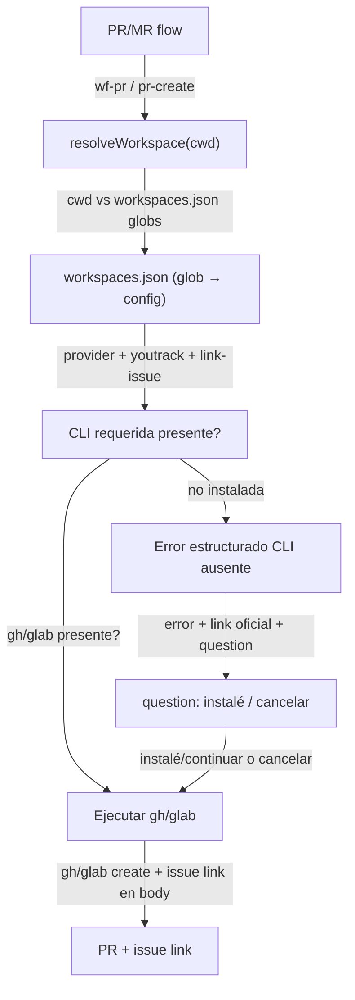

# Spec: VCS workspaces — resolución por ruta + CLI guard

**Branch:** `feature/vcs-workspaces`

## Context

The toolkit supports one global VCS provider (`vcs.json`), but the user lives in a dual-world: work projects (issues in YouTrack, repos in GitLab) vs personal/side projects (issues + repos in GitHub). Switching provider today requires editing config. The PR flow already uses the official CLIs (`gh`/`glab` — verified in `scripts/pr-create.sh`), but (a) provider is a single global value, (b) a missing CLI fails with raw FileNotFoundError, (c) PRs are never linked to their YouTrack issue. This spec adds path-based workspaces (glob → provider/issue config), a structured missing-CLI error with the official install link, and optional PR↔issue linking.

## Goals

- G1: `workspaces.json` (in `configDir()`): array of `{ glob, vcs: { provider }, youtrack?: { baseUrl }, link_issues?: boolean }`; `resolveWorkspace(cwd)` returns the first matching workspace (path glob match) or the global `vcs.json` fallback.
- G2: `pr-create.sh`/`pr-ready-context.sh` resolve the provider via `resolveWorkspace` instead of the single global value; `defaultTargetBranch` comes from the matched workspace (fallback global).
- G3: Missing CLI (`gh`/`glab` not on PATH) → structured error: which CLI is required, the official install link (GitHub CLI docs / GitLab glab docs), and a `question` prompt: "I installed it, continue" / "cancel". No raw FileNotFoundError.
- G4: Optional issue linking: when the workspace has `link_issues: true` and a YouTrack issue is active for the branch (e.g. `IRP-123` in branch name or issue context), the PR body includes a "Related to" line linking the YouTrack issue; configurable per workspace.
- G5: `config.sh load` exposes the resolved workspace so scripts agree (provider, defaultTargetBranch, link_issues, youtrack baseUrl).

## Non-goals

- No automatic install of `gh`/`glab` (link + user confirmation only).
- No changes to how tokens are stored (same token files per provider).
- No workspace manager UI; config is a JSON file (edited by hand or by the wizard later).
- No cross-provider migration of existing PRs.

## Architecture

## Data flow / contracts

| Term | Meaning |
| --- | --- |
| `workspaces.json` | `configDir()/workspaces.json`: `{ workspaces: [{ glob: string; vcs?: { provider: "gitlab"\|"github"; defaultTargetBranch?: string }; youtrack?: { baseUrl?: string; link_issues?: boolean } }] }` |
| `resolveWorkspace(cwd)` | First workspace whose glob matches `cwd` (minimatch on the path); returns `null` → global `vcs.json` fallback |
| Missing CLI error | `workflow CLI missing: <gh|glab> (required for <provider>). Install: <official URL> — say "instalé" to continue or cancel.` |
| Issue link | When `link_issues` and an issue id is derivable (branch `feature/IRP-123-...` or explicit context), append `Related to: <youtrack-url>/issue/<id>` to the PR body |

## Acceptance criteria

- CA-01: `resolveWorkspace(cwd)` matches the first glob; no match → null; malformed/missing workspaces.json → null (no throw).
- CA-02: `pr-ready-context.sh` reports the resolved provider + workspace name in VCS Config; `pr-create.sh` uses the resolved provider/defaultTargetBranch.
- CA-03: With `gh` (or `glab`) missing from PATH, `pr-create.sh` returns the structured error containing the CLI name, official install URL, and does NOT show FileNotFoundError.
- CA-04: With `link_issues: true` and an issue id present (branch name or explicit), the PR body includes the `Related to:` line; `link_issues` false/absent → no line.
- CA-05: `bun run check` green; tests cover CA-01..CA-04 (workspaces resolution, provider override, missing-CLI error, issue-link body); docs validate ok.

## Decisions

- D-01: Path globs in `workspaces.json` (user choice) — e.g. `/home/*/Documents/projects/work/**` → gitlab, `/home/*/Documents/projects/personal/**` → github.
- D-02: Missing CLI → error + official link + `question` (user choice), never auto-install.
- D-03: Issue linking optional per workspace, derived from branch name or explicit context (no new YouTrack tooling).
- D-04: Scripts stay the source of truth for PR creation; the resolution is injected via `config.sh` so bash/python and TS agree.

## Future work

- Wizard step for `workspaces.json` (flowkit init).
- Auto-detect provider from the git remote (`git remote -v`) when no workspace matches.
- `flowkit doctor` showing which workspace a repo resolves to.
