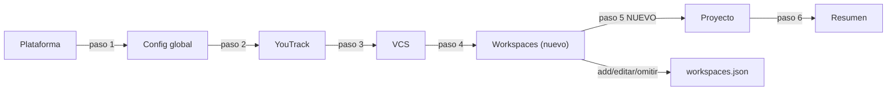

# Spec: Wizard workspaces — paso TUI

**Branch:** `feature/wizard-workspaces`

## Context

`flowkit init` (the Ink TUI wizard) configures platform, global config, YouTrack, VCS, and project hygiene — but **not workspaces**. The user's dual-world setup (work → GitLab+YouTrack, personal → GitHub) was configured by hand-editing `~/.config/workflow-toolkit/workspaces.json` because the wizard has no step for it. The vcs-workspaces spec left this as future work. This spec adds a Workspaces step to the wizard: add, edit, or skip workspace entries (glob → provider/issue config), writing the same `workspaces.json` the toolkit already resolves.

## Goals

- G1: New wizard step (between VCS and Project): add workspace entries — name, path glob, VCS provider (gitlab/github), defaultTargetBranch, optional issue linking (youtrack for gitlab / github issues for github), or skip (no workspaces.json).
- G2: Existing workspaces.json is loaded and editable (add a new workspace, remove an existing one); skip preserves the current file untouched.
- G3: The step writes `configDir()/workspaces.json` in the exact schema `resolveWorkspace` reads (`{ workspaces: [{ name, glob, vcs: { provider, defaultTargetBranch? }, youtrack?: {...} | issues?: {...} }] }`) — parity with the TS core, no drift.
- G4: Summary step reports the written workspace list (name + provider per entry).

## Non-goals

- No workspace validation beyond the existing resolveWorkspace semantics (glob matcher, provider enum).
- No change to the workspaces.json schema (the core defines it; the wizard only writes it).
- No removal/edit UI beyond add + remove (keep the step minimal).
- No changes to resolveWorkspace/config.sh (already shipped and user-verified).

## Architecture

## Data flow / contracts

| Term | Meaning |
| --- | --- |
| `WorkspaceStep` | New Ink step component in `src/cli/steps.tsx` (index 4, before ProjectStep) |
| `workspaces.json` | `configDir()/workspaces.json` — same path as `workspacesPath()` in `src/core/workspaces.ts` |
| Add flow | inputs: name (text, unique — duplicates rejected), glob (text, e.g. `/home/*/Documents/projects/work/**`), provider (select gitlab/github), target branch (text, default develop for gitlab / main for github), issue linking (select gated by provider: youtrack/none for gitlab, github/none for github) |
| Skip | exits the step without writing; existing file untouched |
| Write | `logic.ts` `writeWorkspaces(entries)` — merge with existing entries (add/remove), atomic write, never nulls |

## Acceptance criteria

- CA-01: The wizard has 7 steps; WorkspacesStep sits between VCS and Project; `npx flowkit init` runs end-to-end with the new step (TTY smoke).
- CA-02: Adding an entry writes `workspaces.json` that `resolveWorkspace` reads back identically (parity test: wizard output → core resolution).
- CA-03: Skip preserves an existing workspaces.json byte-identical.
- CA-04: Removing an entry updates the file (that workspace no longer resolves).
- CA-05: The step logic is covered by non-TTY tests (`test/cli-logic.test.ts` style): add-merge, remove, skip-preserve, malformed-existing-file tolerated (treated as empty).
- CA-06: `bun run check` green; docs validate ok.

## Decisions

- D-01: Step index 4 (before Project) — workspaces precede project hygiene.
- D-02: Add + remove only (no inline edit of an existing entry) — minimal; re-add to change.
- D-02a: Issue linking is provider-gated (the wizard's linking select offers youtrack/none for gitlab, github/none for github, and `writeWorkspaces` rejects cross-combos): `youtrack.link_issues` with a non-gitlab provider would leak `Related to: <youtrack>/issue/<id>` into GitHub PR bodies, and `issues` with a non-github provider is silently ignored by config.sh — the exact mismatches the provider gate prevents.
- D-03: Skip = no write (preserves manual configs like the user's).
- D-04: The write reuses the core's `workspacesPath()` env chain — the wizard never invents a new config location.

## Future work

- Inline editing of existing workspace entries.
- Workspace detection preview (show which workspace the current dir resolves to).
- Removing workspaces.json entirely (no-workspaces mode).
