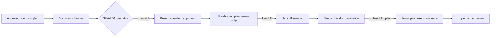

# Spec: Workflow integrity

**Branch:** `bugfix/workflow-integrity`

## Context

Three gaps let workflow state diverge from user intent: approved documents can be edited without invalidating approval evidence, seeded handoff destinations receive the normal menu and can recursively hand off, and incomplete subagent-driven plans can freeze unrelated planning even when execution is no longer active. These bugs share one root cause: persisted flow state does not bind approval, menu context, and execution lifecycle strongly enough to the canonical documents and current operation.

This change makes those relationships explicit in the shared core, migrates concrete existing `flow.json` data fail-closed, and exposes identical outcomes through OpenCode tools, Cursor MCP tools, and CLI commands.

## Goals

- Bind every spec and plan approval to a SHA-256 digest of that canonical document's exact valid UTF-8 bytes.
- Reconcile approval drift before effective state is returned or any gate is evaluated, with deterministic dependent-state resets and structured reasons.
- Make fresh approval possible after any integrity reset while treating approved legacy state without digests as stale.
- Mark generated handoff destinations in a host-neutral, machine-readable execution contract and limit them to the four non-handoff choices.
- Track plan execution as `pending`, `active`, `paused`, or `completed`, with explicit confirmed pause/resume operations and verified completion.
- Restrict subagent-driven reminders and interception to active subagent-driven execution so paused, completed, and unrelated flows remain usable.
- Keep all state normalization, validation, transitions, and contract generation in the shared core with host adapter and CLI parity.

## Non-goals

- No cancellation lifecycle state.
- No new dependency, profile system, or host-specific duplicate of core workflow logic.
- No Cursor release/configuration work or Marketplace work.
- No worktrees or changes to the guarded in-place branch model.
- No hashing of optional mirrors, aliases, generated prompts, or any document other than the canonical `docs/<slug>/spec.md` and `docs/<slug>/plan.md` pair.

## Architecture

## Data flow / contracts

| Term | Meaning |
| --- | --- |
| Canonical document | The normalized repo-relative `docs/<slug>/spec.md` or `docs/<slug>/plan.md` path bound to its flow. Path traversal, symlink escapes, alternate paths, and optional mirrors are rejected. |
| Approval digest | Lowercase hexadecimal SHA-256 stored with approval evidence. The input is the document's exact bytes after strict UTF-8 validation; line endings and Unicode are not normalized. |
| Effective state | Persisted state after legacy normalization and approval-integrity reconciliation. Status reads and every gate operate only on this state. |
| Drift reason | A structured entry containing `document`, `code`, and canonical `path`; codes distinguish `digest_missing`, `document_missing`, `document_unreadable`, and `digest_mismatch`. |
| Execution lifecycle | `pending`, `active`, `paused`, or `completed`, stored with the selected execution mode. |
| Handoff destination marker | The exact host-neutral contract sentinel `<workflow-handoff-destination>true</workflow-handoff-destination>`. |
| SDD ledger completeness | Every top-level task parsed from the canonical plan has a corresponding completed task record in that plan's workflow-managed SDD ledger. |

Approval and reconciliation happen under the same per-flow critical section as persistence. Approval first resolves and validates the canonical path, reads valid UTF-8 content, computes the digest, and atomically stores the digest with the approval receipt. Effective-state reads and gates recompute approved-document digests before trusting approval evidence.

| Detected condition | Required effective-state transition |
| --- | --- |
| Spec digest missing, document missing/unreadable, or digest mismatch | Reset spec and plan approval, clear both digests and menu evidence, clear handoff-destination context, set execution to `pending`, and report the spec drift reason. |
| Plan digest missing, document missing/unreadable, or digest mismatch | Preserve valid spec approval; reset plan approval, clear its digest and menu evidence, clear handoff-destination context, set execution to `pending`, and report the plan drift reason. |
| Approval reset followed by unchanged readable canonical content | Permit the normal fresh approval sequence and store a new digest; stale evidence never blocks reapproval. |
| Malformed persisted state | Fail closed with a structured, actionable state error and preserve the original file rather than guessing or overwriting it. |

Choosing `handoff` from the normal five-option post-plan menu records the source receipt, leaves execution `pending`, and generates the destination contract. The core atomically marks the flow as a handoff destination, resets menu presentation for the destination, emits the machine-readable marker, and emits an explicit allow-list containing only `Subagent-driven`, `Inline`, `Review spec first`, and `Review plan first`. Generic contracts and reminders select the normal five-option wording or destination four-option wording from this context. The core rejects `handoff` for a marked destination even if an adapter submits it directly.

| Operation | Precondition | Result |
| --- | --- | --- |
| Approve plan | Canonical spec remains approved and canonical plan is readable valid UTF-8 | Plan approval and digest are stored; execution is `pending`. |
| Choose `subagent-driven` or `inline` | Plan remains approved; menu context permits the choice | Menu evidence is recorded and execution becomes `active` in the selected mode. |
| Choose a review option | Plan remains approved | Menu evidence is recorded and execution remains `pending`. |
| Pause | Execution is `active`; host-native confirmation is present | Execution becomes `paused`; all SDD progress is preserved. |
| Resume | Execution is `paused`; host-native confirmation is present; approvals remain valid | Execution becomes `active` in its prior mode with progress preserved. |
| Complete | Execution is `active` or `paused`; host-native confirmation is present | In one operation, require complete ledger coverage and run repository verification; only success stores `completed`. |

OpenCode uses native-question receipts, Cursor uses its native AskQuestion policy with MCP confirmation, and the CLI uses `--confirm` or a TTY prompt for lifecycle mutations. Adapters only translate these host-native surfaces into core operations. A failed completion check or failed repository verification returns structured failure details and leaves lifecycle and progress unchanged. A resume attempt with missing/unreadable or drifted documents reconciles to `pending` and requires fresh approvals instead of resuming stale execution.

Existing persisted `flow.json` is compatibility data. A missing lifecycle field normalizes to `active` only when the existing state has an approved plan, a recorded `subagent-driven` choice, and an incomplete ledger that proves execution is underway; all other missing lifecycle values normalize to `pending`. Approved documents without hashes then reconcile as stale and reset according to the rules above. Normalization and mutation use a core-owned process-safe per-flow lock plus same-directory temporary write, flush, and atomic rename so concurrent hosts cannot observe partial JSON or silently lose a transition.

## Acceptance criteria

- CA-01: Spec and plan approval store SHA-256 of the canonical document's exact valid UTF-8 bytes together with approval evidence; invalid UTF-8, missing/unreadable files, non-canonical paths, aliases, traversal, and symlink escapes fail closed with structured errors.
- CA-02: `workflow_flow_status` and every approval, menu, lifecycle, implementation, review, handoff, and completion gate reconcile document digests before using persisted approvals.
- CA-03: Spec drift resets spec and plan approval, both digests, menu evidence, handoff-destination context, and execution lifecycle to `pending`; plan drift preserves valid spec approval while resetting plan approval, its digest, menu evidence, handoff context, and execution to `pending`.
- CA-04: Effective flow status exposes structured drift reasons that identify the affected document, canonical path, and one of `digest_missing`, `document_missing`, `document_unreadable`, or `digest_mismatch`.
- CA-05: Approved legacy state without the corresponding digest is stale and fails closed, and the reset state accepts a fresh approval sequence without manual state-file deletion.
- CA-06: Hash comparison uses exact validated UTF-8 bytes without line-ending or Unicode normalization, so every content-byte change invalidates the affected approval.
- CA-07: A successful handoff generation atomically marks the flow as a handoff destination and includes `<workflow-handoff-destination>true</workflow-handoff-destination>` plus the explicit four-choice allow-list in the generated execution contract.
- CA-08: Normal post-plan contracts/reminders present exactly `Subagent-driven`, `Inline`, `Handoff`, `Review spec first`, and `Review plan first`; marked handoff destinations present exactly the same list without `Handoff`.
- CA-09: The shared core rejects a `handoff` choice for a marked destination, preventing recursive handoffs even when a host adapter or CLI caller bypasses prompt wording.
- CA-10: The same core-generated destination contract and four-option behavior work in OpenCode seeded sessions, Cursor copy/paste prompts, and CLI output without relying on session IDs, parent IDs, or other host-specific session metadata.
- CA-11: Core flow state supports only `pending`, `active`, `paused`, and `completed`; selecting `subagent-driven` or `inline` activates execution, review and handoff choices leave it pending, and no cancellation state or transition is added.
- CA-12: Pause and resume are explicit confirmed core transitions exposed through OpenCode native tools, Cursor MCP tools, and CLI commands; resume restores the prior execution mode and preserves all task briefs, reviews, and ledger progress.
- CA-13: Completion checks every canonical plan task against the SDD ledger and runs repository verification inside the completion operation; incomplete tasks or failed verification return structured details, preserve progress, and do not store `completed`.
- CA-14: Missing/unreadable documents, approval drift, or invalid prerequisites during resume or completion fail closed; drift reconciliation takes precedence and returns execution to `pending` where required.
- CA-15: Only `active` plus `subagent-driven` triggers the subagent reminder/interception and blocks conflicting inline execution; `pending`, `paused`, `completed`, and active inline flows do not freeze unrelated planning.
- CA-16: Approval drift always resets execution to `pending`, including legacy state normalized as active, and execution can reactivate only after fresh approvals and a fresh implementation choice.
- CA-17: Persisted state missing lifecycle normalizes to active only for an approved subagent-driven choice with a provably incomplete ledger; otherwise it normalizes to pending, with parity tests covering both outcomes and the subsequent missing-digest fail-closed reset.
- CA-18: Malformed or unsupported persisted state returns an actionable structured error without replacing the original `flow.json`; missing optional fields are normalized only by the documented compatibility rules.
- CA-19: Core reconciliation and transitions are process-safe and atomic: digest checks and mutations share a per-flow lock, writes use a flushed same-directory temporary file plus atomic rename, and concurrency tests prove no partial JSON or lost lifecycle/approval update.
- CA-20: State rules, normalization, hashing, contract generation, lifecycle transitions, ledger checks, and completion verification live in `packages/workit-core/src/core/`; OpenCode and Cursor adapters and the CLI contain only host-surface mapping.
- CA-21: Parity tests exercise identical success states, reset states, drift/error payloads, handoff menu restrictions, pause/resume behavior, and completion outcomes through OpenCode tools, Cursor MCP tools, and CLI commands.
- CA-22: README, `AGENTS.md`, host contract/reminder assets, and CHANGELOG Unreleased documentation describe digest invalidation, normal versus handoff-destination menus, lifecycle semantics, confirmation behavior, and cross-host parity without claiming Cursor Marketplace publication.
- CA-23: Focused core and adapter tests cover hashing/drift, fresh reapproval, handoff destination enforcement, lifecycle migration/transitions, resumed plans, ledger completeness, verification failure, malformed state, and concurrent atomic writes; full repository verification also succeeds.

## Decisions

- D-01: Treat the three defects as one workflow-integrity boundary because approval validity, menu context, and execution activity are all properties of the same persisted flow.
- D-02: Hash exact valid UTF-8 content with built-in SHA-256 and add no dependency or text normalization that could hide a document change.
- D-03: Fail closed for missing approval digests and malformed state because existing approval evidence cannot prove the currently stored content was reviewed.
- D-04: Persist handoff-destination context and also emit an exact marker so enforcement is structural while generated prompts remain portable across hosts.
- D-05: Keep pause distinct from cancellation: pause preserves resumable progress, completion proves task and verification closure, and cancellation is outside this scope.
- D-06: Derive reminder/interception eligibility from lifecycle plus execution mode, not from a global scan for any incomplete ledger.
- D-07: Use core-owned locking and atomic replacement so all hosts share one safe persistence contract without adapter-specific coordination.

## Future work

- Add a cancellation state only if separate requirements define its confirmation, cleanup, and reactivation semantics.
- Add stronger recovery or audit history only if atomic state plus structured drift reporting proves insufficient in real workflows.
