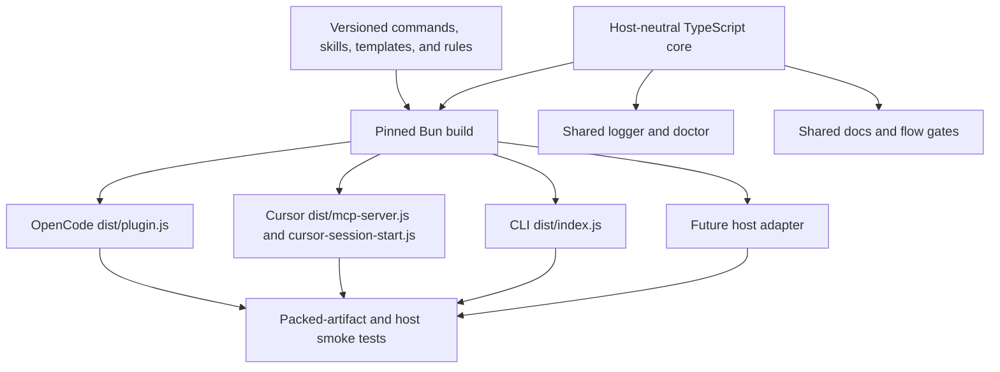

# Spec: Workit reliability, portability, and workflow overhaul

**Branch:** `feature/workit-reliability-overhaul`

## Context

An OpenCode session completed brainstorming, specification, and planning without
using Workit's approval tools or post-plan menu. Investigation showed that
Workit never loaded: the active `git+file://` pin was stale, plugin startup
failed without a Workit-facing diagnostic, and the session fell back to generic
skills and legacy `docs/superpowers/` paths. Broader audits then found related
release, Cursor, CLI wizard, document-layout, flow-enforcement, portability,
configuration, and testing defects that can produce the same false-success
experience.

This specification is the complete source of truth for correcting every finding
from the document migration, diagnostics, reliability debt, wizard UX, and
TypeScript portability audits. Duplicate findings are consolidated into shared
requirements, but every original finding and every active `ponytail:` marker is
mapped in the traceability sections so no item disappears during planning.

After Tasks 1-23 were implemented, an independent final-tree audit found that
several gates proved a sandbox assembled by tests rather than the actual release
workflow, and that some flow-security claims exceeded what the hosts can attest.
Phase 9 is the mandatory remediation pass for those findings. Earlier task
evidence remains historical; it does not close a Phase 9 finding without a new
RED/GREEN regression against the final runtime or release entry point.

The intended outcome is a boring installation: each supported host loads a
self-contained package, reports its provenance and health, follows the same
document and approval contracts, and fails explicitly when those contracts are
unavailable.

## Goals

- G-01: Correct all confirmed published-package, installer, Cursor runtime, and
  credential-safety defects before adding new behavior.
- G-02: Keep maintained first-party logic in TypeScript while publishing
  compiled, self-contained JavaScript artifacts that do not require hosts to
  execute raw TypeScript.
- G-03: Make Bun the pinned development, workspace, test, and build tool while
  keeping published CLI, MCP, and hook artifacts compatible with Node 20+.
- G-04: Rebuild `workit init` as a clear, reversible, accessible draft-review-
  apply wizard that actually configures selected platforms.
- G-05: Automatically prepare canonical `docs/<slug>/` paths and offer a safe,
  native migration when legacy `docs/superpowers/` documents are detected.
- G-06: Add secret-safe first-party logs and a shared doctor so plugin, hook,
  package, configuration, and version failures are diagnosable without relying
  only on host logs.
- G-07: Enforce spec, plan, validation, execution-mode, and coordinator
  boundaries wherever the host exposes a trustworthy interception or identity
  surface, and state weaker policy-only boundaries explicitly instead of
  representing caller-supplied fields as host attestation.
- G-08: Resolve every active reliability ceiling identified by the audits or
  explicitly classify it as accepted future work with a measurable trigger.
- G-09: Require a failing regression first and an independently runnable green
  gate for every phase before the next phase begins.
- G-10: Verify packed artifacts in isolated environments through the same entry
  points used by OpenCode, Cursor, the CLI, and future MCP-capable hosts.
- G-11: Implement every behavioral change through strict test-driven development:
  observe a relevant automated test fail, write the minimum implementation to
  pass, then refactor only while the focused and full checks remain green.

## Non-goals

- Rewriting vendored Superpowers internals merely to remove upstream file types.
  Vendored executable scripts must instead be excluded from active packages or
  replaced where Workit exposes the same behavior.
- Promising Deno support before an actual Deno-based host and executable test
  matrix exist. The host-neutral core must avoid unnecessary incompatibilities.
- Building a Codex adapter before Codex requires behavior not covered by shared
  MCP tools and skills.
- Logging prompts, assistant messages, tool arguments, tool results, tokens,
  headers, issue content, or other user data.
- Deleting legacy documents during automatic migration.
- Preserving known broken installation paths solely for backward compatibility.
- Implementing all phases in one change or allowing later refactors to delay
  urgent safety and release fixes.
- Publishing packages, tags, or marketplace releases as part of this work. The
  completed pull request must be release-ready, but publication requires a later
  explicit user approval.
- Building a Cursor extension solely to attest `AskQuestion` answers. Cursor MCP
  confirmation remains an explicit audited policy boundary until Cursor exposes
  a trusted result callback; a future bridge requires a separate specification.

## Architecture



The core owns domain behavior, canonical path resolution, migrations, logging,
diagnostics, and flow state. Host packages own only host SDK registration,
native questions, hooks, manifests, and presentation. Each host package bundles
the core behavior it needs and ships its required static assets explicitly.

Flow evidence is capability-aware. OpenCode can observe tool calls and session
parentage, so its adapter must derive one-use question receipts and delegated
identity from host data. Cursor MCP cannot observe native `AskQuestion` results
or intercept arbitrary editor writes; it records explicit contract confirmation
with `attested: false`, never calls that confirmation host-trusted, and blocks
the unsupported subagent-driven mutation path rather than accepting a
caller-asserted delegated role.

### Wizard UX target

```text
+------------------------------------------------------------------+
| Workit setup                                      Step 3 of 9    |
|------------------------------------------------------------------|
| Language                                                        |
|                                                                  |
| > English (en)                                                   |
|   Spanish (es)                                                   |
|   Other...                                                       |
|                                                                  |
| This controls Workit responses and generated configuration.      |
|                                                                  |
| [Back]                                        [Next] [Cancel]     |
+------------------------------------------------------------------+
```

Exactly one interactive control is mounted at a time. The wizard accumulates a
draft, previews all mutations, and writes only after explicit Apply.

## Data flow / contracts

### Runtime support contract

| Surface | Source | Published runtime | Required verification |
| --- | --- | --- | --- |
| Core | TypeScript | Bundled into adapters | Unit and adapter tests |
| OpenCode | TypeScript | ESM `dist/plugin.js` | Isolated import + real host smoke |
| Cursor MCP | TypeScript | ESM `dist/mcp-server.js` | MCP initialize + tools/list |
| Cursor hook | TypeScript | ESM `dist/cursor-session-start.js` | JSON stdin/stdout execution |
| CLI | TypeScript/TSX | Single `dist/index.js` | Packed npx/TTY smoke |
| Development | TypeScript | Bun workspace | Pinned Bun CI |
| Deno | Host-neutral code only | Unsupported initially | Add only with an executable host test |

### Incremental delivery contract

Every phase follows the same sequence:

1. Capture the relevant current failure in one minimal runnable regression.
2. Implement only that phase's requirements.
3. Run focused tests, package tests when packaging is touched, and the complete
   repository check.
4. Produce a phase result listing exact checks, known advisories, and rollback.
5. Do not start the next phase until mandatory checks pass.

Each phase must leave `main` releasable. A phase may be split into several pull
requests, but no pull request may mix unrelated later-phase work.

### TDD contract

TDD is mandatory for every implementation task in every phase:

1. **RED:** add the smallest automated check that expresses the missing behavior
   or reproduced defect, run it, and retain the failing command and reason in the
   task evidence.
2. **GREEN:** implement only enough production code to make that focused check
   pass, then run it again.
3. **REFACTOR:** improve structure only after green; rerun focused tests and the
   phase gate after refactoring.

A test written after production code does not satisfy this contract. Existing
green tests may be extended only after a new assertion is observed failing.
Documentation-only changes use document validation and contract assertions as
their red/green evidence. Emergency configuration recovery may edit the user's
runtime config after a reproducible failing health check, but any repository code
changed by that recovery still requires a failing automated regression first.

Every implementation-plan step must name its RED command, expected failure,
GREEN command, and phase gate. Reviews must reject tasks with missing RED
evidence even when the final suite is green.

### Requirement catalog

#### Release and installation safety

- RR-01: Correct published adapter dependency versions so every platform package
  uses the core version prepared for the same release; fail before publish on a
  mismatch.
- RR-02: Replace raw TypeScript runtime entries with built JavaScript entries and
  remove misleading root `main`/`exports` values.
- RR-03: Make Cursor's package launch package-local artifacts rather than a
  personal development or share-clone path.
- RR-04: Include Cursor MCP source in strict typechecking and fix the undeclared
  `workspace_root` and result typing before release.
- RR-05: Fix local installer root resolution, remove SSH-only public cloning,
  and never convert missing tools, lock failures, clone failures, or dependency
  failures into successful installation.
- RR-06: Deduplicate current and legacy OpenCode plugin entries, Cursor plugin
  directories, and MCP registrations without replacing unrelated user config.
- RR-07: Correct Cursor plugin and marketplace manifests to package-relative,
  host-supported schemas.
- RR-08: Declare or bundle every runtime dependency; no adapter may rely on
  monorepo hoisting or another host adapter.
- RR-09: Remove release-time `workspace:*` rewriting by bundling core, or make
  rewriting unconditional and verify the final tarballs before publication.
- RR-10: Pin Bun and supported host SDK versions in CI; test the current and
  declared minimum OpenCode versions.
- RR-11: Prepare an urgent corrective release candidate after Phase 0 and verify
  packed metadata, entry files, dependency ranges, and clean-host startup
  without publishing it.

#### TypeScript and package boundaries

- PT-01: Keep all maintained first-party domain, installer, sync, launcher,
  hook, and verification logic in TypeScript.
- PT-02: Delete shell wrappers that only delegate to TypeScript; expose compiled
  Node bins only when a standalone command is still required.
- PT-03: Port maintained Git/range/context/verification shell logic to shared
  TypeScript functions before removing `runScript` indirection.
- PT-04: Replace Cursor's shell MCP launcher and session hook with direct Node
  execution of built JavaScript.
- PT-05: Keep host-neutral core free of OpenCode SDK, MCP SDK, Ink, and host hook
  dependencies; adapters own those dependencies.
- PT-06: Bundle adapter code and required dependencies into single host entries;
  do not publish source subpath imports.
- PT-07: Copy commands, skills, rules, templates, hygiene files, and filtered
  vendor assets into deterministic package-relative asset roots.
- PT-08: Exclude active vendored shell dependencies from published adapters or
  patch their references to Workit's TypeScript tools.
- PT-09: Replace avoidable runtime `curl` calls with standard `fetch`, use
  `path.delimiter`, and remove Bun-only globals from host-neutral runtime code.
- PT-10: Build one CLI executable without splitting and use a portable Node
  shebang; Cursor manifests invoke Node explicitly for Windows compatibility.
- PT-11: Define Linux, macOS, and Windows as the initial supported OS matrix for
  published Node artifacts.
- PT-12: Keep Deno compatibility as an evidence-based adapter decision rather
  than weakening the tested Node baseline.

#### Logging and diagnostics

- DG-01: Add a dependency-free structured logger shared by CLI, OpenCode,
  Cursor MCP, Cursor hooks, installers, migrations, and doctor.
- DG-02: Write sanitized JSONL logs under the platform state directory with
  daily files, seven-file retention, restrictive permissions, and safe
  concurrent appends.
- DG-03: Mirror OpenCode events to `client.app.log()` and send Cursor startup
  summaries only to stderr; MCP stdout remains protocol-only.
- DG-04: Log initialization, package roots, versions, asset loading, config
  provenance, hook failures, MCP connection, migration, installer steps, and
  uncaught process failures.
- DG-05: Preserve fail-open UX hooks but isolate detectors and log rate-limited
  sanitized failures instead of using empty catches.
- DG-06: Mark Cursor domain failures with MCP `isError: true` while preserving
  structured error content.
- DG-07: Expose one offline diagnostic engine through `workit doctor`,
  `workit doctor --json`, and `workflow_doctor` on both hosts.
- DG-08: Doctor checks runtime, versions, provenance, assets, configuration,
  workspace match, host registration, Cursor launcher/hooks, duplicates,
  utilities, credentials metadata, and log writability without network access
  by default.
- DG-09: Installers run doctor after configuration and return nonzero when any
  required check fails.
- DG-10: Redact secrets, authorization values, URL queries, home prefixes, and
  large stacks; never persist prompts, content, raw arguments, or raw results.

#### Wizard UX and configuration safety

- WZ-01: Replace Step 2's simultaneous Ink listeners with sequential screens
  that mount exactly one active input.
- WZ-02: Detect current locale/timezone, present valid choices plus Other, and
  validate locale with platform facilities where practical.
- WZ-03: Present branch presets with their resulting allowed, protected, and
  target branches; custom policies require nonempty validated values.
- WZ-04: Make YouTrack, GitLab, and GitHub independently optional and remove all
  organization-specific names, issue IDs, URLs, and language defaults.
- WZ-05: Preserve existing credentials and token files byte-for-byte unless the
  user explicitly replaces them; placeholders are created only when absent.
- WZ-06: Distinguish missing from malformed configuration; malformed files block
  Apply and are never treated as empty.
- WZ-07: Accumulate a setup draft in memory; Back preserves it, Cancel writes
  nothing, and Escape cannot silently leave partial state.
- WZ-08: Preview package versions, host config merges, workspaces, project files,
  and `.gitignore` additions before a single Apply boundary.
- WZ-09: Actually configure every selected platform idempotently, preserving
  unrelated plugins, MCP servers, rules, and directories.
- WZ-10: Report per-platform and per-file Installed, Configured, Skipped, and
  Failed results; partial failure exits nonzero and never prints unconditional
  success.
- WZ-11: Remove competing Enter handlers and stale-provider application races.
- WZ-12: Offer current-project workspace setup, add/edit/remove flows, and a
  visible match preview for every accepted workspace pattern.
- WZ-13: Preview and verify packaged hygiene assets; summaries distinguish files
  created from ignore lines appended.
- WZ-14: Make non-TTY `init` fail with actionable guidance while ordinary help
  remains successful.
- WZ-15: Use `/wk-status` and doctor in completion guidance, including restart
  requirements and unresolved credential actions.
- WZ-16: Add deterministic TTY keyboard, focus, Back, Cancel, validation,
  credential-preservation, platform-install, and packed-npx tests.

#### Canonical documents and legacy migration

- DC-01: Centralize workspace-root, slug, containment, basename, and canonical
  path resolution for all OpenCode and Cursor document tools.
- DC-02: Reject absolute paths, traversal, symlink escapes, cross-slug pairs,
  wrong basenames, and arbitrary legacy paths in normal operations.
- DC-03: Add shared `workflow_docs_layout` actions `prepare` and `migrate` to
  both platforms.
- DC-04: `prepare` creates missing `docs/` and `docs/<slug>/`, returns canonical
  paths, and performs read-only legacy detection.
- DC-05: Detect bounded legacy specs, plans, and SDD state under
  `docs/superpowers/`; do not derive canonical slugs from `specs` or `plans`.
- DC-06: Pair legacy documents through explicit plan links first and historical
  filename fallbacks second; report orphaned and ambiguous items.
- DC-07: When preflight is safe, OpenCode uses native `question` and Cursor uses
  native `AskQuestion` with exactly Migrate safely and Not now.
- DC-08: `migrate` requires confirmation, rescans, copies without deleting,
  aborts atomically on differing destinations, and treats identical targets as
  already migrated.
- DC-09: Rewrite only copied plan links and valid copied flow paths; preserve
  malformed state byte-for-byte and report it.
- DC-10: Refuse SDD copying until the canonical SDD ignore contract is active.
- DC-11: If migration for the active workflow is declined, stop canonical
  authoring to avoid two divergent sources of truth.
- DC-12: Make `workflow_sdd_context` create only `docs/<slug>/sdd/` when
  implementation begins; do not create empty progress ledgers.
- DC-13: Correct all contracts that describe SDD as tracked or nested under an
  extra slug; working state is gitignored at `docs/<slug>/sdd/`.
- DC-14: Normalize Cursor's optional workspace root once before shared calls.

#### Structural workflow enforcement

- FG-01: Record flow activation and canonical document paths when preparation
  begins rather than relying on later model-selected tools.
- FG-02: Block plan writes until the canonical spec is self-reviewed and user-
  approved.
- FG-03: Block non-document mutations until spec approval, plan approval,
  document validation, and execution-menu evidence all pass.
- FG-04: On OpenCode, derive approval and execution-menu evidence from an exact,
  one-use, session-bound native `question` result observed by host hooks; the
  workflow tool schema accepts no model-created evidence object. On Cursor,
  record explicit confirmation as unauthenticated policy evidence with
  `attested: false` and never describe it as a native-result attestation.
- FG-05: On OpenCode, block coordinator product edits when subagent-driven mode
  is selected and derive delegated status from host session parentage, never
  caller-supplied `role` or `taskIdentity`. Cursor has no delegated-worker
  identity, so selecting subagent-driven blocks mutation with recovery guidance.
- FG-06: Use the host workspace directory instead of `process.cwd()` for active
  plan and document discovery.
- FG-07: Keep post-hoc reminders as UX support, not as the primary enforcement
  boundary.
- FG-08: Protect flow state against concurrent sessions with unique temporary
  files and compare/retry semantics before adding a heavier lock.
- FG-09: Apply the same transition matrix and domain errors through OpenCode and
  Cursor while exposing each host's evidence provenance and enforcement limits.

#### Configuration, VCS, and remaining reliability

- RL-01: Invalid global, workspace, and VCS JSON produce blocking, path-specific
  diagnostics rather than silently selecting defaults.
- RL-02: Share one branch-preset merge helper across CLI, OpenCode, and Cursor;
  changing a preset resets all derived policy fields consistently.
- RL-03: Resolve PR bases from workspace/global target-branch policy rather than
  hardcoding `develop`.
- RL-04: Reject unsupported workspace glob syntax at write time or replace the
  limited matcher with a tested full matcher.
- RL-05: Prevent date-style branch names from generating unrelated issue-closing
  clauses while preserving deliberate bare numeric issue branches.
- RL-06: Make environment-override behavior explicit in setup previews and tests;
  do not silently ignore active overrides.
- RL-07: Fix configuration migration caching or document and test its exact
  process-level boundary.
- RL-08: Keep token authentication until trusted publishers are configured for
  every package; retain a clear upgrade trigger and verification.
- RL-09: Remove runtime network synchronization from session-start hooks.
  Updates occur during explicit install/update operations and report failures.
- RL-10: Establish a tested host/runtime support matrix and fail CI when a
  declared host SDK changes the plugin or hook contract.

#### Post-implementation audit remediation

- AR-01: The real release workflow builds OpenCode, Cursor, and CLI artifacts and
  runs the release-candidate gate before semantic-release; no required check may
  occur only after a package could already have been published.
- AR-02: Release dependency rewriting runs before package verification and again
  after semantic-release version preparation. The root exposes runnable `build`
  and `verify:release-candidate` scripts used by CI and release automation.
- AR-03: A clean install of `@brainervirus/workit-cli` includes the selected
  OpenCode and Cursor adapter packages through declared same-release dependencies;
  tests may not manually install undeclared siblings to simulate success.
- AR-04: Registration deduplication matches exact current package identities and
  version suffixes only; helper packages sharing a prefix remain untouched.
- AR-05: Cursor's launcher-provided workspace becomes the default root for every
  MCP tool when `workspace_root` is omitted, and process cwd is only the final
  fallback when no host workspace exists.
- AR-06: Build scripts decode `import.meta.url` with `fileURLToPath`; Cursor MCP
  and hook manifests invoke Node explicitly and pass on Linux, macOS, and Windows.
- AR-07: Every config reader, setup preflight, and doctor classifies parseable
  scalar, array, and null JSON as malformed when an object schema is required.
- AR-08: Date-like numeric sequences anywhere in a branch segment cannot derive
  GitHub issue closures; explicit issue branches such as `feature/42-title` and
  `feature/2024-fix` remain supported.
- AR-09: Setup preview lists every exact host registration, copied package,
  credential, project, and config mutation that Apply can perform. Apply rejects
  any unreviewed mutation rather than deriving extra writes after confirmation.
- AR-10: Existing custom YouTrack, GitLab, and GitHub `tokenFile` paths and bytes
  remain authoritative unless the preview explicitly shows and the user approves
  a replacement.
- AR-11: Doctor never reports an incomplete selected host as healthy. Installer
  mode may downgrade optional parity checks only; selected-host registration,
  assets, launchers, runtime, malformed config, and required utilities remain
  failures with nonzero status.
- AR-12: OpenCode flow approval, menu, and delegated identity come from host
  observations, not caller-created evidence, `role`, or `taskIdentity` fields.
  Cursor surfaces unauthenticated confirmation honestly and cannot select a fake
  delegated identity.
- AR-13: OpenCode intercepts known file-write tools and denies coordinator shell
  mutation while subagent-driven mode is active; a bounded read/verification
  allowlist remains available. Cursor documentation explicitly states that MCP
  cannot intercept arbitrary editor writes.
- AR-14: The full check captures expected negative-command stderr so successful
  verification is readable and free of repeated Git usage/fatal dumps.
- AR-15: The final branch merges current `main` so the PR merge-base no longer
  predates the already-squashed recovery change, then the exact branch diff is
  revalidated before PR creation without force-pushing or publishing.

## Phased delivery

### Pre-phase: Restore the development Workit runtime

This recovery runs before Phase 0 so the remaining work can be executed inside
Workit's own brainstorming, approval, TDD, review, and verification flow. It is
a development-install correction, not a registry release.

- Capture the failing health check: a fresh `opencode debug config` process does
  not expose `wk-status`, `wk-implement`, or Workit's skill paths.
- Replace stale `git+file://`/package identities in the user's OpenCode config
  with the direct development entry
  `file:///.../packages/workit-opencode/src/plugin.ts`.
- Place the Workit dev pin before unrelated plugins so another plugin's startup
  failure cannot prevent Workit registration.
- Fix the development installer to resolve and pass the monorepo root, remove
  every stale/current duplicate Workit identity, and write one prioritized pin.
- Verify through fresh OpenCode processes that `wk-*`, `wk-implement`, and the
  vendored brainstorming skill are discoverable.
- Fully restart OpenCode because plugin configuration is loaded once per process.

**Gate:** the installer regression passes; fresh `opencode debug config` and
`opencode debug skill` checks return true for the required Workit entries; no
registry release is required.

**Rollback:** restore the prior OpenCode config entry only if the direct source
entry cannot load, while preserving the failing evidence and installer test.

### Phase 0: Emergency safety and release correction

Scope: RR-01, RR-03, RR-04, RR-05, RR-11, WZ-05, WZ-06, and the minimum
installation messaging needed to stop false success.

- Add regressions for the published core-version mismatch, dead Cursor launcher,
  Cursor init `ReferenceError`, installer false success, and credential overwrite.
- Correct package metadata and critical launch/config behavior without waiting
  for the later architecture rewrite.
- Make the current wizard preserve credentials and stop claiming selected hosts
  were installed if they were not.
- Pack and independently verify the corrective release candidate without
  publishing packages, tags, or marketplace artifacts.

**Gate:** isolated installs load; registry dependencies match; Cursor initializes;
existing tokens survive rerun; installers return nonzero on missing outcomes;
the full existing suite stays green.

**Rollback:** revert to the previous published version only if the new package
cannot load; never roll back credential-preservation or explicit failure status.

### Phase 1: Type safety and host-neutral boundaries

Scope: PT-01, PT-05, RR-04, RR-08, and the type-safety prerequisites for all
later phases.

- Include Cursor MCP and all maintained TypeScript runtime surfaces in strict
  typechecking.
- Move pure handoff/domain behavior out of OpenCode-bound modules.
- Define adapter boundaries and explicit runtime dependencies.
- Capture current shell behavior with focused parity tests before replacing it.

**Gate:** strict typecheck covers every maintained TS entry; Cursor representative
handlers execute; core imports no host SDK; existing behavior tests pass.

### Phase 2: Build, package, and release architecture

Scope: RR-02, RR-06 through RR-10, PT-02 through PT-12.

- Port maintained shell product logic to TypeScript and delete delegating shell
  wrappers, clone/sync installers, and host launchers after callers migrate.
- Build self-contained OpenCode, Cursor MCP, Cursor hook, and CLI JavaScript
  artifacts with explicit assets.
- Correct Cursor manifests and package roots.
- Simplify release dependency handling and pin build/runtime versions.
- Quarantine or exclude vendored executable shell from active packages.

**Gate:** every tarball passes pack-and-run tests without repository
`node_modules`, raw TS entries, workspace protocols, share clones, Bash, Bun,
`flock`, `timeout`, or runtime npm install; Linux/macOS/Windows matrix green.

### Phase 3: Logging, doctor, and installation health

Scope: DG-01 through DG-10 plus final RR-05/RR-06 verification.

- Add secret-safe JSONL logging and host-native sinks.
- Instrument startup, config provenance, assets, hooks, MCP, migration, installer,
  and failure boundaries.
- Add shared doctor surfaces and make installers verify them.
- Report duplicate/stale registrations and mixed package versions.

**Gate:** forced failures create sanitized diagnostic events while hosts remain
usable; doctor catches every known broken installation fixture; no redaction
canary appears in logs; rotation/concurrency tests pass.

### Phase 4: Wizard UX and real platform setup

Scope: WZ-01 through WZ-16, RL-02, RL-06, and packaged CLI asset behavior.

- Replace the current multi-listener interaction with the approved sequential
  draft-review-apply flow.
- Make integrations optional and remove private defaults.
- Configure selected hosts through the package-native architecture from Phase 2.
- Preserve malformed/existing user state and show exact mutations/results.

**Gate:** deterministic TTY tests cover every screen and navigation path;
isolated packed `npx` setup configures selected hosts, preserves unrelated
settings and credentials, creates promised assets, and doctor passes afterward.

### Phase 5: Canonical documents and safe legacy migration

Scope: DC-01 through DC-14.

- Centralize path/root safety before adding writes.
- Add prepare/detect behavior and canonical directory creation.
- Add exact native migration choices and copy-only confirmed migration.
- Tighten validators and consumers to canonical paths.
- Correct SDD contracts and creation behavior.

**Gate:** missing-path, traversal, symlink, collision, ambiguity, orphan,
idempotency, partial-copy retry, flow rewrite, malformed-state preservation, and
OpenCode/Cursor parity tests pass. Legacy sources remain byte-identical.

### Phase 6: Structural approval and execution gates

Scope: FG-01 through FG-09.

- Add structural mutation interception and native-question evidence.
- Enforce spec, plan, validation, menu, and coordinator boundaries.
- Replace `process.cwd()` discovery and protect concurrent state writes.
- Retain reminders only as guidance and recovery UX.

**Gate:** direct bypass attempts fail deterministically on both hosts; valid
inline and delegated flows succeed; concurrent transitions do not lose state;
the original failed session sequence is a passing regression fixture.

### Phase 7: Configuration and VCS reliability

Scope: RL-01 through RL-07 and RL-09.

- Block malformed configuration instead of silently defaulting or overwriting.
- Unify preset/target-branch behavior.
- Correct workspace matching and issue derivation heuristics.
- Remove implicit session-start updates and clarify environment overrides.

**Gate:** malformed and mixed-policy fixtures fail clearly; GitFlow, GitHub Flow,
trunk, and custom repositories resolve correct targets; glob and date regressions
pass across CLI/OpenCode/Cursor.

### Phase 8: Host matrix, debt closure, and release proof

Scope: RL-08, RL-10, all traceability closure, and final release evidence.

- Run packed CLI, real OpenCode, Cursor MCP/hook, and generic MCP adapter tests
  from unrelated working directories on the support matrix.
- Review all `ponytail:` markers: remove resolved comments, rewrite retained ones
  with measurable triggers, and leave no marker without an owner/trigger.
- Confirm every audit row maps to a passing test or an explicitly accepted future
  item in this specification.
- Build the completed release candidate and verify clean installs from packed
  artifacts rather than the monorepo.

**Gate:** all acceptance criteria pass, traceability has no open mandatory row,
doctor is green on clean OpenCode and Cursor installs, and rollback packages are
available.

### Phase 9: Independent audit remediation and final proof

Scope: AR-01 through AR-15 and corrected FG-04, FG-05, FG-09, CA-18 through
CA-20.

- Reproduce every post-implementation finding against the actual workflow,
  packed dependency graph, host process, or malformed fixture before editing.
- Correct release ordering and clean-install dependency closure first.
- Correct Cursor portability/workspace propagation, config/date parsing, wizard
  preview/credential preservation, and doctor failure semantics.
- Replace model-asserted OpenCode evidence and delegated identity with host
  observations; expose Cursor's policy-only boundary without false attestation.
- Re-run isolated package, host, matrix, full-check, traceability, and document
  gates, then reconcile branch history with current `main` before PR preparation.

**Gate:** all AR rows map to observed RED and passing GREEN evidence; the actual
release workflow invokes build and release-candidate verification before release;
a clean CLI dependency install configures both adapters; OpenCode rejects forged
evidence/roles and coordinator writes; Cursor reports `attested: false`; focused
and full checks are readable and green; the branch diff contains only the intended
overhaul relative to current `main`. Nothing is published or force-pushed.

## Test strategy

### Required test layers

| Layer | Purpose |
| --- | --- |
| Pure core tests | Path, migration, config, flow, logging, and diagnostic logic |
| Adapter tests | OpenCode hook/tool and Cursor MCP/hook registration parity |
| TTY tests | Wizard focus, navigation, preview, apply, and cancellation |
| Artifact tests | Tarball entries, bundled assets, dependency and entry integrity |
| Process tests | Node CLI/MCP/hook execution from isolated installs |
| Host tests | Real OpenCode load and Cursor-compatible MCP/manifest startup |
| Matrix tests | Linux, macOS, Windows and declared Node/OpenCode versions |
| Security tests | Log redaction, file modes, containment, symlink and collision handling |

Tests must use temporary homes and unrelated working directories. A test that
imports monorepo source cannot satisfy an artifact or host acceptance criterion.

## Audit traceability

Audit identifiers refer to the five completed research tracks:

- DOC: document path and migration audit.
- LOG: logging, diagnostics, and startup audit.
- REL: ponytail debt and adjacent reliability audit.
- WIZ: CLI wizard reproduction and UX audit.
- PORT: TypeScript and runtime portability audit.

### Document audit

| Finding | Requirement | Phase |
| --- | --- | --- |
| DOC-01 inconsistent containment/canonical enforcement | DC-01, DC-02, DC-14 | 5 |
| DOC-02 no legacy detection/migration | DC-03 through DC-11 | 5 |
| DOC-03 legacy paths collapse to `specs`/`plans` slugs | DC-02, DC-05, DC-06 | 5 |
| DOC-04 SDD creation contract is false | DC-12, DC-13 | 5 |
| DOC-05 Cursor optional workspace root is inconsistent | DC-14 | 1, 5 |
| DOC-06 no migration-specific native question flow | DC-07, DC-08 | 5 |
| DOC-07 tracked/nested SDD contradictions | DC-13 | 5 |
| DOC-08 tests precreate paths or corrupt the wrong location | DC-04, DC-12, test strategy | 5 |

### Diagnostics audit

| Finding | Requirement | Phase |
| --- | --- | --- |
| LOG-01 wizard reports platform setup without installing | WZ-09, WZ-10 | 0, 4 |
| LOG-02 packaged Cursor plugin points outside package | RR-03, RR-07 | 0, 2 |
| LOG-03 Cursor sync failures are erased | DG-04, DG-05, RL-09 | 3, 7 |
| LOG-04 OpenCode enforcement fails silently | DG-03 through DG-05 | 3 |
| LOG-05 Cursor code untyped with runtime fault | RR-04 | 0, 1 |
| LOG-06 MCP domain failures look successful | DG-06 | 3 |
| LOG-07 status is not runtime health | DG-07 through DG-09 | 3 |
| LOG-08 duplicate Cursor registration | RR-06, DG-08 | 2, 3 |
| LOG-09 malformed config silently defaults | RL-01, DG-04 | 3, 7 |
| LOG-10 source/share dependencies are unverified | RR-05, RR-08, RR-09 | 0, 2 |
| LOG-11 bootstrap absence looks successful | DG-04, DG-05, DG-08 | 3 |
| LOG-12 runtime provenance/version incomplete | DG-04, DG-08, RR-10 | 2, 3 |
| LOG-13 unreported native utility dependencies | PT-02 through PT-04, DG-08 | 2, 3 |

### Reliability audit

| Finding | Requirement | Phase |
| --- | --- | --- |
| REL-01 published 0.6 adapters use core 0.4 | RR-01, RR-11 | 0 |
| REL-02 wizard does not install platforms | WZ-09, WZ-10 | 0, 4 |
| REL-03 Cursor package uses dead external path | RR-03 | 0, 2 |
| REL-04 Cursor runtime `workspace_root` fault | RR-04 | 0, 1 |
| REL-05 installers resolve wrong root/silently no-op | RR-05 | 0, 2 |
| REL-06 no packed artifact or host gate | RR-11, test strategy | 0, 2, 8 |
| REL-07 enforcement silently bypassed and wrong cwd | DG-05, FG-06, FG-07 | 3, 6 |
| REL-08 malformed config fallback/overwrite | WZ-06, RL-01 | 0, 4, 7 |
| REL-09 branch-policy/config merge disagreement | RL-02, RL-03 | 4, 7 |
| REL-10 stale/duplicate host config survives | RR-06, DG-08 | 2, 3 |
| REL-11 best-effort sync leaves stale enforcement | DG-04, RL-09 | 3, 7 |
| REL-12 VCS Select workaround applies wrong provider | WZ-11 | 4 |
| REL-13 glob/date shortcuts affect PR routing | RL-04, RL-05 | 7 |
| REL-14 non-TTY wizard reports success | WZ-14 | 4 |
| REL-15 concurrent sessions race flow state | FG-08 | 6 |
| REL-16 host SDK behind and untested | RR-10, RL-10 | 2, 8 |

### Wizard audit

| Finding | Requirement | Phase |
| --- | --- | --- |
| WIZ-01 platform selection installs nothing | WZ-09, WZ-10 | 0, 4 |
| WIZ-02 rerun overwrites real credentials | WZ-05 | 0, 4 |
| WIZ-03 Step 2 has no focus model | WZ-01, WZ-02 | 4 |
| WIZ-04 incremental mutation without back/cancel | WZ-07, WZ-08 | 4 |
| WIZ-05 packed CLI loses hygiene assets | PT-07, WZ-13 | 2, 4 |
| WIZ-06 YouTrack mandatory with private defaults | WZ-04 | 4 |
| WIZ-07 malformed workspaces can be replaced | WZ-06, RL-01 | 0, 4, 7 |
| WIZ-08 competing provider event/default branch | WZ-03, WZ-11, RL-03 | 4, 7 |
| WIZ-09 validation incomplete/misleading | WZ-02, WZ-03, WZ-12 | 4 |
| WIZ-10 success/accessibility messaging unreliable | WZ-10, WZ-14 through WZ-16 | 4 |

### Portability audit

| Finding | Requirement | Phase |
| --- | --- | --- |
| PORT-01 packages expose raw TypeScript | RR-02, PT-06 | 2 |
| PORT-02 raw source does not execute reliably in Node | RR-02, PT-06 | 2 |
| PORT-03 Cursor MCP omitted from typecheck | RR-04 | 0, 1 |
| PORT-04 Cursor relies on undeclared/host-specific deps | RR-08, PT-05, PT-06 | 1, 2 |
| PORT-05 Cursor launcher is not a package adapter | RR-03, PT-04 | 0, 2 |
| PORT-06 Cursor manifests invalid/nonportable | RR-07 | 2 |
| PORT-07 Cursor hook is shell/sync coupled | PT-04, RL-09 | 2, 7 |
| PORT-08 CLI bundle loses assets/platform install is false | PT-07, WZ-09, WZ-13 | 2, 4 |
| PORT-09 workspace rewrite is fragile/late | RR-01, RR-09 | 0, 2 |

### Post-implementation audit

| Finding | Requirement | Phase |
| --- | --- | --- |
| POST-01 release can publish without built adapter `dist/` | AR-01, AR-02 | 9 |
| POST-02 release rewrite/check order is after a possible publish | AR-01, AR-02 | 9 |
| POST-03 clean CLI install omits both adapter packages | AR-03 | 9 |
| POST-04 Workit package-prefix matching removes helper packages | AR-04 | 9 |
| POST-05 Cursor launcher workspace is ignored by defaulted tools | AR-05 | 9 |
| POST-06 URL pathname builds and direct hook entry are not Windows-safe | AR-06 | 9 |
| POST-07 object-shaped config accepts scalar/array/null JSON | AR-07 | 9 |
| POST-08 embedded year-first dates derive `Closes #2024` | AR-08 | 9 |
| POST-09 preview omits host writes performed during Apply | AR-09 | 9 |
| POST-10 custom credential paths are replaced by defaults | AR-10 | 9 |
| POST-11 doctor downgrades required installer failures | AR-11 | 9 |
| POST-12 native-choice evidence is model-forgeable | AR-12, FG-04 | 9 |
| POST-13 delegated identity and direct edits bypass coordinator gates | AR-12, AR-13, FG-05 | 9 |
| POST-14 successful full checks emit unbounded negative Git diagnostics | AR-14 | 9 |
| POST-15 feature history still carries the pre-squash recovery lineage | AR-15 | 9 |

## Ponytail debt traceability

There are 18 active tracked `ponytail:` markers. They are not separate hidden
scope; each maps below to a requirement or an accepted trigger.

| Marker | Requirement / disposition | Phase |
| --- | --- | --- |
| `.github/workflows/release.yml` token auth | RL-08; retain until all trusted publishers exist | 8 |
| Cursor legacy share alias | RR-03, PT-04 | 0, 2 |
| Cursor session-start network sync | RL-09 | 7 |
| Scaffold parity test | WZ-16; retain parity until duplicate scaffolds are removed | 4 |
| Duplicated YouTrack scaffold | PT-01, WZ-04, WZ-05 | 2, 4 |
| Ignored wizard env overrides | RL-06 | 4, 7 |
| Duplicated VCS scaffold | PT-01, RL-02 | 2, 7 |
| YouTrack confirmation focus workaround | WZ-16 | 4 |
| VCS Select Enter workaround | WZ-11 | 4 |
| Workspace Select submit workaround | WZ-01, WZ-12 | 4 |
| Disabled-option limitation | WZ-01, WZ-16 | 4 |
| Non-TTY clean exit | WZ-14 | 4 |
| Bootstrap once/reminder thereafter | FG-07; retain with regression evidence | 6 |
| `process.cwd()` document scan | FG-06 | 6 |
| Config migration cache edge | RL-07 | 7 |
| Globstar-only matcher | RL-04 | 7 |
| Date-style issue false positive | RL-05 | 7 |
| Develop-only PR base | RL-03 | 7 |

## Acceptance criteria

- CA-01: Every mandatory row in both traceability sections maps to at least one
  implemented requirement and runnable passing check; no row is silently closed
  by prose alone.
- CA-02: Each phase begins with a failing regression, ends with focused and full
  green checks, and leaves the repository releasable before the next phase.
- CA-03: Published platform packages never depend on an incompatible core
  version and contain no `workspace:*`, raw runtime `.ts`, or missing entry.
- CA-04: Clean OpenCode installation registers all expected Workit commands,
  skills, tools, bootstrap assets, and diagnostics from an unrelated cwd.
- CA-05: Clean Cursor installation starts its package-local MCP server and hook
  without a share clone, Bun, Bash, runtime npm install, or undeclared dependency.
- CA-06: Cursor MCP strict typechecking and representative execution include all
  registered handlers, including init hygiene and gitignore actions.
- CA-07: All maintained first-party runtime logic is TypeScript; active packaged
  adapters invoke compiled JavaScript and require no first-party shell.
- CA-08: Packed CLI, OpenCode, Cursor MCP, and Cursor hook tests execute extracted
  artifacts with repository dependencies unavailable.
- CA-09: Doctor identifies stale pins, mixed versions, missing assets, duplicate
  registrations, invalid config, missing launchers, unavailable runtimes, and
  unwritable logs with specific fixes and nonzero status.
- CA-10: Logs are valid JSONL, rotate safely, preserve protocol stdout, use
  restrictive permissions, and pass all secret/content redaction canaries.
- CA-11: Wizard language/timezone fields cannot affect each other; branch policy,
  Back, Cancel, and keyboard behavior pass deterministic TTY tests.
- CA-12: Wizard writes nothing before Apply and preserves all existing tokens,
  unrelated host config, workspace mappings, and project files unless the user
  explicitly approves a shown mutation.
- CA-13: Selected OpenCode/Cursor adapters are actually configured and verified;
  partial failures are separately reported and return nonzero.
- CA-14: Wizard contains no organization-specific defaults, integrations are
  optional, and completion guidance uses `/wk-status` plus doctor.
- CA-15: Missing canonical document directories are created safely and all
  document/flow/SDD operations enforce one shared contained path contract.
- CA-16: Legacy migration is offered only through native host questions, copies
  without deleting, never overwrites differing files, preserves malformed state,
  and is idempotent.
- CA-17: Declining migration for the active legacy workflow cannot create a
  second divergent canonical source of truth.
- CA-18: OpenCode direct write tools and coordinator shell mutations cannot
  bypass spec, plan, validation, menu, or subagent-driven gates. Cursor exposes
  the same domain transition gates but explicitly reports that MCP cannot
  intercept arbitrary editor writes.
- CA-19: OpenCode approvals and menu choices consume exact one-use native
  question receipts bound to the host session. Cursor confirmations are stored
  with `attested: false` and are never represented as host-observed answers.
- CA-20: OpenCode subagent-driven selection blocks root-session product edits
  while allowing child sessions derived from host parentage. Cursor blocks the
  unsupported subagent-driven mutation path and accepts no delegated-role field.
- CA-21: Active plan discovery uses the real host workspace, and concurrent flow
  transitions cannot overwrite newer state or share a temporary filename.
- CA-22: Invalid configuration blocks risky actions with path-specific errors;
  no reader/wizard silently defaults or overwrites malformed state.
- CA-23: GitFlow, GitHub Flow, trunk, and custom branch policies resolve the same
  effective values across CLI, OpenCode, Cursor, and PR tooling.
- CA-24: Unsupported workspace patterns are rejected or correctly matched, and
  date-style branches never close unrelated numeric issues.
- CA-25: Session startup performs no implicit network update and reports missing
  contract/runtime state without pretending success.
- CA-26: Linux, macOS, and Windows package/process tests pass on declared Node
  versions; current and minimum supported OpenCode host tests pass.
- CA-27: Deno is not advertised until the same artifact/host evidence exists;
  host-neutral code avoids unnecessary Bun/Node-specific behavior meanwhile.
- CA-28: The original failing session path is preserved as a regression: with a
  broken plugin, doctor fails clearly; with a healthy plugin, legacy docs are
  detected and the spec/plan/menu sequence cannot be skipped.
- CA-29: No resolved `ponytail:` marker remains as stale debt; every retained
  marker states a current ceiling, measurable trigger, and owner.
- CA-30: Final registry/marketplace-shaped artifacts are packed, installed from
  scratch, and verified independently of the development checkout; no package,
  tag, or marketplace release is published without separate user approval.
- CA-31: Every implementation task contains observed RED evidence before its
  production change, focused GREEN evidence afterward, and a passing phase gate;
  post-hoc tests do not count as TDD completion.
- CA-32: Before Phase 0 starts, a restarted development OpenCode process loads
  the direct Workit source entry and exposes the required commands, tools,
  bootstrap assets, and skills without downloading or releasing a package.
- CA-33: On a clean checkout with no generated `dist/`, the release job builds all
  adapters and completes `verify:release-candidate` before semantic-release can
  run; all dependency/protocol checks are pre-publication.
- CA-34: Installing only the packed CLI and its declared dependency closure makes
  both adapter packages discoverable and permits selected-host setup without
  manually copying sibling tarballs.
- CA-35: Unrelated package names that begin with a Workit package prefix survive
  registration merging unchanged.
- CA-36: Cursor tools called without `workspace_root` use the launcher workspace,
  and all build/hook entry paths pass Windows process tests.
- CA-37: Scalar, array, null, unreadable, and syntactically invalid configuration
  fixtures block readers, setup, and doctor with exact paths and nonzero status.
- CA-38: Full date segments embedded after text cannot create issue clauses while
  explicit numeric issue branches retain their documented behavior.
- CA-39: Preview and Apply mutation sets are identical, including host package
  copies and registration files, and custom credential paths/bytes survive rerun.
- CA-40: Installer doctor treats selected-host runtime, assets, launchers,
  registration, malformed config, and required utility defects as failures.
- CA-41: Forged OpenCode evidence, replayed receipts, mismatched sessions/labels,
  and caller-supplied delegated roles fail; a real host question plus child
  session succeeds.
- CA-42: Cursor flow results expose unauthenticated confirmation provenance and
  subagent-driven selection returns actionable unsupported-mode failure.
- CA-43: A successful `bun run check` has zero test failures and no repeated raw
  Git usage/fatal dumps from expected negative fixtures.
- CA-44: The Phase 9 release candidate passes clean dependency install, isolated
  runtime, Linux/macOS/Windows, doctor, traceability, and no-publication checks.
- CA-45: Before PR creation, the feature branch has current `main` as its base,
  documents validate with all tasks numbered, and the PR diff excludes the
  already-squashed recovery lineage.

## Decisions

- D-01: One comprehensive spec covers all audit findings; implementation is
  deliberately split into a development-recovery pre-phase and nine
  independently gated delivery phases.
- D-02: Critical release/runtime/data-safety fixes ship before the architectural
  package rewrite.
- D-03: Maintained source logic is TypeScript, but published runtime entries are
  compiled JavaScript. Raw TypeScript is never a host contract.
- D-04: Bun is the pinned development/build tool; Node 20+ is the published
  CLI/MCP/hook runtime baseline.
- D-05: Core is host-neutral and bundled into adapters. Host SDKs and native
  question/hook behavior stay in thin host packages.
- D-06: No first-party shell is required at runtime. Vendored shell is upstream
  data and cannot remain an implicit active package dependency.
- D-07: Wizard setup is draft-review-apply and integration-neutral; safety takes
  precedence over preserving incremental-write behavior.
- D-08: Legacy migration is copy-only, no-clobber, confirmed, and recoverable.
- D-09: Structural mutation gates are authoritative only where the host exposes
  trustworthy interception and identity. Reminders are advisory UX, and a host
  limitation is reported rather than hidden behind model-supplied evidence.
- D-10: Logging is sparse, local, secret-safe, and dependency-free. Doctor is
  offline unless network verification is explicitly requested.
- D-11: Tests against monorepo source do not prove package or host correctness.
  Packed-artifact and real-process checks are mandatory.
- D-12: Every phase must be releasable and reversible; later architecture work
  cannot block urgent corrective releases.
- D-13: Strict RED-GREEN-REFACTOR evidence is a completion gate for every
  implementation task, not optional process guidance.
- D-14: This implementation ends with a release-ready pull request and verified
  local artifacts. Publishing is a separate, explicitly approved operation.
- D-15: OpenCode uses host-observed question calls and session parentage for
  attestation; flow tools do not accept caller-created evidence or role fields.
- D-16: Cursor uses the honest capability boundary selected after audit: explicit
  audited confirmation with `attested: false`, no fake delegated identity, and
  no claim that MCP intercepts editor writes.
- D-17: Release proof must execute through the same root scripts and workflow
  ordering used for publication; a test-only sandbox assembly is supporting
  evidence, not release orchestration evidence.
- D-18: Branch-history reconciliation occurs only after Phase 9 is green and
  merges current `main` through non-destructive in-place workflow tooling; no
  rebase, force push, or publication is part of remediation.

## Future work

- Add a Codex adapter when a real Codex capability requires host-specific
  behavior beyond MCP tools and shared skill assets.
- Add formal Deno support when a Deno-based host exists and joins the executable
  package/process matrix.
- Replace npm token authentication with trusted publishing after all Workit
  packages have configured trusted publishers and release verification passes.
- Publish the verified package and marketplace release after separate user
  review and approval of the completed pull request and release candidate.
- Add a Cursor extension attestation bridge only if Cursor exposes a stable
  native-question callback and policy-only confirmation becomes insufficient.
- Add richer operation timing only if sparse startup/error logs and doctor do
  not provide enough production diagnosis.
