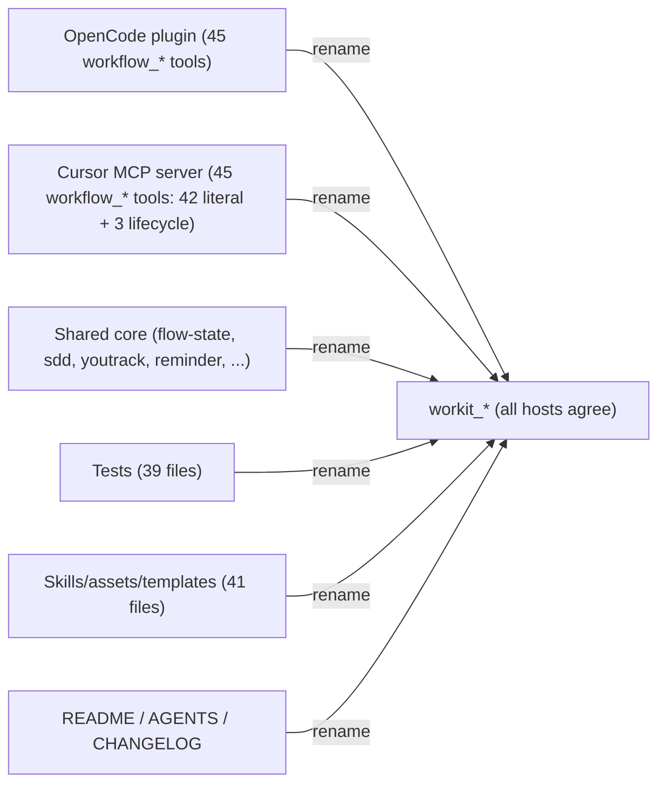

# Spec: Rename workflow_* tools to workit_*

**Branch:** `feature/workit-tool-rename`

## Context

The rename to `workit` covered only the three `workflow_toolkit_*` status/init tools (`workit_status`, `workit_init_status`, `workit_init_apply`). The far larger tool surface — every MCP/plugin tool exposed to agents — still uses the `workflow_` prefix: `workflow_flow_status`, `workflow_verify`, `workflow_doctor`, `workflow_spec_approve`, `workflow_plan_*`, `workflow_pr_*`, `workflow_docs_*`, `workflow_sdd_*`, `workflow_youtrack_*`, `workflow_present_*`, `workflow_rule_*`, `workflow_template_*`, `workflow_commit`, `workflow_handoff_*`. Users still see `workflow_` in tool names and docs, which is inconsistent with the `workit` brand and confusing when some tools are `workit_*` and others `workflow_*`.

There is no single source of truth: the OpenCode plugin declares each tool name as a literal object key (`workflow_foo: tool({...})`), the Cursor MCP server declares each as a literal first argument to `registerTool("workflow_foo", ...)`, and the shared core references these names as standalone strings (error messages, retry fields, and the mutation-tool allowlist). The rename must therefore update every literal in both adapters, the shared core, tests, skills/assets/templates, and user docs.

Two names are host-specific and must be renamed independently, not unified: OpenCode has `workflow_commit` (Cursor has no commit tool) and `workflow_handoff_session` (spawns a native session), while Cursor has `workflow_handoff_prompt` (builds a copy-paste prompt). Each maps to its own `workit_` equivalent. Legacy brand strings (`workflow-toolkit`, `workflow_toolkit`, `workflow-toolkit-contract`) are intentionally kept for legacy-identity detection and are out of scope. Counts refreshed after the merged OpenCode execution-reliability repair (PR #58), which added the advisory surface: 45 distinct `workflow_*` identifiers in the OpenCode plugin, 42 literal Cursor MCP registrations plus 3 template-generated lifecycle names, 39 test files, and 41 shipped skill/asset/template/vendor Markdown files referencing live `workflow_*` names.

## Goals

- Rename every `workflow_*` tool identifier to `workit_*` across the OpenCode plugin, Cursor MCP server, shared core, tests, skills/assets/templates, and user docs, matching the already-renamed `workit_status`/`workit_init_*`.
- Keep host-specific names host-specific: OpenCode `workit_commit` + `workit_handoff_session`; Cursor `workit_handoff_prompt` (no commit tool on Cursor).
- Make the mutation-tool allowlist, error/retry strings, and verification-claim detection in the shared core reference the renamed `workit_*` names.
- Leave legacy `workflow-toolkit`/`workflow_toolkit`/`workflow-toolkit-contract` brand strings untouched (legacy-identity detection depends on them).

## Non-goals

- No behavioral change to any tool; this is a pure mechanical rename of exposed identifiers.
- No unifying `handoff_prompt`/`handoff_session`/`commit` across hosts (behavior differs; names stay per-host).
- No change to legacy-identity detection or migration paths.
- No change to the CLI command surface (it already uses `workit`/`workit flow`); the CLI adapter receives an unchanged-behavior parity test while its asset templates are renamed.
- No change to legacy brand strings in any tracked document; tracked `docs/**/*.md` tool-name references are updated too, including older specs that describe live tool behavior.

## Architecture

Every `workflow_` tool identifier becomes `workit_` (prefix substitution on the tool name). The shared-core allowlist and strings follow. No runtime logic changes.

## Data flow / contracts

| Term | Meaning |
| --- | --- |
| Tool identifier | The exposed name agents call, e.g. `workflow_verify` → `workit_verify`. |
| Host-specific name | A tool that exists on one host only: `workit_commit` (OpenCode), `workit_handoff_session` (OpenCode), `workit_handoff_prompt` (Cursor). |
| Legacy brand string | `workflow-toolkit` / `workflow_toolkit` / `workflow-toolkit-contract` — kept for legacy-identity detection, not renamed. |
| Mutation-tool allowlist | `flow-state.ts` list of tools permitted for a delegated worker while a subagent-driven plan is active; must use the renamed `workit_*` names. |

| Surface | Before | After |
| --- | --- | --- |
| OpenCode tools | `workflow_verify`, `workflow_flow_status`, `workflow_commit`, `workflow_handoff_session`, … (45) | `workit_verify`, `workit_flow_status`, `workit_commit`, `workit_handoff_session`, … |
| Cursor MCP tools | `workflow_verify`, `workflow_flow_status`, `workflow_handoff_prompt`, … (42 literal + 3 lifecycle) | `workit_verify`, `workit_flow_status`, `workit_handoff_prompt`, … |
| Core strings / allowlist | `workflow_spec_approve`, `workflow_verify`, `workflow_commit`, `workflow_youtrack_post`, … | `workit_*` equivalents |

## Acceptance criteria

- CA-01: No `workflow_` tool identifier remains in any source file (`packages/*/src`, `packages/*/mcp`, `packages/workit-core/src/core`), except the intentionally-kept legacy brand strings (`workflow-toolkit`, `workflow_toolkit`, `workflow-toolkit-contract`). Verified by a grep for tool-name usage that excludes legacy brand strings.
- CA-02: Every OpenCode tool and Cursor MCP tool exposes the `workit_`-prefixed name; host-specific names stay per-host (`workit_commit`, `workit_handoff_session` on OpenCode; `workit_handoff_prompt` on Cursor).
- CA-03: The shared-core mutation-tool allowlist, error/retry strings, and verification-claim detection reference `workit_*` names and behave identically.
- CA-04: Tests across `test/artifacts`, `test/workit-core`, `test/workit-cursor`, `test/workit-opencode`, and `test/workit-cli/flow-parity.test.ts` assert `workit_*` names and pass; an explicit parity assertion compares the OpenCode and Cursor common tool set to the CLI's unchanged command contract, allowing only `commit`, `handoff_session`, and `handoff_prompt` host differences.
- CA-05: Every tracked skill, asset, template, and vendored skill under `packages/workit-core`, `packages/workit-opencode`, `packages/workit-cursor`, and `packages/workit-cli` references `workit_*` tool names; this includes `packages/workit-core/templates/**`, both Cursor/Core vendor Superpowers trees, and the OpenCode vendor tree.
- CA-06: README, AGENTS.md, package READMEs, CHANGELOG Unreleased, and every tracked `docs/**/*.md` file that contains a live `workflow_*` tool identifier reference `workit_*`; exact legacy brand strings remain for detection.
- CA-07: Full repository verification passes: lint, format:check, tests, build, changelog (`bun run check` / `workflow_verify`), plus `bun run validate:cursor-marketplace`.

## Decisions

- D-01: Do a mechanical prefix rename `workflow_*` → `workit_*` rather than unifying all hosts onto one registry; each host keeps its literal-declaration style to minimize blast radius and review surface.
- D-02: Keep host-specific names host-specific (`workit_commit`, `workit_handoff_session` OpenCode-only; `workit_handoff_prompt` Cursor-only) because the underlying behavior genuinely differs; renaming does not change that.
- D-03: Keep legacy brand strings (`workflow-toolkit`, `workflow_toolkit`, `workflow-toolkit-contract`) untouched for legacy-identity detection.
- D-04: Treat this as a single mechanical rename PR; the parity tests are the guard that all hosts stayed consistent.
- D-05: Update all tracked documentation tool references, including existing specs/plans, because leaving stale live identifiers in documentation would recreate the user-facing split this spec removes.

## Future work

- Consider extracting a single shared registry of tool names (constant per tool) so a future rename touches one file per host instead of every literal, once the `workit_*` rename is settled.
- Consider whether Cursor should gain a commit tool / session-spawning handoff in the Cursor subagent spec (separate spec).
