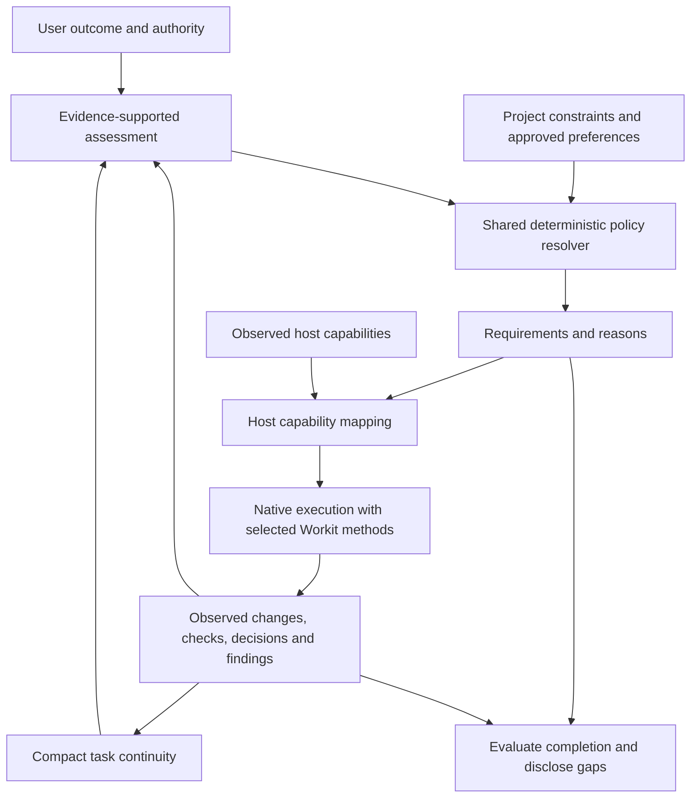

# Spec: Workit v1 adaptive engineering workflow

Status: Design decisions closed; implementation plan complete; execution not authorized.
Written 2026-09-02; finalized 2026-09-03; dependency baseline amended
2026-09-04.

Target: Workit 1.0, a breaking redesign of the current 0.x product. “Workit 2”
was the working name during discussion; this document uses Workit v1.

This is the product and architecture specification, not an implementation plan.
It consolidates the approved product, architecture, contract, and rollout decisions.
It does not authorize implementation, publication, installation changes, or
automatic conversion of existing workflows.

## 1. Context

Workit should be a second engineer: capable of challenging a weak proposal,
doing straightforward work without ceremony, and adding discipline when the
actual consequences justify it. It should not be a methodology that every task
must complete, or an agreeable assistant that helps rationalize every idea.

The current repository provides useful evidence about native integrations,
workflow integrity, and failure modes. It is not the blueprint that v1 must
preserve. Design the desired product first; assess implementation reuse,
compatibility, and conversion only after that design is settled.

### Current-code grounding

The local baseline when this draft was written was version 0.11.0 at commit
`0d78d8b2d6f948bcf4827d2c0979728512cdb7b3`.

| Observed implementation                                                                                                                                                        | Design implication, not a reuse commitment                                                             |
| ------------------------------------------------------------------------------------------------------------------------------------------------------------------------------ | ------------------------------------------------------------------------------------------------------ |
| [Shared core](../../packages/workit-core/src/core/) and separate OpenCode, Cursor, and CLI packages                                                                            | Keep engineering policy host-neutral and execution host-native.                                        |
| [Flow state](../../packages/workit-core/src/core/flow-state.ts), including `mintDelegateToken`, couples delegation to an active approved plan                                  | Bounded authority must not require formal planning when planning adds no value.                        |
| [Text detectors](../../packages/workit-core/src/core/detector.ts) infer missing discipline from conversational phrases                                                         | Words such as “test” or “design” are not evidence that the corresponding work happened.                |
| [OpenCode bootstrap](../../packages/workit-opencode/src/bootstrap.ts) and [Cursor session start](../../packages/workit-cursor/hooks/session-start.ts) inject workflow guidance | Bootstrap should establish a compact contract; task policy should select the methods loaded afterward. |
| [Repository verification](../../packages/workit-core/src/core/verify-project.ts) reports command results and can return success with checks skipped                            | Command success and sufficient evidence for an outcome are separate judgments.                         |
| [Handoff context](../../packages/workit-core/src/core/handoff-context.ts) requires spec and plan documents                                                                     | Resumable work must not depend on creating those documents for every task.                             |
| [Contract tests](../../test/workit-core/contracts.test.ts) include both text assertions and cross-host behavioral scenarios                                                    | Preserve meaningful behavioral coverage; do not use text conformity as a substitute for behavior.      |

Earlier recommendations to preserve `flow.json`, the existing approval chain,
or the current execution lifecycle as architectural constraints are superseded.
Their integrity properties remain worth evaluating; their representations and
ceremonies are not adopted by default.

## 2. Goals and non-goals

### Goals

- G-01: Make a natural-language outcome request sufficient to start useful work.
- G-02: Scale investigation, challenge, artifacts, testing, review, verification,
  and delegation independently, with reasons grounded in the task.
- G-03: Increase and decrease process as evidence changes without expanding
  authority or silently dropping obligations.
- G-04: Prefer useful behavioral tests and evidence over test volume, ritual,
  or claims of compliance.
- G-05: Preserve decisions and continuity across interruptions without forcing
  every task into a spec-and-plan workflow.
- G-06: Deliver equivalent policy semantics across the supported environments,
  while accurately reporting differences in available controls.
- G-07: Demonstrate that Workit improves real agent behavior without imposing
  disproportionate questions, artifacts, latency, or usage.
- G-08: Start v1 on the newest stable mutually compatible toolchain and adopt
  newer APIs only when they reduce duplication, improve a measured hot path, or
  strengthen a boundary.

### Non-goals

- Backward-compatible commands, state, package layout, or workflow ceremonies
  as constraints on the target design.
- A general-purpose workflow language, arbitrary phase engine, marketplace,
  or large catalog of personas.
- A new coding-agent runtime, provider catalog, or model-routing platform.
- A fork of Pi or ownership of its model, authentication, or terminal runtime.
- Prerelease dependencies, floating development-tool selectors, or migrations
  whose only benefit is a higher version number.
- Mandatory specs, plans, delegation, new tests, or approval of every action.
- A new memory database or mandatory external memory service.
- Worktrees or concurrent writers in the user's shared checkout.
- Automatic publishing, pushing, PR creation, issue updates, or time logging
  merely because engineering work has finished.

## 3. Product behavior

Workit is ambient by default. The user describes what they want; the lead agent
investigates and works within that request. There is no required workflow picker.
Users can request a specific method or more scrutiny without learning a policy
configuration language.

Straightforward work stays quiet. Workit explains a policy change when it creates
meaningful friction, changes the approach, reveals an assurance gap, or requires
a user decision. The full policy and its reasons remain inspectable on demand;
routine internal updates do not become a stream of status messages.

The agent makes reversible technical choices within the agreed scope. It asks
about consequential product choices, material dependency or cost commitments,
hard-to-reverse tradeoffs, and new authority. It investigates facts itself rather
than turning repository discovery into questions for the user.

| Situation                               | Intended behavior                                                                                                                                               |
| --------------------------------------- | --------------------------------------------------------------------------------------------------------------------------------------------------------------- |
| A mechanical version update             | Check the actual consumer and relevant existing checks; no new test whose only assertion repeats the version, no mandatory spec.                                |
| A small authorization change            | Inspect the affected trust boundary, add a meaningful regression where practical, and obtain fresh-context review; small diff size does not lower consequences. |
| A broad but behavior-preserving rename  | Coordinate the change and run affected checks; file count alone does not require deep design or new tests.                                                      |
| An ambiguous feature proposal           | Investigate and challenge the unresolved choices, then reduce ceremony once those choices are settled.                                                          |
| A long-running change with dependencies | Keep a durable plan and compact task state because coordination and resumption benefit from them.                                                               |

These examples illustrate separate policy dimensions, not named routes the user
must select.

## 4. Architecture and ownership

These are responsibilities, not a requirement to create a service, package, or
abstraction for each box. The minimum architecture is one shared decision core,
small native integrations, and the methods required by the resolved policy.

| Owner                     | Responsibility                                                                                           | Must not own                                                                          |
| ------------------------- | -------------------------------------------------------------------------------------------------------- | ------------------------------------------------------------------------------------- |
| Lead agent                | Investigate, assess, choose concrete steps, coordinate helpers, integrate, and explain results           | Grant itself authority or declare its own claims verified without supporting evidence |
| Shared Workit core        | Resolve policy, track requirements and evidence, reconcile task state, evaluate completion               | Host-specific model loops, presentation, or duplicated per-host policy rules          |
| Host adapter              | Discover capabilities, map native events and tools, present decisions, report provenance and limitations | Quietly weaken a core requirement or invent host attestation                          |
| Workit methods and skills | Carry out focused design, testing, debugging, review, planning, and handoff                              | Impose an independent universal workflow on top of the resolved policy                |
| Native host               | Run the agent and provide its actual tools, permissions, sessions, and supported delegation              | Be treated as exposing controls it does not provide                                   |
| Workit CLI                | Setup, diagnostics, task inspection, and explicit workflow control                                       | Become a sixth coding-agent runtime                                                   |

Bootstrap loads the invariant contract and how to obtain current task context.
Additional method instructions are loaded when needed. Compaction and resumption
must restore the current contract without repeatedly accumulating duplicate
bootstrap text or every available skill.

Workit-owned methods must follow the shared policy. Third-party or host-mandated
instructions can impose additional constraints; Workit must disclose material
conflicts rather than claim it can override higher-priority host instructions.

## 5. Policy resolver contract

### Assessment inputs

The model supplies a structured assessment supported by inspected evidence.
The resolver does not interpret conversation keywords as proof and does not
call a model, inspect files, or execute tools while resolving policy.

| Input                       | Required meaning                                                                                                 |
| --------------------------- | ---------------------------------------------------------------------------------------------------------------- |
| Requested outcome and scope | What the user wants, exclusions, and authorized actions                                                          |
| Intent and uncertainty      | Settled decisions, unresolved choices, and unknown facts that affect the work                                    |
| Consequences                | Behavioral change, public contracts, data integrity, security, operations, reversibility, and affected consumers |
| Coordination needs          | Duration, dependencies, separable work, interruptions, and likely handoffs                                       |
| Verification opportunities  | Existing checks, stable behavioral boundaries, practical reproductions, and missing facilities                   |
| Constraints                 | Applicable repository requirements, explicit user limits, approved preferences, and resource budgets             |
| Prior task context          | Current requirements, user decisions, evidence, findings, and outstanding obligations                            |

Non-obvious assertions carry an evidence reference or an explicitly labeled
inference. Unknown is distinct from false and from low consequence. A model's
assessment remains fallible; deterministic policy does not make that assessment
objectively correct. Contradictory observations require reconciliation.

### Independent dimensions

| Dimension                | Resolution rule                                                                                                                        |
| ------------------------ | -------------------------------------------------------------------------------------------------------------------------------------- |
| Investigation            | Resolve consequential unknowns before dependent decisions; uncertainty does not automatically create a long plan.                      |
| Design challenge         | Critical judgment is always present; a dedicated challenge pass is justified by unresolved assumptions or consequential choices.       |
| Artifacts                | A spec records a durable behavior agreement; a plan records useful sequencing or coordination. Either can be needed without the other. |
| Test creation and method | Select useful behavioral coverage; apply TDD where practical at agreed boundaries. TDD is a method, not the highest severity setting.  |
| Verification             | Require evidence appropriate to the affected behavior and consequences, plus applicable repository-required checks.                    |
| Review                   | Fresh-context review is the default for nontrivial behavior changes; mechanical low-risk work can use self-review.                     |
| Delegation               | Use helpers when independent judgment, context isolation, investigation, or parallelism pays for the coordination cost.                |
| Continuity               | Maintain compact task-local continuity automatically; increase durable documentation only when it helps.                               |
| User decisions           | Ask for unresolved user-owned choices or new authority, not routine policy adjustments.                                                |

There is no single risk score that controls all dimensions. File count, line
count, and labels such as “small” may be descriptive evidence, never sole
authority for the required workflow.

### Default rule catalog

These rules apply independently. The assessment must establish the condition;
the resolver selects the response rather than inferring risk from filenames or
the size of a diff.

| Observed condition                                                                 | Required response                                                                                      |
| ---------------------------------------------------------------------------------- | ------------------------------------------------------------------------------------------------------ |
| An unknown fact could change the approach                                          | Investigate before the dependent action; do not automatically require a spec or plan.                  |
| A consequential product choice remains unresolved                                  | Present alternatives and obtain the user's decision.                                                   |
| Behavior changes in decisions, errors, side effects, permissions, or data handling | Require behavioral verification and fresh-context review, even for a one-line fix.                     |
| A change is demonstrably mechanical and low-risk                                   | Use relevant existing checks and self-review; do not automatically create new tests.                   |
| The work needs a durable agreement about intended behavior                         | Write a spec.                                                                                          |
| Dependencies or coordination cannot be adequately captured in compact task notes   | Write a plan.                                                                                          |
| Independent investigation or judgment would help                                   | Use a scoped helper when the benefit justifies the cost; keep tightly coupled implementation together. |
| Evidence removes the condition that required extra process                         | Remove that extra process while retaining unresolved findings and relevant verification obligations.   |

A version bump or configuration edit is not mechanical merely because it changes
a constant. Establish its behavioral consequences first. Unknown consequences
trigger investigation rather than a low-risk assumption.

### User preference semantics

- “Be thorough” adds scrutiny where it is useful, not a fixed set of extra
  artifacts, agents, or review rounds.
- “Keep it fast” removes optional work; it cannot remove permission boundaries,
  applicable mandatory checks, or the evidence needed for a success claim.
- The user can explicitly accept a permitted limitation. Record that limitation
  and its scope instead of representing the missing evidence as verification.

### Resolver outputs and invariants

The output identifies the selected methods and concrete requirements. Each
requirement has a purpose, applicable scope, reason, evidence or decision needed
to satisfy it, and the point at which it must be satisfied. Requirements are
separate from observations claiming to satisfy them.

- PR-01: Identical normalized inputs and policy version produce identical
  requirements and reasons. Any relevant prior state is an explicit input.
- PR-02: A stronger requirement on one dimension does not automatically
  strengthen unrelated dimensions.
- PR-03: Invalid or incomplete inputs never silently become a permissive policy.
  Identify the missing assessment and restrict the dependent action; safe,
  authorized investigation may continue.
- PR-04: User preferences can adjust process within applicable constraints.
  Scope, host permissions, evidence truthfulness, and non-overridable requirements
  cannot be bypassed through a “fast” preference.
- PR-05: Missing host capabilities do not erase requirements. Host mapping
  reports how each requirement can be met and what remains unavailable.
- PR-06: Reassessment may add, replace, or retire requirements only with a
  recorded reason. It cannot silently discard an unresolved failure or finding.
- PR-07: Policy revision cannot grant new authority, approve new spending, or
  expand the user's requested outcome.

### Shared task and operation contract

All hosts use one versioned task model with the following logical sections.
These are data boundaries, not separate services or mandatory documents.

| Section               | Required contents                                                                |
| --------------------- | -------------------------------------------------------------------------------- |
| Task                  | Identity, objective, scope, current status, next action, and revision            |
| Assessment            | Observed facts, inferences, consequential unknowns, and supporting references    |
| Policy                | Required work, reasons, and the policy version that produced it                  |
| Decisions             | What the user approved or accepted, its scope, and its provenance                |
| Evidence and findings | What was checked, the relevant code state, actual results, and unresolved issues |
| Workers               | Assignments, authority, execution status, and checkout writer ownership          |

Expose purpose-specific operations to inspect/control a task, submit an
assessment, record evidence/findings, record a decision, and coordinate helpers.
Host adapters translate native actions into these shared operations. There is
no generic operation to overwrite task state or arbitrarily set individual
fields that bypasses those operations' validation.

Every update identifies the revision it read. Reject stale updates rather than
silently applying them over newer work. Agents may submit claims, but cannot
label themselves host-attested or satisfy requirements merely by asserting
compliance. Inspection is read-only. Closure evaluates evidence; it does not
accept a caller-supplied completion flag as proof.

A started task is `active`. It can move between `active` and `paused`, and either
state can transition to `closed`. Store the closing outcome separately:

- `verified`: applicable requirements are satisfied.
- `accepted_limitations`: explicitly accepted, permitted gaps remain visible.
- `stopped`: work ended without claiming completion.

A blocker describes an obstacle to the task, not another lifecycle state.
The shared task structure, operation boundaries, revision checks, and lifecycle
are settled. The [shared contract reference](contracts.md) defines the serialized
fields, public operation names, structured errors, independent schema/policy
versions, and adapter trust boundary. Revisions are opaque snapshot identities;
even explicit recovery creates a fresh revision rather than reusing an old one.

### Adaptation boundaries

Reassess after consequential discoveries, changed intent or scope, an altered
behavioral boundary, relevant failures or findings, host capability changes,
resumption, and before delivery. Do not reclassify the entire task after every
message or tool call.

Escalate before the newly affected action. De-escalate when evidence resolves the
condition that justified extra process. Settled work is not repeated merely
because the policy changed. Persistent findings may require revisiting the
design; they are not a reason for an endless review loop.

## 6. Authority, assurance, and user choices

Policy describes what discipline the work needs. Authority describes what the
agent is allowed to do. Neither a plan, a helper assignment, a summary, nor an
increased policy level creates authorization for external or destructive actions.

An approval records the actual decision, scope, and content presented to the
user, together with its provenance. Consent for one purpose does not authorize
another. If the relevant approved intent changes, obtain the required new
decision; do not invalidate unrelated settled choices by default.

Bind approval to a snapshot containing the exact decision presented, its purpose,
task/workspace scope, and approved content, using a SHA-256 fingerprint. A change
to that approved decision invalidates its approval; an unrelated section's edit
does not reset other approvals. When the user approves an entire document, its
complete contents are bound.

Design approval remains applicable while the approved scope and content remain
unchanged. Approval of a one-time action cannot become standing permission.
A fingerprint establishes content consistency, not the identity of the approver:
native receipts and agent-reported consent retain their different provenance.

Once the user knowingly accepts a legitimate tradeoff, do not keep arguing the
same point. Reopen it only when new material evidence changes that tradeoff.
Acceptance of a verification limitation records a limitation, not a passing test.

| Assurance    | Meaning                                                                                                |
| ------------ | ------------------------------------------------------------------------------------------------------ |
| Enforced     | A tested control can prevent the prohibited action within a stated surface and scope.                  |
| Agent-guided | Instructions or coordination require the behavior, but the adapter cannot reliably prevent violations. |
| Unavailable  | The required mechanism or evidence cannot be provided in this environment.                             |

Assurance is recorded per capability and controlled surface, not as a single
badge for the host. An MCP tool checking its own calls does not imply that it
intercepts arbitrary editor or shell writes. Prompt text labeled “HARD-GATE,” a
caller-supplied role, or a generated summary is not host attestation.

When a necessary capability is unavailable, offer an honest alternative that
satisfies the requirement, request the necessary user decision, or stop the
dependent action. Unrelated safe progress can continue. Requirements with an
explicit enforcement minimum cannot be satisfied by guidance alone.

## 7. Challenge-design

The user's proposed solution is a hypothesis to evaluate, not a position to
defend. A dedicated challenge pass must:

1. Inspect the relevant system and separate facts, inferences, opinions, and
   unknowns where the distinction affects a decision.
2. Identify meaningful hidden assumptions, simpler alternatives, coupling,
   failure modes, and operational or maintenance consequences.
3. State directly when the proposal is weak, overcomplicated, or solves the
   wrong problem, with concrete reasons.
4. Ask only the remaining decisions the user owns, giving a recommendation
   and its tradeoffs.
5. Stop when the consequential decisions are settled; do not manufacture
   objections or exhaust hypothetical branches for their own sake.

Critical thinking remains active during ordinary work without requiring a
separate grilling session. The method must neither optimize for agreement nor
become performative opposition.

## 8. Testing and verification

### Behavioral TDD

Follow the selected Matt Pocock approach: agree on observable behaviors and
stable interfaces, then use TDD wherever practical at those boundaries.

Agreement belongs in the relevant design conversation, not an approval prompt
for every assertion. For routine, unambiguous fixes, an existing agreed contract
can supply the boundary; ask when the choice would change intended behavior.

Work in vertical slices: one meaningful failing behavioral test, the minimum
implementation to pass it, then the next case. Observe that the failure is for
the intended reason. Refactor behind the same behavioral contract.

Prefer tests that survive implementation refactors. Do not require tests per
function, coverage quotas, assertions copied from the implementation, duplicated
cases, or tests that merely restate dependency versions and document wording.
Exact-value checks remain valid when the value is a real external protocol or
consumer contract; the objection is to tautology, not to exactness.

When test-first is impractical, explain why and identify the alternative evidence.
For behavior-preserving refactors and mechanical changes, existing checks may
be sufficient. No new tests never means no verification.

### Evidence and freshness

| Evidence property   | Required meaning                                                                |
| ------------------- | ------------------------------------------------------------------------------- |
| Claim               | Which behavior, requirement, or consequence the observation supports            |
| Scope and candidate | Relevant code, configuration, inputs, and environment observed                  |
| Provenance          | Actual producer or observation mechanism, including assurance limitations       |
| Result              | Passed, failed, missing, skipped with reason, or stale; not one success boolean |
| Relevance           | Why the observation applies to the delivery candidate                           |

Run focused checks during work and broader affected checks before delivery.
Applicable repository-required checks remain requirements. Merely running the
usual commands does not establish that the requested behavior was verified.

Evidence is fresh relative to relevant state, not the number of messages since
it was collected. Relevant changes invalidate the affected evidence. When the
dependency scope is uncertain, treat freshness conservatively. An unrelated
documentation edit does not automatically invalidate all behavioral evidence.

Missing tools, skipped suites, failed checks, and unavailable environments are
visible gaps. A command's exit status is preserved, but exit zero alone cannot
satisfy an unrelated or untested requirement.

### Delivery

Before claiming completion, reconcile the requested outcomes, applicable
requirements, current candidate, evidence, and review findings. A full success
claim requires sufficient current evidence and no unresolved blocking findings.

The user may stop work or accept a disclosed limitation where allowed. Record
that disposition separately from verified completion; do not report a missing
review, failed check, or unverified behavior as passed. The delivery summary
states the outcome, useful verification, and remaining limitations concisely.

Completion does not depend on a mandatory spec, plan file, per-task commit,
progress-ledger line, or a ritual final command. Explicit task closure must remain
recoverable and inspectable through the host and Workit CLI.

## 9. Review

Fresh-context review is the default for every nontrivial behavior change.
Mechanical low-risk changes may use self-review. A small high-consequence change
does not become low-risk because it is short.

A reviewer receives the real change, intended behavior, accepted decisions,
constraints, and actual verification evidence, not only the author's success
summary. Fresh context means a separate review context from the implementation
conversation; it need not mean a different provider or model.

Review must address intent and project standards as well as correctness and
regression risks. Add specialist perspectives only for relevant risks, not a
fixed panel of reviewers for every change.

Treat findings as claims to investigate. Confirm the affected behavior and
consequence, then fix in-scope defects, dismiss unsupported findings with reasons,
defer pre-existing or out-of-scope issues explicitly, or ask the user to resolve
a real tradeoff. Do not patch every comment automatically.

Use one substantive review and targeted rechecks of findings or material changes.
Review must refer to a stable candidate. If that candidate changes, reconcile
which conclusions remain valid. Persistent serious findings call for revisiting
the approach, not cycling reviewers indefinitely.

If independent review is required but unavailable, same-session self-review
cannot be relabeled independent. Preserve the gap and follow the authority and
delivery rules above.

## 10. Delegation and checkout ownership

Use one accountable lead with scoped helpers, not a permanent team. Delegation
can provide independent judgment, focused research, context isolation, or useful
parallelism. It must not force a formal spec, plan, or execution-mode menu.

Each helper receives an objective, relevant decisions, allowed scope, applicable
test boundaries, necessary evidence, and a clear stopping condition. It cannot
expand authority, approve its own exceptions, or create an uncontrolled tree of
nested helpers. The lead owns integration and delivery.

There is one active writer per shared checkout, whether lead or helper. Writer
ownership transfers explicitly; the lead does not edit while a worker owns it.
The restriction includes builds, formatters, tests, and tools that mutate shared
state, not only calls named “edit.” No worktrees are used.

Scoped Workit metadata updates, such as recording evidence or a worker report,
use the core's short serialized lock and revision checks; they do not acquire or
transfer repository writer ownership. Agents must not edit `.workit/` files
directly. Read-only workers may use these bounded reporting operations without
gaining permission to edit product files or run side-effectful commands.

Independent read-only investigation can run in parallel when it has no conflicting
side effects. Review uses a stable candidate. Read-heavy operations that depend
on files remaining unchanged must coordinate with the active writer.

Cancellation must stop or account for active helpers before writer ownership is
reassigned. An uncertain worker state is not proof that the worker stopped.
Do not grant a second writer because a coordination timeout elapsed.

Unavailable implementation delegation can fall back to inline execution when
the policy allows it. Unavailable required independent review remains a gap.
Report whether single-writer coordination is enforced or agent-guided on the
actual host surface; it is not a general OS-level security boundary.

## 11. Continuity, documents, and memory

Maintain compact task-local continuity automatically. Capture:

- Objective, scope, exclusions, and current authority.
- User decisions and reasons, distinct from assumptions and observed facts.
- Current progress, unresolved questions, and next useful action.
- Policy requirements and the reasons for meaningful changes.
- The working candidate, evidence, findings, limitations, and writer ownership.

Update at meaningful boundaries, not by copying every message and tool output.
Keep useful references to source evidence; do not turn task memory into a second
transcript. Avoid retaining secrets or unrelated user data.

Specifications are for durable agreements about behavior. Plans are for useful
sequencing, dependencies, and coordination. Neither is a prerequisite for every
task or for continuity. Describe changes against the existing system instead of
rewriting its entire specification.

Use an ADR when the decision is hard to reverse, surprising, and involves a real
tradeoff. A short paragraph can be sufficient. Do not create decision documents
for ordinary implementation details.

On resume, reconcile the workspace, relevant files, current candidate, evidence,
active workers, and authority. Preserve settled decisions while surfacing new
contradictions. A summary cannot grant authority or make stale evidence current.
Documentation records intended behavior; code and observations show actual
behavior. Surface disagreement rather than silently treating either as correct.

Task-specific preferences do not become project-wide rules without the user's
approval. No external memory service is required for core Workit behavior.

### Project-local storage contract

Each project stores Workit's compact, versioned task records in a Git-ignored
`.workit/` directory. All local Workit host integrations operating on that
checkout use the same records; task continuity does not depend on any one host's
conversation storage. Deliberately shareable specifications and plans remain
in `docs/`, separate from runtime task history.

Records contain the task information listed above, including references to
evidence, rather than copies of conversations. They must not contain credentials.
Do not automatically delete task history. Any cleanup requires an explicit user
action with the affected records identified.

Reads never repair, initialize, or migrate task state. Recovery is an explicit
operation. Updates must be atomic, and conflicting updates must fail visibly
rather than silently overwrite a newer record. Failed writes or ambiguous
ownership cannot produce a success record.

Approvals follow section 6: they bind to the particular decision and content
presented. A relevant change requires renewed approval; unrelated decisions
remain valid. Persisting or transferring an approval record does not strengthen
its provenance or create new authority.

Task history belongs to this checkout. Moving it to another clone or machine
requires explicit export/import rather than background synchronization. Imported
history is continuity context: reconcile the destination workspace, evidence,
and authority before using it to resume work.

### Snapshot layout, updates, and recovery

Use readable JSON snapshots, without a database or background coordination
daemon:

| Stored item                  | Purpose                                                 |
| ---------------------------- | ------------------------------------------------------- |
| `.workit/tasks/<id>.json`    | One task's versioned state                              |
| `.workit/workspace.json`     | Checkout identity and authoritative writer ownership    |
| Previous validated snapshots | Recovery copies, never a second source of current state |

The workspace record is authoritative for writer ownership. Task records must
not contain competing ownership claims; their shared-model ownership view is
resolved against the workspace record.

An update acquires a short metadata lock, checks the expected revision, writes a
complete temporary file, and atomically replaces the current snapshot. Failed
updates must leave the previous valid state available. Recovery copies are not
used automatically to bypass revision or ownership checks.

Never reclaim ownership solely because a lock is old. After a process crash or
uncertain ownership, block dependent mutations and report recovery needed.
Explicit recovery checks that the previous worker has stopped before granting
another writer. Preserve corrupt records for inspection; never silently replace
them with empty state.

V1 supports local filesystems, not shared network storage or cross-machine
concurrent writers. Occasional explicit recovery after a crash is an accepted
tradeoff for avoiding a continuously running coordination service.

The storage architecture, retention, recovery behavior, and approval-binding
semantics are settled. Exact serialized fields and recovery preconditions are
defined in the [shared contract reference](contracts.md).

## 12. Supported environments

| Target        | Product contract                                                                                                                                      |
| ------------- | ----------------------------------------------------------------------------------------------------------------------------------------------------- |
| OpenCode      | Native plugin, tools, lifecycle hooks, and native subagents. Shared core owns policy.                                                                 |
| Cursor        | Native plugin with MCP tools, hooks, and native subagents. Report the assurance of each capability honestly.                                          |
| Codex CLI     | Native plugin components, tools, hooks, and subagents; its own capability and acceptance matrix.                                                      |
| Codex desktop | Share Codex integration components where possible; validate desktop activation, tools, hooks, and subagents separately from CLI.                      |
| Pi            | Native extension with bundled coordination of supervised stock-Pi worker processes.                                                                   |
| Workit CLI    | Installation/setup, diagnostics, task status, policy explanation, and explicit pause/resume/closure or handoff control. No autonomous coding runtime. |

Parity means identical policy semantics for identical inputs, compatible evidence
and decision meaning, and an honest account of different capabilities. It does
not mean identical prompts, commands, UI, identity mechanisms, or prevention
guarantees. Do not reduce every host to the weakest host's surface.

Adapters must identify the environment and relevant capabilities. Installed,
loaded, operational, agent-guided, and unavailable are not interchangeable.
Diagnostics must reveal missing activation and dependencies without claiming
success because package files exist.

Interactive decisions use native presentation when available. In non-interactive
operation, missing required consent produces an explicit needs-input result;
absence of a dialog is never consent. Task inspection must remain possible
without starting another model session.

### Native integration and release baseline

Use supported native hooks as well as tools and instructions. Do not preserve
the old assumption that Cursor or Codex can integrate only through prompts and
MCP. Hook coverage, failure behavior, and worker identity must be tested for each
surface; the presence of a hook is not proof that every execution path is
intercepted. See the official [Cursor hooks](https://cursor.com/docs/hooks),
[Codex hooks](https://learn.chatgpt.com/docs/hooks), and
[OpenCode plugins](https://opencode.ai/docs/plugins/) documentation.

All requested targets must meet the applicable baseline before the release is
called v1. No target counts as supported merely because its package or
instructions exist. Each coding environment must demonstrate:

1. Reliable activation and application of shared policy.
2. Evidence recording and truthful completion outcomes.
3. Fresh-context review.
4. Pause, resume, and continuity across the supported session boundaries.
5. Safe cancellation and writer ownership wherever delegation is provided.

Workit CLI must demonstrate the same core semantics through its commands,
including inspection, evidence and decision handling, lifecycle, and recovery;
it does not need to supply a coding-agent or reviewer runtime. Passing this
baseline does not imply identical assurance, complete tool interception, or
sandboxing. Capability reports must still distinguish enforced, agent-guided,
and unavailable behavior.

These integration strategies are settled design choices. Actual host checks,
supported version ranges, and the resulting capability matrix are release
evidence still to produce, not completed validation.

### Toolchain and dependency baseline

V1 uses the newest stable mutually compatible direct dependencies available at
the dependency audit, excluding prereleases. “Latest” is a selection decision,
not a floating runtime selector: the accepted versions are exact in manifests,
CI, and `bun.lock`. Host peer ranges may cover a tested compatible release line,
but a version is not supported until the corresponding build, package, and host
checks pass. Transitive packages are owned by the direct dependency and lockfile;
do not add or override them without a demonstrated conflict.

The baseline below was audited on 2026-09-04. It is the implementation target,
not a claim that the current 0.x checkout already passes every combination.

| Role                   | V1 baseline                                                                                                                                                                    | Selection and intended use                                                                                                                                            |
| ---------------------- | ------------------------------------------------------------------------------------------------------------------------------------------------------------------------------ | --------------------------------------------------------------------------------------------------------------------------------------------------------------------- |
| Distributed runtime    | Node.js 24 LTS; package engine `>=24`; CI/release pin `24.20.0`; `@types/node` `24.13.3`                                                                                       | Prefer the latest LTS line over Node 26 Current. Packages must still run without Bun.                                                                                 |
| Development runtime    | Bun `1.4.1`; `@types/bun` `1.4.1`                                                                                                                                              | Use for install, build, and tests. Do not introduce Bun-only APIs into Node-distributed artifacts.                                                                    |
| Compiler               | TypeScript `7.0.2`                                                                                                                                                             | Use the native `tsc` CLI. Workit imports no TypeScript compiler API, so it needs no TypeScript 6 compatibility sidecar.                                               |
| Shared schemas         | Zod `4.5.4`                                                                                                                                                                    | Define strict canonical schemas once, selectively compile the eight stable operation unions, and derive MCP JSON Schema from the uncompiled definitions.              |
| MCP transport          | `@modelcontextprotocol/sdk` `1.30.0`                                                                                                                                           | Use the latest stable SDK and its low-level server transport while Workit controls tool-schema publication and core controls parsing. Do not adopt the v2 prerelease. |
| OpenCode               | `@opencode-ai/plugin` `1.18.27`; host `1.18.27`                                                                                                                                | Pin the build contract and validate the native plugin against the same host release; do not ship the SDK as a runtime dependency.                                     |
| Pi                     | `@earendil-works/pi-coding-agent` `0.85.0`                                                                                                                                     | Pin the development fixture and declare the tested `^0.85.0` peer line; do not bundle Pi itself.                                                                      |
| Codex                  | Codex CLI `0.153.2` qualification target                                                                                                                                       | Codex is a host, not a Workit runtime dependency. Test CLI and desktop separately and record the desktop build used.                                                  |
| CLI UI                 | Ink `7.1.1`, `@inkjs/ui` `2.0.0`, React `19.2.8`, `@types/react` `19.2.18`, `react-devtools-core` `7.0.1`                                                                      | These installed direct versions were already the newest compatible stable set; keep them rather than churning the CLI.                                                |
| Validation and release | AJV `8.20.0`, `ajv-formats` `3.0.1`, oxfmt `0.66.0`, oxlint `1.81.0`, semantic-release `25.0.9`, exec `7.1.0`, GitHub `12.0.9`, npm `13.1.5`, release-notes generator `14.1.1` | Upgrade only oxfmt and oxlint; the other audited direct packages were already current.                                                                                |

TypeScript 7 currently type-checks the repository without source changes. Its
native compiler and parallel work are the benefit; Workit must not add the
TypeScript 6 API package unless a later direct tool proves that it needs the old
compiler API.

Zod's uncompiled schemas remain the source of truth. `parseOperation` uses one
explicitly compiled parser per closed operation family via `z.compile()`, and
tests compare accepted values, parsed output, rejected values, and issue details
against the uncompiled schema corpus. Do not globally import `zod/compile`: that
application-wide side effect is inappropriate in a shared library and would also
compile unrelated host schemas. Compilation generates code only from Workit's
trusted static schema definitions; no task input contributes code.

Generate advertised MCP input schemas with `z.toJSONSchema(..., {
target: "draft-2020-12" })`. The stable MCP SDK 1.30.0 accepts Zod 4 but its
high-level `McpServer` currently advertises draft-07 for this path. Workit must
therefore use the SDK's low-level `Server` handlers for `tools/list` and
`tools/call`, publish the explicit 2020-12 schema, and parse calls through the
same compiled core schema. Do not patch or vendor the SDK, duplicate hand-written
JSON Schema, or depend on experimental `z.fromJSONSchema()`.

The implementation plan begins by upgrading the shared development toolchain so
all later tasks run on the target compiler/runtime. Host dependencies move in
their owning adapter tasks. Before release qualification, rerun the direct
dependency audit; a newer stable patch may replace a listed patch only after the
same deterministic, package, and host gates pass and the recorded design
baseline is updated.

### Pi package contract

“Baked in” means required capabilities are available, integrated, and tested
after the Workit installation. It does not mean writing every component from
scratch or assuming the user installed optional companion packages manually.

The Pi package must provide:

1. Workit activation and compact context restoration, including after compaction.
2. Core-backed assessment, policy, evidence, and workflow tools using native
   extension hooks where they provide real controls.
3. Scoped worker and fresh-context review execution, result collection,
   cancellation, and single-writer coordination.
4. Usable interactive decisions and explicit behavior for headless operation.
5. Session-aware persistence, resume reconciliation, and diagnostics that expose
   missing or conflicting components.

Workit bundles the coordinator and launches fresh stock-Pi worker processes,
collects structured results, and handles cancellation, failures, and interrupted
writer ownership. Reviewers receive read-only tools; implementation workers
receive explicitly scoped writer ownership. This is a workflow control, not an
OS sandbox. A timeout alone cannot prove that a writer has stopped.

Required worker coordination must not depend on the user separately installing
a subagent package. Pi continues to own model selection, authentication, and
agent execution; Workit does not fork Pi or provide a replacement agent runtime.
The official
[subagent example](https://github.com/earendil-works/pi/blob/4e69b0c28060f0f02fbe38bfa7c21a2e2eb25057/packages/coding-agent/examples/extensions/subagent/index.ts)
is an implementation reference, not evidence of production readiness. Validate
the packaged extension and worker behavior on stock Pi before release, including
the supported interactive and headless modes.

Pi's extension system supports tool hooks, custom tools, and session data, but
extensions execute with the user's process permissions. Pi has no built-in
sandbox. Workflow guards must not be described as isolation from arbitrary code
or prompt injection. Actual sandboxing belongs to the host/OS environment.
See the [Pi extension documentation](https://pi.dev/docs/latest/extensions),
[package documentation](https://pi.dev/docs/latest/packages), and
[security documentation](https://pi.dev/docs/latest/security).

During design, local Pi 0.84.4 and Codex CLI 0.145.0 were identified. Pi's installed
extension documentation was inspected. This establishes a concrete research
baseline, not a supported-version promise or completed integration test. Codex
desktop is a separate target; the CLI version does not attest its capabilities.

## 13. Optional integrations

Repository hosting, issue tracking, time logging, and documentation helpers
remain separable capabilities. The v1 inventory is:

| Capability              | Included scope                                                                                  |
| ----------------------- | ----------------------------------------------------------------------------------------------- |
| Git, GitHub, and GitLab | Branch setup, commit preparation, issue/PR context, and authorized commit, push, and PR actions |
| YouTrack                | Issue context, update drafts, posting updates, and time logging                                 |
| Meeting logging         | Optional YouTrack convenience, not a required engineering-workflow step                         |
| Documentation helpers   | Changelog, release-note drafts, and affected-document updates when relevant                     |

These capabilities preserve useful outcomes, not the old command names or
mandatory workflow. Completing a coding task does not by itself require a
commit, PR, changelog entry, issue update, or time entry.

Core assessment, verification, review, and continuity must not require credentials
for optional services. Enabling an integration does not authorize every external
action it supports. Failures must identify the affected integration without
misrepresenting unrelated engineering work as failed or completed.

### Action and permission defaults

- Enabling or configuring an integration grants no permission to publish or
  change anything. Each action must stay within the user's authorized scope.
- A clear user request can authorize a bounded workflow, including its stated
  actions. Do not ask again for every already-authorized step; obtain a new
  decision when the action or scope is not covered by that authority.
- Time entries use durations supplied or confirmed by the user. Never infer
  hours worked from agent runtime, token usage, or other agent activity.
- After an uncertain remote response, reconcile the service's actual state
  before retrying. Do not blindly duplicate comments, time entries, or PRs. If
  the outcome cannot be established, preserve the uncertainty and request
  resolution instead of claiming success or automatically repeating the write.
- Missing optional credentials must not prevent unrelated core work. Report
  the affected action and its actual outcome separately.

Verification must exercise a bounded authorized workflow without redundant
permission prompts, refusal to invent logged time, and an uncertain remote
write without a duplicate retry. These are behavioral contracts, not a
requirement for a generic integration framework.

## 14. Acceptance criteria and evaluation

### Behavioral acceptance criteria

These are release requirements to test, not claims that the current repository
already satisfies them.

| ID    | Scenario                                                | Required observable outcome                                                                                                                                                       |
| ----- | ------------------------------------------------------- | --------------------------------------------------------------------------------------------------------------------------------------------------------------------------------- |
| CA-01 | Mechanical, low-risk edit                               | No mandatory spec, plan, delegation, or tautological new test; relevant verification still occurs.                                                                                |
| CA-02 | Small authorization change                              | Consequence-sensitive verification and fresh-context review despite the small diff.                                                                                               |
| CA-03 | Large behavior-preserving rename                        | No escalation based only on file count; affected consumers and checks determine the work.                                                                                         |
| CA-04 | Ambiguity resolved during investigation                 | Extra challenge or artifacts can be reduced with a reason; unrelated verification obligations remain.                                                                             |
| CA-05 | New material risk discovered                            | The dependent action waits for the newly required decision/evidence; policy does not grant new authority.                                                                         |
| CA-06 | User accepts an informed tradeoff                       | The agent stops repeating the objection unless new material evidence appears.                                                                                                     |
| CA-07 | Resolver replay                                         | Same normalized inputs, prior state, and policy version yield identical requirements and reasons.                                                                                 |
| CA-08 | Unknown or malformed assessment                         | No silent low-risk default; missing inputs and affected restrictions are explicit.                                                                                                |
| CA-09 | Behavioral test boundary                                | A relevant failing test precedes implementation where practical; refactoring preserves the public behavior test.                                                                  |
| CA-10 | Test-first is impractical                               | The limitation and alternative evidence are recorded; no fabricated RED result.                                                                                                   |
| CA-11 | Existing checks pass but requested behavior is untested | Exit zero alone does not produce a verified-success claim.                                                                                                                        |
| CA-12 | Relevant files change after verification                | Affected evidence becomes stale; unaffected evidence is retained when relevance is established.                                                                                   |
| CA-13 | Reviewer reports an unsupported defect                  | The finding is investigated and dismissed with reasons, not patched automatically.                                                                                                |
| CA-14 | Required independent review is unavailable              | Self-review is not relabeled independent; delivery preserves the gap.                                                                                                             |
| CA-15 | Two workers request write ownership                     | Workit grants at most one owner on controlled paths and accurately labels any host enforcement limits.                                                                            |
| CA-16 | Writer cancellation or uncertain worker state           | No replacement writer is granted until the previous worker's ownership is safely resolved.                                                                                        |
| CA-17 | Small task uses a helper without formal documents       | Bounded authority and useful results work without spec/plan creation.                                                                                                             |
| CA-18 | Resume after external edits or compaction               | Decisions survive; workspace, evidence, authority, and workers are reconciled; no duplicate bootstrap accumulation.                                                               |
| CA-19 | Host has guidance but no interception                   | Assurance says agent-guided, never enforced merely because a rule or MCP tool exists.                                                                                             |
| CA-20 | Required consent in headless mode                       | An explicit needs-input result; no simulated approval.                                                                                                                            |
| CA-21 | Clean stock Pi plus Workit                              | Required methods activate, a worker/review completes, cancellation and resume work, and missing components are diagnosed without hidden companion assumptions.                    |
| CA-22 | Equivalent task across coding environments              | Shared policy semantics and requirement identities match; adapter differences and gaps are explicit. Codex CLI and desktop are tested separately.                                 |
| CA-23 | Workit CLI inspection and control                       | Current task, policy reasons, evidence gaps, and lifecycle controls are accessible without an LLM call.                                                                           |
| CA-24 | Optional service unavailable                            | Core work remains usable; the affected external action is not silently executed or reported successful.                                                                           |
| CA-25 | User accepts a verification limitation or stops work    | Closure preserves the limitation; the absent check is not recorded as passed.                                                                                                     |
| CA-26 | Read-only task inspection or resolver evaluation        | No hidden workflow repair, migration, authority change, or model session is triggered.                                                                                            |
| CA-27 | Configuration-conversion preview                        | No installation/state mutation or secret disclosure; supported mappings and unresolved settings are explicit before approval.                                                     |
| CA-28 | Continue selected legacy work                           | Original documents and records remain untouched; fresh v1 task context does not inherit old execution state, tokens, or action authority.                                         |
| CA-29 | Upgrade with old or mixed integration components        | Stop or account for old sessions, replace only approved Workit-managed components, and do not claim a mixed installation is operational.                                          |
| CA-30 | Rollback after further user edits                       | Restore only approved integration/configuration changes; preserve repository work and v1 task data, and refuse to overwrite conflicting subsequent edits.                         |
| CA-31 | Latest-compatible dependency qualification              | Typecheck, deterministic tests, package checks, and clean host smokes pass on the pinned Node/Bun/toolchain and adapter dependencies; no known failure is waived as tooling-only. |
| CA-32 | Compiled schema and MCP publication parity              | Compiled and uncompiled operation schemas accept and reject the same corpus with equivalent data/issues, and MCP advertises draft-2020-12 generated from those definitions.       |

### Test strategy

Use three layers, each proving a different claim:

1. Small deterministic core tests for policy rules, consequential interactions,
   evidence freshness, authority boundaries, ownership, and state recovery.
2. Shared contract scenarios plus adapter-specific checks for actual native
   mappings, activation, distribution, and capability reporting. Do not duplicate
   every core assertion in every adapter suite.
3. A bounded set of real-agent scenarios across supported targets to check that
   the agent actually follows the policy and that the product is useful.

Judge observable actions and outcomes, not an agent's statement that it complied.
Exercise failures, interruptions, stale evidence, missing capabilities, and
overly cautious behavior as well as successful happy paths. A hook unit test or
successful package import does not substitute for a real host interaction.

Compare representative tasks against the same native host without Workit, using
comparable model settings and task conditions. Track both missed safeguards and
unnecessary questions, documents, tests, review rounds, elapsed time, and usage.
No single quality score should hide either side of that tradeoff.

Run cheap deterministic checks frequently and bounded live evaluations at
milestones. Passing core tests alone is not sufficient to claim the rework is
successful.

### Release-evaluation protocol

Use these six real-agent scenarios, with fixtures and expected observable
outcomes fixed before the evaluated batch begins:

| ID   | Scenario                                    | Required outcome                                                                          |
| ---- | ------------------------------------------- | ----------------------------------------------------------------------------------------- |
| E-01 | Mechanical edit                             | Relevant existing checks, without unnecessary questions, documents, helpers, or new tests |
| E-02 | Tiny authorization change                   | Meaningful behavioral verification and fresh-context review despite the small diff        |
| E-03 | Ambiguity resolved during investigation     | Reduce the extra process when its justification disappears; retain relevant obligations   |
| E-04 | An informed tradeoff has been accepted      | Do not reopen it without new material evidence                                            |
| E-05 | Interrupted work followed by external edits | Reconcile writer ownership and evidence freshness before dependent work or completion     |
| E-06 | Required independent reviewer unavailable   | Preserve the review gap; never fabricate independent review or verified success           |

Run each scenario once with Workit and once without it on OpenCode, Cursor,
Codex CLI, Codex desktop, and Pi: 60 main scenario runs. Repeat the safety-critical
Workit scenarios E-02, E-05, and E-06 twice more on each coding environment:
30 additional runs, for 90 in the release-qualification set. A scenario run
includes its required interruption/resume and helper activity; this is not a
count of individual model calls. Workit CLI receives command-level checks
without model sessions.

Use equivalent starting repositories, task instructions, available permissions,
and model settings within each with/without-Workit comparison. Record host,
model, Workit and policy versions, configuration, and fixture revision. Score
actual actions and outcomes, not self-reported compliance. The native baseline
is a comparison, not a substitute for the Workit acceptance requirements.

This is release qualification, not a 90-run requirement for every commit and
not statistical proof of reliability. Native-capability checks and deterministic
tests remain necessary alongside these scenarios.

### Release gates and evaluation authority

Release requires:

1. Passing applicable core and native-integration checks on every supported
   target, including the optional-integration contracts in section 13.
2. No unresolved required-scenario failures, unauthorized actions, false
   completion claims, or unsafe writer replacement in the qualification results.
3. No mandatory documents, helpers, or pointless new tests for the mechanical
   scenario; relevant verification must still occur.
4. A comparison recording questions, artifacts, review rounds, elapsed time,
   and usage against the native baseline. Report regressions separately rather
   than hiding them in an average quality score.
5. CA-31 and CA-32 on the locked release candidate: every selected direct
   dependency combination passes its real compatibility checks, compiled schema
   behavior matches the canonical schemas, and MCP publishes the required JSON
   Schema dialect.

Preserve failed attempts and their dispositions. Diagnose and fix the cause,
then rerun the affected checks and relevant regressions; do not retry until a
passing attempt appears and discard the failures. Missing, interrupted, or
budget-exhausted required runs cannot count as passing evidence.

Before any live batch, obtain authorization for its models, maximum run count,
wall-time limit, and usage/spending ceiling, including helpers and resume
activity. Fix rounds and reruns must fit the authorized limits or receive new
authorization. Approval of this specification does not authorize those sessions,
spending, or external writes. Use fixture data; any external service mutation
also requires its own applicable action authority.

The protocol and release criteria are settled. Actual batch budgets and results
are execution inputs and release evidence, not unresolved product-design choices.

## 15. Design decisions

| ID   | Decision                                                              | Reason                                                                                             |
| ---- | --------------------------------------------------------------------- | -------------------------------------------------------------------------------------------------- |
| D-01 | Breaking v1, target design before compatibility                       | Existing workflow structure must not constrain the desired product.                                |
| D-02 | Shared deterministic policy, native execution                         | Consistent decisions without owning another agent runtime.                                         |
| D-03 | Independent dimensions and two-way adaptation                         | Consequences, uncertainty, and coordination are different problems.                                |
| D-04 | Critical judgment always; dedicated grilling when useful              | Challenge weak ideas without manufacturing friction.                                               |
| D-05 | Behavioral TDD where practical at agreed boundaries                   | Gain regression protection without implementation-coupled test noise.                              |
| D-06 | Fresh-context review for nontrivial behavior changes                  | Independent scrutiny is valuable without forcing a permanent team.                                 |
| D-07 | One lead, scoped helpers, one checkout writer, no worktrees           | Preserve accountability and avoid conflicting mutations.                                           |
| D-08 | Automatic compact continuity, selective documents                     | Resumption should not require formal project ceremony.                                             |
| D-09 | Explicit assurance levels                                             | Do not confuse instructions, observed receipts, and enforced controls.                             |
| D-10 | First-class stock-Pi package; separate Codex CLI/desktop validation   | Complete required behavior with host-specific, tested integration.                                 |
| D-11 | Optional service integrations separated from core                     | Engineering discipline should not depend on unrelated credentials.                                 |
| D-12 | Behavioral evaluation is a release requirement                        | The rework must improve real behavior, not only pass implementation tests.                         |
| D-13 | Clean break with explicit, recoverable cutover                        | Protect existing work without inheriting the old workflow or silently changing installations.      |
| D-14 | Latest stable compatible dependencies, exact pins, benefit-gated APIs | Gain current compiler/schema/runtime improvements without floating builds or novelty-driven churn. |

## 16. Reference choices

References inform mechanisms; none is adopted wholesale or treated as authority
over the decisions above. Most comparison snapshots were inspected on 2026-09-01;
Pi-specific follow-up was inspected on 2026-09-02. Pinned links identify the
research baseline, not promises about later upstream versions.

| Reference                                                                                                                                                                                                                                                                                                | Adopt or adapt                                                                                          | Do not copy                                                                                 |
| -------------------------------------------------------------------------------------------------------------------------------------------------------------------------------------------------------------------------------------------------------------------------------------------------------- | ------------------------------------------------------------------------------------------------------- | ------------------------------------------------------------------------------------------- |
| [Gentle AI](https://github.com/Gentleman-Programming/gentle-ai/tree/72e0cccb1ff10a7cf6ca0270961e903c4d7eb686)                                                                                                                                                                                            | Natural outcome requests, inline work, focused delegation, and optional durable SDD as distinct choices | Arbitrary file-count thresholds or the whole surrounding ecosystem                          |
| [GSD Core context engineering](https://github.com/open-gsd/gsd-core/blob/eca9c2b590bf49ff37dccd869ce689a34431410a/docs/explanation/context-engineering.md)                                                                                                                                               | Bounded fresh contexts and durable continuity                                                           | A universal phase loop, worktree assumptions, or large provider-routing machinery           |
| [Spec Kit agentic SDD](https://github.com/github/spec-kit/blob/1bd7743ede29dd22a93237559df26b2b5c773fe4/docs/reference/agentic-sdd.md)                                                                                                                                                                   | Useful consistency analysis and explicit requirements when documents exist                              | A generic workflow engine or mandatory artifact pipeline                                    |
| [OpenSpec overview](https://github.com/Fission-AI/OpenSpec/blob/d0071d7326689a0269332a500c8f56b3f2218ba9/docs/overview.md)                                                                                                                                                                               | Describe the intended change against an existing system; let artifacts support work                     | File-existence checks as evidence of completion                                             |
| [BMAD review triage](https://github.com/bmad-code-org/BMAD-METHOD/blob/7c3e58279bb0594024624e53941286c002b75609/docs/build/review-a-change.md)                                                                                                                                                           | Validate findings and give each a reasoned disposition                                                  | Automatic acceptance of reviewer claims or a default panel of personas                      |
| [Matt Pocock grilling](https://github.com/mattpocock/skills/blob/6654f6b60cd9d5be8b54c6fafe44346dabeb3b76/skills/productivity/grilling/SKILL.md)                                                                                                                                                         | Agent researches facts; user resolves consequential choices                                             | Exhaustive questioning once useful decisions are settled                                    |
| [Matt Pocock TDD](https://github.com/mattpocock/skills/blob/6654f6b60cd9d5be8b54c6fafe44346dabeb3b76/skills/engineering/tdd/SKILL.md)                                                                                                                                                                    | Agreed behavioral boundaries and vertical RED/GREEN slices                                              | Tests that repeat implementation structure or unnecessary approval per assertion            |
| [Matt Pocock review](https://github.com/mattpocock/skills/blob/6654f6b60cd9d5be8b54c6fafe44346dabeb3b76/skills/engineering/code-review/SKILL.md) and [ADR guidance](https://github.com/mattpocock/skills/blob/6654f6b60cd9d5be8b54c6fafe44346dabeb3b76/skills/engineering/domain-modeling/ADR-FORMAT.md) | Review intent and standards; document consequential, surprising, hard-to-reverse tradeoffs selectively  | Documentation for ordinary choices or review without explicit correctness scrutiny          |
| [Superpowers](https://github.com/obra/superpowers/tree/b36e0829c6d0140e93cfef2ca599b1b07d4a7797)                                                                                                                                                                                                         | Evidence before claims, systematic debugging, and scoped worker context                                 | Universal approval/TDD/artifacts, one-way process escalation, or skills owning the workflow |
| [Pi extension examples](https://github.com/earendil-works/pi/tree/4e69b0c28060f0f02fbe38bfa7c21a2e2eb25057/packages/coding-agent/examples/extensions)                                                                                                                                                    | Native extension primitives and scoped subagent implementation examples                                 | Treating examples as production-ready controls or extensions as a sandbox                   |
| [Gentle Pi](https://github.com/Gentleman-Programming/gentle-pi/tree/d901018a7d84f3b12f5eee1ebd3d49c996ab2f10)                                                                                                                                                                                            | Pi-specific workflow packaging and review integration lessons                                           | Assuming recommended companion packages are all bundled or copying strict routing rules     |
| [GSD Pi](https://github.com/open-gsd/gsd-pi/tree/2a1882e9d5a8aa4d1fcabd3b8eeb42429dded8b6)                                                                                                                                                                                                               | Orchestration and lifecycle lessons                                                                     | Its broader Pi-derived runtime/distribution ownership                                       |

These are Workit design judgments, not claims that any reference is universally
better or worse. In particular, replacing the vendored Superpowers version alone
would not deliver the policy architecture specified here.

## 17. Compatibility, conversion, and rollout

The target design is settled before considering reuse or conversion. There is
no legacy workflow compatibility layer: old commands, approval chains,
execution states, and ceremonies are not requirements for v1. Reuse an existing
module only when its behavior and boundaries fit this specification. The rework
does not require discarding useful code merely because it came from 0.x.

### Existing work and configuration

Preserve existing specs, plans, and legacy workflow records untouched. To
continue selected old work, start a fresh v1 task referencing the relevant
documents and reconcile current intent, code, evidence, and authority. Do not
bulk-convert old workflow states, delegation tokens, or approval records into
v1 execution authority. The v1-to-v1 export/import contract is separate from
this document-based continuation path.

Configuration conversion is preview-first. Identify supported preferences and
integration settings that carry forward, changed meanings, and settings needing
a user decision. Apply only the approved changes; never silently infer that an
unsupported old value means a permissive new default. Keep credentials out of
task records and conversion reports. Existing credential storage is not moved
or replaced without an applicable explicit action request.

### Integration cutover and distribution

Stop or account for old sessions before switching integrations. Back up the
affected Workit-managed configuration, then replace old hooks, rules, tools,
and registrations as a coherent set. Do not activate both generations in the
same environment or mix old workflow instructions with new control tools.
Preserve unrelated user settings and report incomplete/conflicting activation
instead of claiming that package installation alone completed the cutover.

Keep the shared core and thin native integrations as one tested release set,
distributed through each host's native packaging. Codex CLI and desktop can
share integration components but retain their separate validation requirements.
Use an opt-in prerelease channel first; stable promotion requires clean-install,
upgrade, rollback, and all-target qualification evidence. Publication and local
installation changes require their own authorization; spec approval grants
neither.

V1's update behavior stays within the selected major version. Major-version
cutover is explicit, not a side effect of an unrestricted runtime selector.
Existing source-linked and `@latest` installations require a tested transition;
do not assume those old launchers acquire the new version boundary by themselves.
Detect old/mixed components before normal v1 activation and require the approved
cutover where necessary. This replaces the old unbounded-selector policy for
v1 installations, not the current installation during specification work.

### Rollback and local baseline

Rollback restores approved integration/configuration changes, not repository
history. Keep v1 task data and all subsequent product work. Compare the current
managed content with the installed version before restoring a backup; conflicting
subsequent user edits require reconciliation instead of blind overwriting.
Retain the old runtime/configuration needed for the planned rollback, but do not
run both generations together. V1 state is not converted back into 0.x state.

The local inspection on 2026-09-03 found OpenCode loading this checkout's source
plugin directly, Cursor's Workit runtime following `@latest`, and 31 legacy
workflow records: 28 recorded as pending and three completed. These are planning
observations, not proof that no process is running. Recheck the actual sessions
and registrations before implementation can affect those live loaders. Do not
modify them as part of writing this specification.

## 18. Design closure and implementation boundary

The default resolver rules, preference semantics, shared task structure,
operation boundaries, and lifecycle are settled in section 5. Approval binding
and storage/recovery behavior are settled in sections 6 and 11. Native
integration strategies, stock-Pi worker coordination, and the all-target release
baseline are settled in section 12. The optional integration inventory and
action permissions are settled in section 13. The evaluation protocol,
repetitions, release gates, and live-run authorization rules are settled in
section 14. Compatibility, conversion, distribution, and rollback are settled in
section 17. The [shared contract reference](contracts.md) closes the data/tool
contract: exact fields and operations, strict validation, version separation,
conflict handling, core-owned conclusions, and structured failures.

The native capability matrix remains release evidence to produce: test every
target, including Codex CLI and desktop separately and Pi's supported interactive
and headless modes. In particular, validate worker launch, cancellation,
coordination, and packaged dependencies on stock Pi. These checks verify the
chosen design; they are not undecided integration strategies or completed tests.

There are no remaining product or architecture decisions intentionally deferred
to the implementation plan. Supported-version evidence, native capability checks,
evaluation fixtures and authorized batch budgets, and release results still have
to be produced. They verify this design; their absence is not a claim that v1
already works. If implementation evidence contradicts an approved requirement,
surface the conflict and revise the design explicitly instead of silently
weakening it.

The accompanying implementation plan defines bounded work, dependencies,
behavioral verification, and the approved cutover safeguards. This specification
and that plan do not authorize execution; implementation begins only after the
user chooses an execution mode.
