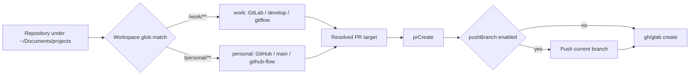

# Spec: Workspace routing config repair

**Branch:** `feature/workspace-routing-config-repair`

## Context

The active `~/.config/workit/` configuration does not match the user's real workspace split and produced a broken PR preflight: the personal repository resolved `develop` as its target (a branch that does not exist in the GitHub-Flow repo), the global `vcs.json` defaulted to `develop` over the workspace's GitHub-Flow policy, and the YouTrack token file still pointed into the legacy `~/.config/workflow-toolkit/` directory. Two confirmed PR-tool defects surfaced while creating PR #43:

1. The GitHub path of `prCreate` ignores the configured `pr.pushBranch` flag: it invokes `gh pr create` without pushing the current branch first, failing with `aborted: you must first push the current branch to a remote` (the GitLab path pushes via `glab mr create --push`). The user had to push manually.
2. A caller-supplied `target_branch` override equal to the workspace-configured target (e.g. `main` under GitHub Flow) is rejected as protected (`PR target "main" is a protected branch — override must be an allowed non-protected target`), even though the same value flows unvalidated when derived from configuration. The OpenCode wrapper forwards `target_branch` into `WF_PR_TARGET`, so passing the natural target fails while omitting it succeeds — the override validation treats the workspace's own default as a hostile override.

This change finalizes the active config layout, repairs the two PR-tool defects with parity tests, and cleans up the legacy config directory once the active config is verified.

## Goals

- Persist the final desired work/personal routing in the active `~/.config/workit/` config: `work` → GitLab/`develop`/gitflow, `personal` → GitHub/`main`/github-flow, with YouTrack linked only for `work`.
- Remove the conflicting global `vcs.json` default so the workspace policy is authoritative everywhere (docs branch, PR target, branch setup).
- Make the GitHub PR path honor `pr.pushBranch` by pushing the current branch before `gh pr create`, matching GitLab's `--push` behavior.
- Accept a caller-supplied PR target that equals the resolved workspace default even when that default is protected, while still rejecting genuine overrides to protected or disallowed branches.
- Move all token files into the active config dir and delete the legacy `~/.config/workflow-toolkit/` config files only after the active config is verified complete.
- Prove routing, push-before-create, and target-equality behavior with core/CLI parity tests and full repository verification.

## Non-goals

- No Cursor Marketplace or release workflow changes.
- No change to the auto-migration contract's copy-once semantics (legacy files are removed explicitly by this feature's cleanup task, not by migration).
- No new branch policy presets; the existing `gitflow` and `github-flow` presets are reused.
- No worktrees or changes to the guarded in-place branch model.

## Architecture

## Data flow / contracts

| Term | Meaning |
| --- | --- |
| Active config dir | `~/.config/workit/` (or `WORKFLOW_TOOLKIT_CONFIG` override) — the only config/credentials location the runtime reads. |
| Legacy config dir | `~/.config/workflow-toolkit/` — copy source for auto-migration; its config files are removed only by this feature's explicit cleanup task. |
| Workspace routing | `workspaces.json` glob match, first match wins: `work` = `~/Documents/projects/work/**`, `personal` = `~/Documents/projects/personal/**`. |
| PR target override | Caller-supplied `target_branch` / `WF_PR_TARGET`. Equals the resolved workspace default → treated as authoritative (accepted, even if protected). Differs → validated against allowed/protected policy. |

Workspace resolution order: workspace `branchPolicy` > workspace `vcs` fields > global `vcs.json` > preset defaults. The global `vcs.json` keeps only provider credentials and PR flags; the `defaultTargetBranch` field is removed so it can never shadow a workspace policy.

`prCreate` target resolution: `WF_PR_TARGET` override (validated) else the workspace-resolved default target. When `pr.pushBranch` is enabled (the default) and the provider is GitHub, the current branch is pushed to `origin` with `-u` before `gh pr create`; GitLab keeps its existing `--push` flag behavior.

## Acceptance criteria

- CA-01: `workspaces.json` in the active config dir declares exactly `work` (GitLab, `defaultTargetBranch: develop`, gitflow) and `personal` (GitHub, `defaultTargetBranch: main`, github-flow, `issues.link_on_pr`), and `resolveWorkspace` maps both globs correctly.
- CA-02: The active `vcs.json` has no `defaultTargetBranch`; docs-branch, PR target, and branch-setup surfaces resolve `develop` for `work` and `main` for `personal` from workspace configuration alone.
- CA-03: `youtrack.json` in the active config dir references the token file inside the active config dir; no active config references a legacy path.
- CA-04: GitHub `prCreate` with `pushBranch` enabled pushes the current branch (`git push -u origin <branch>`) before invoking `gh pr create`; with `pushBranch: false` it does not push and fails closed with the CLI's own error when the branch is unpushed.
- CA-05: GitLab `prCreate` behavior is unchanged (`glab mr create --push` when enabled), and parity tests assert both providers push exactly once before create when enabled.
- CA-06: A caller-supplied target equal to the workspace default (e.g. `main` under github-flow, `develop` under gitflow) is accepted even though it is protected; a target differing from the default that is protected or disallowed is still rejected.
- CA-07: Legacy `~/.config/workflow-toolkit/` config files (config, vcs, youtrack, workspaces, templates) are deleted only after the active config passes the toolkit status checks; the doctor/status surface still reports health from the active dir alone.
- CA-08: Parity tests exercise workspace resolution, target resolution, push-before-create, and target-equality acceptance through core, the OpenCode wrapper, and the CLI surface with identical outcomes.
- CA-09: README, `AGENTS.md`, and CHANGELOG Unreleased document the two-workspace routing, the removed global default, the GitHub push-before-create behavior, and the legacy cleanup.
- CA-10: Full repository verification (lint, format, tests, build) succeeds after the change.

## Decisions

- D-01: Encode the user's actual split (`work` GitLab/develop, `personal` GitHub/main) as the canonical `workspaces.json` rather than keeping the single-workflow-toolkit entry that caused the misrouting.
- D-02: Remove the global `defaultTargetBranch` instead of overriding it, because a global fallback can silently shadow a per-workspace policy for unmatched repos.
- D-03: Treat a caller-supplied target equal to the resolved default as authoritative (no policy re-validation), since the workspace policy already validated that value; genuine overrides keep the strict validation.
- D-04: Push from `prCreate` (GitHub) before `gh pr create`, honoring the existing `pr.pushBranch` flag, so the CLI needs no manual push step and matches GitLab parity.
- D-05: Clean the legacy config dir explicitly after verification instead of changing auto-migration's never-delete contract.

## Future work

- Add per-provider push diagnostics (upstream tracking state, uncommitted changes) if push failures prove hard to interpret.
- Consider validating workspace globs at write time against a broader supported grammar if real repos need nested or multi-root patterns.
