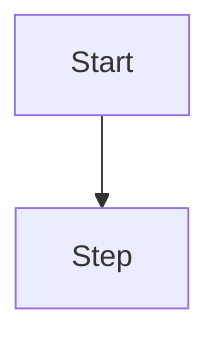

# Spec: <feature>

**Branch:** `feature/<slug>`

**Change:** ADDED|MODIFIED|REMOVED — <one-sentence intent>. (Small work with
no durable agreement: `Spec: none (<reason>)`, no file.)

## Context

<!-- Why does this exist? What problem does it solve? 1-3 sentences. -->

## Goals

- <!-- measurable, one per bullet -->

## Non-goals

- <!-- explicitly out of scope -->

## Architecture

<!-- May be `N/A (<reason>)` when the change has no flows or architecture. -->
<!-- Otherwise REQUIRED: render a mermaid diagram (workit-diagram skill). -->


<!-- REQUIRED if this spec touches UI: render an ASCII wireframe (workit-mockup skill). -->
```text
┌──────────────┐
│ Header       │
└──────────────┘
```

## Data flow / contracts

<!-- REQUIRED when there is a glossary, scope comparison, or contracts: use markdown tables. -->
| Term | Meaning |
| --- | --- |
| <term> | <meaning> |

## Acceptance criteria

<!-- REQUIRED: enumerable, each verifiable. Numbered CA-01, CA-02, ... -->
<!-- Requirements use SHALL/MUST (one per bullet, observable, no HOW); each
     carries at least one GIVEN/WHEN/THEN, including the most-regretted edge. -->
- CA-01 …

## Review checklist

<!-- Before implementation: intent matches; nothing extra; each requirement
     testable with an exercising scenario; most-cared case covered;
     tasks trace to requirements; you would sign if built exactly as written. -->
- [ ] …

## Decisions

- D-01 …

## Future work

- …
