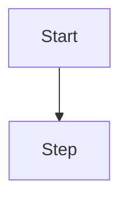

# Spec: <feature>

**Branch:** `feature/<slug>`

## Context

<!-- Why does this exist? What problem does it solve? 1-3 sentences. -->

## Goals

- <!-- measurable, one per bullet -->

## Non-goals

- <!-- explicitly out of scope -->

## Architecture

<!-- REQUIRED if this spec has flows or architecture: render a mermaid diagram (workflow_present_flow). -->


<!-- REQUIRED if this spec touches UI: render an ASCII wireframe (workflow_present_ascii). -->
```text
┌──────────────┐
│ Header       │
└──────────────┘
```

## Data flow / contracts

<!-- REQUIRED when there is a glossary, scope comparison, or contracts: use markdown tables. -->
| Term | Meaning |
| --- | --- |
| <term> | <meaning> |

## Acceptance criteria

<!-- REQUIRED: enumerable, each verifiable. Numbered CA-01, CA-02, ... -->
- CA-01 …
- CA-02 …

## Decisions

- D-01 …

## Future work

- …
